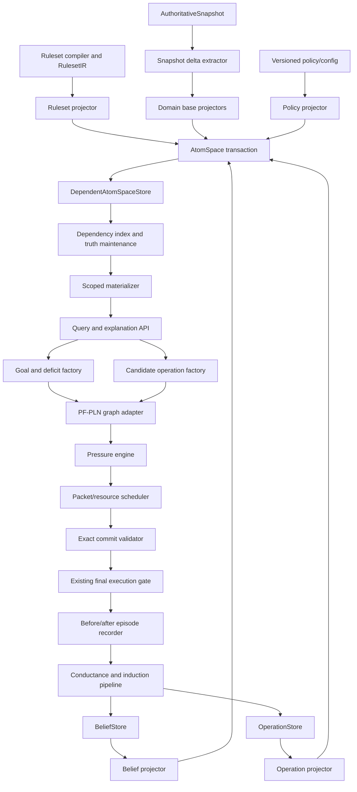

# Functional Dependent AtomSpace (FDAS)

## Detailed implementation plan for a richer, functional, dependency-aware AtomSpace in FreeCiv OmegaClaw PF-PLN

**Status:** Proposed implementation plan
**Target branch:** `experimental/functional-dependent-atomspace`
**Repository:** `machieke/freeciv-omegaclaw`
**Baseline reviewed:** 2026-08-01
**Primary objective:** Replace the current thin, mostly flat snapshot projection with a rich, scoped, incrementally maintained knowledge substrate that can support genuine PLN-driven city, unit, region, economy, threat, operation, and learning behavior without weakening any existing truth, pressure, resource, legal-action, commit, or execution firewall.

---

## Contents

1. [Executive decision](#1-executive-decision)
2. [Target outcome](#2-target-outcome)
3. [Current baseline and principal gaps](#3-current-baseline-and-principal-gaps)
4. [Scope](#4-scope)
5. [Non-negotiable invariants](#5-non-negotiable-invariants)
6. [Functional dependency semantics](#6-functional-dependency-semantics)
7. [High-level architecture](#7-high-level-architecture)
8. [Core data model](#8-core-data-model)
9. [Scope model and microspace topology](#9-scope-model-and-microspace-topology)
10. [Predicate ontology](#10-predicate-ontology)
11. [Grounded function system](#11-grounded-function-system)
12. [Ruleset IR 2.0 and executable domain semantics](#12-ruleset-ir-20-and-executable-domain-semantics)
13. [Projection and incremental materialization pipeline](#13-projection-and-incremental-materialization-pipeline)
14. [Generic inference and goal regression](#14-generic-inference-and-goal-regression)
15. [Local goals and the PF-PLN pressure bridge](#15-local-goals-and-the-pf-pln-pressure-bridge)
16. [Operation representation and candidate generation](#16-operation-representation-and-candidate-generation)
17. [Domain implementation slices](#17-domain-implementation-slices)
18. [Episodes, attribution, conductance, and induction](#18-episodes-attribution-conductance-and-induction)
19. [Proposed package and file layout](#19-proposed-package-and-file-layout)
20. [Public APIs](#20-public-apis)
21. [Events, metrics, and observability](#21-events-metrics-and-observability)
22. [Configuration and activation](#22-configuration-and-activation)
23. [Testing strategy](#23-testing-strategy)
24. [Performance and boundedness targets](#24-performance-and-boundedness-targets)
25. [Implementation phases](#25-implementation-phases)
26. [Concrete pull-request sequence](#26-concrete-pull-request-sequence)
27. [Migration and compatibility strategy](#27-migration-and-compatibility-strategy)
28. [Risks and mitigations](#28-risks-and-mitigations)
29. [Definition of done](#29-definition-of-done)
30. [Immediate implementation backlog](#30-immediate-implementation-backlog)
31. [Detailed end-to-end example](#31-detailed-end-to-end-example)
32. [Repository-specific baseline references](#32-repository-specific-baseline-references)
33. [Final architectural recommendation](#33-final-architectural-recommendation)

---

## 1. Executive decision

Implement a **Functional Dependent AtomSpace**, abbreviated **FDAS**, as a versioned materialized knowledge graph over the systems that already exist:

1. the immutable authoritative FreeCiv snapshot;
2. the compiled ruleset IR;
3. the uncertain belief store;
4. the persistent operation store;
5. the pressure/controller configuration; and
6. observed before/after action episodes.

“Functional” means that every deterministic derived atom is produced by a declared, side-effect-free derivation over immutable inputs. “Dependent” means that every projected or derived atom records the exact source fields, atoms, rules, policies, beliefs, or operation revisions on which it depends. When an input changes, the system invalidates and recomputes only the affected downstream materialization.

FDAS must **not** become a second game-state authority. It is a dependency-aware, explainable view over authoritative state and explicitly qualified uncertain knowledge.

The target control path is:

```text
Authoritative snapshot + ruleset + beliefs + operations
                         │
                         ▼
               base-domain projection
                         │
                         ▼
        dependency-aware scoped materialization
                         │
            ┌────────────┼────────────┐
            ▼            ▼            ▼
       crisp facts   uncertain     local deficits
                     beliefs          and goals
            └────────────┼────────────┘
                         ▼
              causal/requirement graph
                         ▼
                 PF-PLN pressure field
                         ▼
             grounded operation candidates
                         ▼
          resource and packet reservation
                         ▼
            exact current-state revalidation
                         ▼
             existing final execution gate
                         ▼
             observed outcome and episode
                         ▼
           contextual conductance/induction
```

The first live vertical slice should be **city stability plus city defense**, because the current snapshot and planner already expose most of the required authoritative data and exact legal actions. Individual citizen-tile micro-management should remain out of scope until the proxy exposes individual worker assignments and legal reassignment actions.

---

## 2. Target outcome

At completion, a controller decision should be explainable at this level:

```text
Goal:
  Maintain survival of city-17 before turn 48.

Authoritative facts:
  city-17 is owned by player-1.
  city-17 currently has one persistent defender.
  enemy-unit-8 is visible within wrapped distance 2.
  enemy-unit-8 can reach city-17 in an estimated 2 turns.
  unit-42 can reach city-17 in 1 turn.
  unit-42 currently covers city-12.
  city-17 can build defender-type-3 in 4 turns.

Derived local facts:
  city-17 has an imminent garrison coverage deficit.
  building a new defender cannot close the deficit before the threat deadline.
  moving unit-42 closes the city-17 deficit but creates a smaller city-12 deficit.
  unit-55 can replace unit-42 at city-12 in 2 turns.

Candidate operation:
  move unit-42 to city-17, then move unit-55 to city-12.

Dependencies:
  snapshot fields for cities 12 and 17;
  unit positions, health, movement and roles;
  current legal moves;
  wrapped-map topology;
  ruleset unit capabilities;
  threat observation and its validity interval;
  current resource claims;
  operation deadline policy.

Control result:
  survival pressure concentrates on the two-step operation;
  resource arbitration reserves unit-42 and unit-55;
  the byte-identical first move is revalidated against the current legal set;
  the final execution gate remains authoritative.

Learning:
  the next authoritative snapshot is compared with the predicted transition;
  observed garrison relief updates contextual conductance;
  action acceptance alone is not treated as goal relief.
```

This is materially different from assigning a higher score to a broad `city_defense` category. The decision is local, causal, temporally bounded, resource-aware, and traceable to exact dependencies.

---

## 3. Current baseline and principal gaps

The implementation should be evolutionary. Several strong foundations already exist and should be reused rather than duplicated.

| Existing component | Current value | Gap FDAS must close |
|---|---|---|
| `state/snapshot.py` | Rich immutable authoritative state for research, economy, government, cities, units, map visibility, legal actions, routes, and combat probabilities | Most of this state is not projected into the live AtomSpace |
| `state/atoms.py` | Small `Atom` representation and authoritative/visible/uncertain snapshot partitions | Projection is thin, flat, rebuilt wholesale, and uncertain output is empty |
| `state/store.py` | Thread-safe transactional replacement of current snapshots | Stores only the current projection and does not perform field-level delta invalidation or dependency maintenance |
| `state/grounded.py` | Declared grounded checks with snapshot/ruleset provenance | Registry covers only a narrow numeric catalog and lacks dependency-declaring grounded functions |
| `rulesets/ir.py` and `rulesets/compiler.py` | Typed ruleset prerequisites, quantitative fields, roles/traits, and independent audit support | Predicate and grounding catalogs remain narrow; action effects and richer causal semantics are not first-class |
| `beliefs/model.py` and `beliefs/store.py` | Evidence, revision, decay, provenance, conflicts, quarantine, and uncertain beliefs | Beliefs are not projected into rich scoped live reasoning contexts |
| `beliefs/inference.py` | Technology prerequisite closure and basic deduction/abduction | Domain inference is still predominantly technology-specific rather than a generic typed rule engine |
| `planning/impact.py` | Extensive grounded operational behavior over exact snapshot and legal-action data | Many domain choices remain encoded as imperative branches and priority tables rather than reusable causal knowledge |
| `planning/operations.py` and operation lifecycles | Durable operation intent, participants, steps, requirements, expiry, provenance, and bounded authority readout | Operations are not represented as first-class AtomSpace structures that can participate in PLN goal regression |
| `pressure/model.py`, `pressure/engine.py`, adapters and schedulers | Typed goals, rules, truth firewall, pressure channels, requirement sets, resources, deadlines, risk, conductance, and multi-goal control | Current live adapter largely builds goal/category/candidate graphs from already-produced planner candidates rather than deriving candidates through a rich domain graph |
| `pressure/transitions.py` | Conservative expected-transition models with explicit residual unknown mass | Transition predictions need direct links to operation, context, dependency, and episode atoms |
| `planning/commit_validator.py` and final execution gate | Fail-closed current-state and legal-action revalidation | Must remain downstream of FDAS and must never be bypassed |

The architectural gap is therefore not a lack of raw state, pressure mathematics, resource arbitration, or operation lifecycle machinery. The gap is the **domain knowledge layer connecting them**.

---

## 4. Scope

### 4.1 In scope

FDAS must support:

- a rich typed predicate and entity catalog;
- logical scopes for world, empire, city, unit, task force, region, opponent, operation, and episode contexts;
- static ruleset/capability knowledge;
- authoritative and visible state projection;
- deterministic derived facts with exact dependencies;
- uncertain beliefs with evidence, validity, decay, and provenance;
- local deficits and goals derived from current state and policy;
- generic typed inference and bounded goal regression;
- grounded numeric and Boolean evaluators;
- projection of existing `OperationSpec` lifecycles;
- generation of new candidate operations from action schemas and local deficits;
- pressure-driven materialization, inference, observation, action, expansion, and retention;
- exact resource claims and conflict detection;
- before/after episode recording;
- contextual conductance learning;
- later activation of observation and induction components in the live loop;
- deterministic replay, explanation, metrics, and audit.

### 4.2 Explicit non-goals

The first implementation must not:

- replace the authoritative snapshot with symbolic state;
- put pressure values into PLN truth or revision formulas;
- let the scheduler perform logical inference;
- let a prediction, simulation, analogy, LLM proposal, or associative relation authorize an action;
- infer hidden enemy absence from fog-of-war silence;
- materialize every possible tile relation, route, action binding, or counterfactual every turn;
- duplicate FreeCiv’s exact mechanics when an authoritative server result already exists;
- pretend to control individual citizen assignments before the proxy exposes them;
- remove the grounded Impact planner before replacement slices have passed shadow parity and live acceptance;
- make new score or win-rate claims without the branch’s existing predeclared empirical gates.

---

## 5. Non-negotiable invariants

### 5.1 Truth and authority

1. **Engine state remains ground truth.** An authoritative atom must be a lossless projection of an immutable snapshot field or exact server-advertised relation.
2. **Ruleset facts are exact only for the compiled ruleset digest from which they were derived.**
3. **Deterministic derived atoms never become authoritative atoms.** They remain reproducible conclusions with dependency witnesses.
4. **Uncertain beliefs remain in the uncertain belief system.** They cannot be silently promoted to crisp state.
5. **Predicted transitions are control-layer models.** They cannot create or revise epistemic truth.
6. **Pressure is not truth.** Pressure may select work on an atom, but it cannot alter strength, confidence, evidence, or revision.
7. **Goal utility is not truth.** A desired proposition and a believed proposition must remain separate objects.

### 5.2 Dependency and consistency

8. Every derived atom must have at least one valid support record.
9. Every support record must name its derivation version and exact dependency fingerprints.
10. A derived atom is queryable only when all dependencies match the active revision.
11. Retraction is support-aware: an atom remains materialized when another independent valid support still exists.
12. A cold full rebuild and an incremental update from the same inputs must produce the same canonical atom set and support hashes.
13. Derivation cycles must be rejected by static stratum validation or bounded by an explicitly declared fixed-point operator.
14. Negative conclusions require a completeness witness. Absence in an incomplete or fogged domain is not evidence of falsity.
15. All atom IDs, support IDs, scope IDs, materialization keys, and event hashes must be deterministic.

### 5.3 Numeric grounding

16. Continuously changing numeric state remains outside ordinary symbolic atoms.
17. Numeric predicates may be exposed only through declared grounded functions with typed inputs, units, authority, dependency keys, and witnesses.
18. Symbolic threshold atoms must refer to stable policy or ruleset threshold identifiers, not uncontrolled ad hoc numeric literals.
19. Heuristic numeric models cannot emit crisp truth. They may emit uncertain assessments or predicted operation outcomes with confidence caps and residual unknown mass.

### 5.4 Action safety

20. A candidate operation may exist without immediate execution authority.
21. An executable step must bind to a byte-identical action in the current server-advertised legal set.
22. Resource and packet reservations must be complete and non-duplicated before commit when the corresponding safety switches are enabled.
23. Current snapshot identity, legal-action digest, context digest, lifecycle generation, quarantine state, evidence overlap, category-specific exact guards, and predicted cost must be revalidated before plan materialization.
24. The existing final execution gate remains the final authority after FDAS selection.
25. Stale, quarantined, unsupported, expired, or partially materialized contexts fail closed.

### 5.5 Boundedness and observability

26. Every scope has explicit atom, derivation, rule-fire, grounding, route, and wall-clock budgets.
27. Pressure may expand a scope only through a metacontrol budget.
28. Every selected operation must have a machine-readable explanation linking goal, deficit, causal rule, grounded checks, dependencies, resource claims, predicted transition, and legal action.
29. Every incremental commit must emit enough structural evidence to replay or audit the materialization.
30. Feature activation must be versioned and declared separately from component implementation.

---

## 6. Functional dependency semantics

### 6.1 Base facts and derived facts

FDAS contains two fundamentally different deterministic records:

```text
Base atom
  = direct projection of one or more authoritative/visible/ruleset inputs

Derived atom
  = output of a registered derivation over base atoms, other lower-stratum
    derived atoms, declared groundings, policy values, or durable store revisions
```

For a derivation specification `D`, scope `S`, binding `B`, and dependency vector `X`, the output is:

\[
O = D_v(S, B, X)
\]

where `v` is the immutable derivation version. Its materialization identity is:

\[
M = H(D_v, S, B, F(X))
\]

`F(X)` is the ordered vector of dependency fingerprints. Two evaluations with the same `M` must produce byte-identical canonical outputs.

### 6.2 Dependency kinds

The implementation must distinguish at least these dependency kinds:

| Dependency kind | Example |
|---|---|
| Snapshot field | `city:17.food_surplus`, `unit:42.tile_id`, `economic.gold` |
| Snapshot collection membership | set of own units at tile 301; set of legal actions for actor 42 |
| Snapshot identity | game, player, turn, source sequence, legal-action digest |
| Ruleset item | unit type role/capability, building requirement, movement class |
| Ruleset digest | protects every static derivation from cross-ruleset reuse |
| Atom support | lower-stratum atom and support hash |
| Grounding result | exact result plus grounding version and witness hash |
| Belief revision | `BeliefKey` plus store revision/evidence set hash |
| Operation revision | operation ID, state, step, claim, and lifecycle generation |
| Policy/configuration | named versioned threshold or feature flag |
| Visibility/completeness domain | visible tile set or complete legal-action catalog digest |
| Time/validity | turn boundary, observation expiry, operation deadline |

A dependency key identifies the source concept. A dependency fingerprint identifies its value in a specific revision. Reverse indexes map each dependency key to all affected support records.

### 6.3 Support-aware truth maintenance

FDAS should implement a lightweight justification-based truth maintenance system:

```text
AtomRecord
  ├── Support A: derivation city-garrison-deficit/1
  │     ├── city ownership
  │     ├── city location
  │     ├── defenders-at-city collection
  │     └── defense policy threshold
  └── Support B: derivation emergency-threat-deficit/1
        ├── visible local threat
        ├── threat arrival ETA
        └── defender completion ETA
```

When one support becomes invalid, only that support is retracted. The atom disappears only when no valid support remains or its revised uncertain truth falls below a declared retention boundary in the belief store.

Crisp deterministic supports and uncertain evidence contributions must remain separate:

- crisp support maintenance belongs to FDAS;
- uncertain revision, evidence overlap, decay, conflict, and quarantine remain owned by `BeliefStore`;
- FDAS projects the resulting uncertain belief into scopes but does not reimplement revision formulas.

### 6.4 Stratification

The dependency graph must be stratified to prevent semantic cycles:

| Stratum | Contents | May depend on |
|---|---|---|
| S0 | Ruleset and versioned policy constants | Nothing above S0 |
| S1 | Authoritative snapshot and exact visible observations | S0 only for type validation |
| S2 | Deterministic factual derivations | S0-S2 lower-ranked rules |
| S3 | Uncertain beliefs and observation assessments | S0-S2 plus prior belief revisions |
| S4 | Goal satisfaction and local deficit atoms | S0-S3 |
| S5 | Candidate operation structures and predicted transitions | S0-S4, legal actions, operation/resource state |
| S6 | Pressure and scheduling overlays | References S2-S5 but is not epistemic truth |
| S7 | Committed operation state and observed episodes | S1-S6 event identities |
| S8 | Learned conductance and quarantined induced rules | S7; promotion requires independent validation |

A planned assignment must not feed back into a factual proposition. For example:

- `unit-42-is-at-city-17` is S1/S2 factual state;
- `operation-9-plans-unit-42-for-city-17` is S5 control intent;
- `city-17-garrison-covered` may depend only on current factual defenders, not on the plan;
- `operation-9-predicts-city-17-garrison-covered` is a predicted transition, not current truth.

### 6.5 Negative dependencies and completeness witnesses

The system must never implement negation as “query returned no row” unless the queried domain is declared complete.

Valid examples:

```text
No legal fortify action exists for unit-42
  dependency: complete current legal-action set digest

No owned unit currently occupies tile-301
  dependency: complete own-unit collection in authoritative snapshot

No visible enemy exists within radius 3 of city-17
  dependency: exact visible-enemy collection plus visible-tile domain
  semantics: no *visible* enemy, not no enemy
```

Invalid example:

```text
No enemy exists near city-17
  inferred merely because no enemy was observed under fog of war
```

Each derivation using negation must declare a `CompletenessSpec` describing why the domain is closed for that conclusion.

---

## 7. High-level architecture



### 7.1 One physical store, many logical AtomSpaces

Do not create one heavyweight physical AtomSpace instance for every city, unit, and tile. Use a shared indexed store with logical scoped views.

A logical microspace is defined by:

- a scope root;
- imported parent summaries;
- allowed namespaces and predicates;
- materialization roots;
- expansion depth;
- atom and rule-fire budgets;
- validity and retention policy;
- export predicates exposed to parent scopes.

This gives local reasoning without duplicating shared ruleset and world facts.

### 7.2 Always-materialized and focus-materialized knowledge

Always materialize compact summaries for:

- the current player and empire;
- every owned city;
- every owned unit;
- every visible enemy unit;
- current research and economy;
- active and reserved operations;
- current global goal satisfaction atoms.

Materialize detailed local graphs only when selected by threat, active operation, explicit query, or pressure:

- city radius and nearby units;
- route corridors;
- candidate settlement regions;
- transport embarkation corridors;
- tactical combat neighborhoods;
- opponent hypothesis contexts;
- counterfactual operation outcomes.

---

## 8. Core data model

Create a new package under `src/freeciv_agent/state/atomspace/`. The current `state/atoms.py` should become a compatibility facade during migration.

### 8.1 Atom namespaces

```python
from enum import Enum

class AtomNamespace(str, Enum):
    RULESET = "ruleset"
    AUTHORITATIVE = "authoritative"
    OBSERVATION = "observation"
    DERIVED = "derived"
    BELIEF = "belief"
    GOAL = "goal"
    OPERATION = "operation"
    EPISODE = "episode"
    DIAGNOSTIC = "diagnostic"
```

`DIAGNOSTIC` atoms are inspectable but cannot participate in action authorization unless a separate declared adapter converts them into a validated lower-stratum fact.

### 8.2 Typed terms and keys

```python
from dataclasses import dataclass
from typing import Tuple

@dataclass(frozen=True, order=True)
class EntityRef:
    kind: str       # player, city, unit, tile, region, operation, technology...
    entity_id: str

@dataclass(frozen=True, order=True)
class SymbolRef:
    catalog: str    # activity, role, capability, policy-threshold, state...
    symbol: str

AtomTerm = EntityRef | SymbolRef

@dataclass(frozen=True, order=True)
class AtomKey:
    namespace: AtomNamespace
    predicate: str
    arguments: Tuple[AtomTerm, ...]
    scope_id: str
```

Numeric values are deliberately not ordinary `AtomTerm` values. Tile coordinates are projected through stable tile entities; policy thresholds are referred to by symbolic IDs and evaluated by groundings.

### 8.3 Predicate registry

```python
@dataclass(frozen=True)
class PredicateSpec:
    predicate: str
    arity: int
    argument_kinds: tuple[tuple[str, ...], ...]
    namespaces: frozenset[AtomNamespace]
    truth_kind: str              # crisp, uncertain, structural
    allowed_scope_kinds: frozenset[str]
    completeness_policy: str     # open, closed, explicit-witness
    export_policy: str           # local, parent-summary, global
    schema_version: str
```

Production code must reject unregistered predicates, wrong arity, invalid argument kinds, numeric leakage, invalid namespaces, and inappropriate scope exports.

### 8.4 Authority and validity

```python
class AuthorityClass(str, Enum):
    RULESET_EXACT = "ruleset_exact"
    ENGINE_AUTHORITATIVE = "engine_authoritative"
    PACKET_OBSERVATION = "packet_observation"
    DETERMINISTIC_DERIVED = "deterministic_derived"
    UNCERTAIN_BELIEF = "uncertain_belief"
    CONTROL_MODEL = "control_model"
    POLICY = "policy"

@dataclass(frozen=True)
class ValidityInterval:
    snapshot_id: str | None
    valid_from_turn: int | None
    valid_through_turn: int | None
    source_seq: int | None
    ruleset_digest: str | None
```

### 8.5 Supports and dependency fingerprints

```python
@dataclass(frozen=True, order=True)
class DependencyKey:
    kind: str
    owner_id: str
    path: str

@dataclass(frozen=True)
class DependencyRef:
    key: DependencyKey
    fingerprint: str

@dataclass(frozen=True)
class SupportRecord:
    support_id: str
    derivation_id: str
    derivation_version: str
    binding_hash: str
    dependencies: tuple[DependencyRef, ...]
    witness_hash: str
    provenance_ids: tuple[str, ...]
    confidence_cap: float | None = None
```

`support_id` should be a structural hash over the derivation identity, scope, binding, ordered dependencies, and witness.

### 8.6 Atom records

```python
@dataclass(frozen=True)
class AtomRecord:
    atom_id: str
    key: AtomKey
    authority: AuthorityClass
    truth: object | None          # existing TruthState or a compatible immutable view
    validity: ValidityInterval
    supports: tuple[SupportRecord, ...]
    provenance_ids: tuple[str, ...]
    lifecycle: str
    materialization_key: str
    tags: tuple[tuple[str, str], ...] = ()
```

Rules:

- authoritative and ruleset atoms have direct projection supports;
- derived crisp atoms must have at least one deterministic support;
- belief atoms point to `BeliefStore` revision/evidence identities;
- operation atoms point to operation revisions;
- structural atoms may use crisp existence truth but must not be mistaken for goal satisfaction;
- pressure values are never stored in `AtomRecord.truth`.

### 8.7 Derivation specifications

```python
@dataclass(frozen=True)
class DerivationSpec:
    derivation_id: str
    version: str
    stratum: int
    scope_kinds: frozenset[str]
    input_patterns: tuple[object, ...]
    grounding_calls: tuple[str, ...]
    output_templates: tuple[object, ...]
    evaluator: object
    completeness: object | None
    eager_policy: str             # always, active-scope, query-only
    cache_policy: str             # revision, turn, persistent-static
    maximum_bindings: int
    maximum_outputs_per_binding: int
    export_policy: str
```

The evaluator must be pure: it receives a read-only derivation context and returns canonical output proposals plus witnesses. It cannot mutate the snapshot, atom store, belief store, operation store, pressure state, or external world.

### 8.8 Projection batches and transactions

```python
@dataclass(frozen=True)
class ProjectionBatch:
    projector_id: str
    projector_version: str
    scope_id: str
    upserts: tuple[AtomRecord, ...]
    retract_support_ids: tuple[str, ...]
    dependency_fingerprints: tuple[DependencyRef, ...]
    diagnostics: tuple[object, ...]

class AtomSpaceTransaction:
    def apply_batch(self, batch: ProjectionBatch) -> None: ...
    def invalidate(self, changed_keys: tuple[DependencyKey, ...]) -> None: ...
    def materialize(self, requests: tuple[object, ...]) -> None: ...
    def validate(self) -> None: ...
    def commit(self) -> str: ...
```

A transaction commits the snapshot projection, support changes, reverse indexes, scope revisions, and event identities atomically.

---

## 9. Scope model and microspace topology

### 9.1 Scope specification

```python
@dataclass(frozen=True)
class ScopeSpec:
    scope_id: str
    scope_kind: str
    owner_player_id: int
    root_entities: tuple[EntityRef, ...]
    parent_scope_ids: tuple[str, ...]
    imported_predicates: tuple[str, ...]
    exported_predicates: tuple[str, ...]
    namespaces: frozenset[AtomNamespace]
    maximum_atoms: int
    maximum_rule_fires: int
    maximum_groundings: int
    maximum_expansion_depth: int
    retention_policy: str
    validity: ValidityInterval
```

Scope IDs must be deterministic. Examples:

```text
scope:game:<game-id>:player:1:world
scope:game:<game-id>:player:1:empire
scope:game:<game-id>:player:1:city:17:facts
scope:game:<game-id>:player:1:city:17:control
scope:game:<game-id>:player:1:unit:42:facts
scope:game:<game-id>:player:1:region:city-17:r3
scope:game:<game-id>:player:1:operation:<operation-id>
scope:game:<game-id>:player:1:episode:<episode-id>
```

### 9.2 Factual and control facets

Separate factual and control facets even when they share a root entity.

```text
city:17:facts
  current ownership, location, stock, surplus, mood, buildings,
  actual garrison, visible local threat, exact buildability

city:17:control
  local deficits, candidate operations, reservations, predicted transitions,
  deadlines, conflicts, pressure explanations
```

This separation prevents a plan from becoming a factual self-fulfilling dependency.

### 9.3 Required logical spaces

| Scope | Lifetime | Principal contents | Parent exports |
|---|---|---|---|
| Ruleset/capability | Persistent per ruleset digest | entity types, requirements, capabilities, effects, action schemas, roles, costs, obsolescence | capability and requirement summaries |
| World | Snapshot revision | map topology, visible domain, global turn identity, current legal-action catalog | map and observation summaries |
| Empire/economy | Snapshot revision | treasury, rates, research, government, city/unit inventory, global capacities | global goal satisfaction and resource summaries |
| City facts | Snapshot revision | food, growth, production, mood, buildings, governor, local outputs, actual garrison | city stability, capacity, and deficit summaries |
| City control | Active while pressured or operated | local goals, candidate production/governor/rate/support/defense operations | selected requirements and resource claims |
| Unit facts | Snapshot revision | type, roles, capabilities, location, health, movement, activity, home city, transport state | availability and capability summaries |
| Unit control | Active while pressured or assigned | route, mission, opportunity cost, target, task-force membership, candidate actions | operation participant status |
| Region | Focused and bounded | tiles, topology, terrain, visibility, local ownership, threat envelope, route corridor, settlement candidates | threat and reachability summaries |
| Opponent belief | Durable with decay | last-seen units, inferred capabilities, uncertain technology and intention hypotheses | bounded threat assessments |
| Operation | Operation lifetime | goals, participants, steps, requirements, claims, predicted effects, deadline, state | operation status and expected goal relief |
| Episode | Durable compact record | before context, selected action, predictions, observed delta, attribution, realized relief | learning samples and audit records |

### 9.4 Scope import rules

Imports must form a directed acyclic graph within a revision.

Recommended import pattern:

```text
ruleset ──────────────┐
world ────────────────┼──> empire facts
                      ├──> city facts
                      ├──> unit facts
                      └──> region facts

city facts + unit facts + region facts + beliefs
                      └──> city/unit control

control + operation store + legal actions
                      └──> operation scope

operation + before/after authoritative revisions
                      └──> episode scope
```

A parent should import only compact exports from a child. For example, the empire scope should import `city-food-risk`, `city-garrison-deficit`, and `city-production-capacity`, not every tile and local route atom in each city region.

### 9.5 Scope activation policy

A `ScopeActivator` should produce deterministic activation requests from:

- active operation roots;
- visible threat proximity;
- global safety deficits;
- current founders and transports;
- unresolved high-pressure atoms;
- explicit diagnostic queries;
- bounded exploration pressure;
- retained scope momentum to prevent turn-to-turn thrashing.

Suggested initial policy:

| Scope class | Default materialization |
|---|---|
| Ruleset, world, empire | Always |
| City summary | All owned cities |
| Unit summary | All owned units and visible enemies |
| City detail | Top safety deficits plus cities with active queues/operations |
| Region detail | Threatened cities, active founders, operation routes |
| Unit detail | Reserved/active participants plus top candidate actors |
| Counterfactuals | Only for scheduled candidate set |
| Opponent hypotheses | Only when observation or action decision is sensitive to them |

The activator must emit why each scope was opened and which budget funded it.

---

## 10. Predicate ontology

The following is a minimum production ontology, not an exhaustive final list. Predicate names should be normalized to lowercase kebab-case, versioned in the registry, and assigned exact argument signatures.

### 10.1 Ruleset and capability predicates

| Predicate | Arguments | Semantics |
|---|---|---|
| `entity-kind` | entity, kind-symbol | Exact ruleset classification |
| `requires` | subject, requirement | Structural requirement edge |
| `requirement-kind` | requirement, kind-symbol | Tech, building, government, terrain, minimum size, grounded check, etc. |
| `obsoleted-by` | entity, entity | Exact ruleset obsolescence edge |
| `grants-capability` | entity, capability | Capability obtained from unit/building/technology/government |
| `has-role` | entity, role | Compiled exact or declared role classification |
| `can-produce` | city-type-or-player, target | Static eligibility before current-state grounding |
| `can-research` | player-type, technology | Static research relation before current-state grounding |
| `action-schema` | schema, action-type | Declares a typed action schema |
| `schema-actor-kind` | schema, kind | Actor signature |
| `schema-target-kind` | schema, kind | Target signature |
| `schema-requires` | schema, requirement-expression | Preconditions |
| `schema-predicts` | schema, effect-template | Declared causal effect |
| `schema-claims` | schema, resource-kind | Resource claim type |
| `terrain-grants` | terrain, capability-or-effect | Terrain semantics available from ruleset |
| `building-affects` | building, effect-kind | Building effect class without embedding changing numeric state |

### 10.2 Authoritative world and empire predicates

| Predicate | Arguments | Source |
|---|---|---|
| `current-player` | player | Snapshot identity |
| `current-turn` | turn-symbol | Snapshot identity; symbolic turn entity |
| `known-technology` | player, technology | Research state |
| `research-target` | player, technology | Research state |
| `active-government` | player, government | Government state |
| `owns-city` | player, city | City collection |
| `owns-unit` | player, unit | Unit collection |
| `visible-enemy-unit` | player, unit | Visible enemy collection |
| `city-at` | city, tile | City state |
| `unit-at` | unit, tile | Unit state |
| `unit-activity` | unit, activity | Unit state |
| `unit-home-city` | unit, city | Unit state when defined |
| `unit-transported-by` | unit, transport | Unit state when defined |
| `tile-visible` | player, tile | Visible tile set |
| `legal-action-for` | action, actor | Canonical legal-action set |
| `legal-action-type` | action, action-type | Canonical legal-action set |
| `legal-action-target` | action, entity | Canonical legal-action set |
| `current-city-production` | city, target | City state |
| `city-has-building` | city, building | City state |
| `city-governor-active` | city, governor-policy | City state |
| `city-in-disorder` | city | City state |
| `city-famine-recorded` | city | City state |

Exact changing values such as gold, food stock, shield stock, output vectors, movement points, health, progress, cost, and rates remain available through grounded functions and evidence records rather than ordinary atoms.

### 10.3 Derived empire and economy predicates

| Predicate | Arguments | Typical dependencies |
|---|---|---|
| `treasury-below-reserve` | player, reserve-policy | gold, upkeep reserve, policy threshold |
| `treasury-structurally-safe` | player, policy | operating GPT, capitalization, committed upkeep, reserve |
| `research-progressing` | player | progress deltas across authoritative revisions |
| `research-stalled` | player | turn delta, progress delta, observed effective BPT |
| `rate-change-safe` | player, rate-policy | current rates, economy, legal rate actions |
| `supports-additional-upkeep` | player, upkeep-class | current and projected economy |
| `empire-lacks-capability` | player, capability | owned entities and compiled capabilities |
| `empire-has-spare-capability` | player, capability | capability count minus protected commitments |
| `global-resource-conflict` | operation, operation | resource claims and capacities |

### 10.4 City predicates

| Predicate | Arguments | Semantics |
|---|---|---|
| `city-food-secure` | city, food-policy | Exact threshold result from grounded city data |
| `city-food-deficit` | city, food-policy | Current local deficit |
| `city-famine-risk` | city, horizon-policy | Grounded near-horizon risk |
| `city-growth-possible` | city | Current grounded growth feasibility |
| `city-growth-stalled` | city | No positive growth route under current constraints |
| `city-order-stable` | city | Current authoritative mood/disorder state satisfies policy |
| `city-order-deficit` | city | Disorder or declared happiness deficit |
| `city-production-active` | city | Positive grounded shield production or valid capitalization route |
| `city-production-stalled` | city | Current queue lacks progress under exact state |
| `city-queue-funded` | city, target | Grounded economy and upkeep test |
| `city-queue-completes-before` | city, target, deadline-policy | Grounded ETA comparison |
| `city-can-build` | city, target | Current exact buildability projection |
| `city-garrison-covered` | city, defense-policy | Current factual defenders satisfy policy |
| `city-garrison-deficit` | city, defense-policy | Current coverage below policy |
| `city-threatened` | city, threat-context | Visible or explicitly qualified belief threat |
| `city-threat-arrives-before-defense` | city, threat-context | Threat ETA precedes grounded defense completion ETA |
| `city-can-host-production-route` | city, goal-kind | Local buildability, shields, economy, deadline |
| `city-can-host-treasury-route` | city | Structural economy and legal action grounding |
| `city-is-critical-support-source` | city, unit | Unit upkeep/home-city dependency |
| `city-operation-blocked` | city, operation | Requirement or resource conflict |

### 10.5 Unit and task-force predicates

| Predicate | Arguments | Semantics |
|---|---|---|
| `unit-has-capability` | unit, capability | Ruleset capability bound to current unit type |
| `unit-has-role` | unit, role | Current type role |
| `unit-combat-capable` | unit | Persistent combat capability, excluding one-shot/worker/founder roles as policy requires |
| `unit-persistent-defender` | unit | Grounded role/capability classifier |
| `unit-founder` | unit | Founder capability |
| `unit-transport` | unit | Transport capability |
| `unit-damaged` | unit, health-policy | Grounded health threshold |
| `unit-mobile` | unit | Grounded movement availability plus legal move existence |
| `unit-available` | unit, operation-kind | Not already exclusively claimed and not protected elsewhere |
| `unit-critical-garrison` | unit, city | Removing it would create a factual deficit |
| `unit-can-reach` | unit, target | Exact route exists under current route authority |
| `unit-arrives-before` | unit, target, deadline-policy | Route ETA comparison |
| `unit-route-risky` | unit, route | Grounded visible/belief threat exposure |
| `unit-assigned-to` | unit, operation | Operation intent, not factual state |
| `task-force-member` | unit, task-force | Structural operation relation |
| `task-force-capability-covered` | task-force, capability | Participants satisfy requirement |
| `task-force-ready` | task-force | All exact current requirements satisfied |

### 10.6 Region and map predicates

| Predicate | Arguments | Semantics |
|---|---|---|
| `tile-adjacent` | tile, tile | Exact wrapped topology relation, materialized only locally |
| `tile-in-region` | tile, region | Scope membership |
| `region-centered-on` | region, entity | Region root |
| `terrain-kind` | tile, terrain | Authoritative visible/known terrain |
| `tile-owned-by` | tile, player | Authoritative visible/known ownership |
| `frontier-tile` | tile, player | Deterministic local frontier classification |
| `within-defense-radius` | tile-or-unit, city, radius-policy | Grounded wrapped distance threshold |
| `visible-threat-near` | threat, anchor, radius-policy | Observation-qualified threat relation |
| `last-seen-near` | threat-belief, anchor, radius-policy | Uncertain valid-time relation |
| `region-contested` | region | Visible or qualified uncertain opponent presence |
| `route-corridor` | route, region | Bounded path context |
| `route-blocked` | route, blocker | Exact current failure or qualified uncertain risk |
| `settlement-candidate` | tile, settlement-policy | Grounded candidate eligibility |
| `settlement-site-safe` | tile, threat-policy | Observation-qualified safety, never global enemy absence |
| `chokepoint-candidate` | tile, region | Derived topology heuristic; uncertain/control use only until validated |

### 10.7 Goal, operation, and episode predicates

| Predicate | Arguments | Semantics |
|---|---|---|
| `serves-goal` | operation, goal | Declared operation-goal relation |
| `goal-target` | goal, atom | Goal satisfaction target |
| `goal-local-to` | goal, scope-root | Goal context |
| `goal-blocked-by` | goal, atom | Regressed blocker |
| `operation-participant` | operation, entity | Participant binding |
| `operation-step` | operation, step | Ordered lifecycle step |
| `step-requires` | step, requirement-set | Exact requirement structure |
| `operation-claims` | operation, resource | Resource request/claim |
| `operation-predicts` | operation, predicted-outcome | Control model relation |
| `operation-conflicts-with` | operation, operation | Resource/deadline/participant conflict |
| `operation-eligible` | operation | All scheduling prerequisites currently satisfied; no execution authority implied |
| `operation-selected` | operation, decision | Scheduler result |
| `operation-completed` | operation | Operation lifecycle state |
| `episode-action` | episode, action | Selected canonical action |
| `episode-prediction` | episode, predicted-outcome | Pre-action model |
| `episode-observed-effect` | episode, effect | Exact after-state delta |
| `episode-realized-relief` | episode, goal | Attributed goal relief |
| `episode-no-progress` | episode, operation | Exact accepted/no-effect or delayed unresolved outcome |
| `episode-context` | episode, context-signature | Learning context |

---

## 11. Grounded function system

### 11.1 Replace a narrow check list with typed grounding specifications

Keep `GroundedCheck` compatibility, but introduce a richer registry:

```python
class GroundingAuthority(str, Enum):
    SNAPSHOT_EXACT = "snapshot_exact"
    RULESET_EXACT = "ruleset_exact"
    SERVER_EXACT = "server_exact"
    DETERMINISTIC_DERIVED = "deterministic_derived"
    CONTROL_MODEL = "control_model"

@dataclass(frozen=True)
class GroundingSpec:
    grounding_id: str
    version: str
    input_schema: tuple[object, ...]
    output_schema: object
    units: str | None
    authority: GroundingAuthority
    deterministic: bool
    cache_policy: str
    dependency_resolver: object
    evaluator: object
    confidence_cap: float | None
    residual_unknown_required: bool

@dataclass(frozen=True)
class GroundingResult:
    grounding_id: str
    version: str
    value: object
    units: str | None
    authority: GroundingAuthority
    snapshot_id: str
    ruleset_digest: str
    dependencies: tuple[DependencyRef, ...]
    witness: object
    result_hash: str
    confidence_cap: float | None = None
```

A grounding call must return both its value and the exact dependency witness. Caching by function arguments alone is insufficient; the cache key must include dependency fingerprints.

### 11.2 Grounding categories

#### City and production

- `city.food-stock`
- `city.food-produced`
- `city.food-used`
- `city.food-surplus`
- `city.food-reserve-turns`
- `city.growth-cost`
- `city.growth-eta`
- `city.shield-stock`
- `city.shield-produced`
- `city.shield-used`
- `city.shield-surplus`
- `city.production-cost`
- `city.production-eta`
- `city.production-switch-retention`
- `city.production-switch-loss`
- `city.mood-count`
- `city.disorder-active`
- `city.local-garrison-count`
- `city.local-garrison-coverage`
- `city.output-vector`
- `city.buildability`

#### Economy and research

- `economy.gold-stockpile`
- `economy.gross-gpt`
- `economy.net-gpt`
- `economy.turn-start-upkeep-reserve`
- `economy.operating-runway`
- `economy.counterfactual-runway-after-operation`
- `economy.rate-tuple`
- `economy.rate-change-delta`
- `research.progress`
- `research.cost`
- `research.beakers-per-turn`
- `research.observed-progress-delta`
- `research.completion-eta`

#### Movement, map, and settlement

- `map.wrapped-distance`
- `map.adjacency`
- `map.tile-visible`
- `map.visibility-age`
- `movement.legal-routes`
- `movement.shortest-route`
- `movement.route-cost`
- `movement.arrival-eta`
- `movement.route-risk`
- `settlement.site-eligible`
- `settlement.site-value`
- `settlement.population-recovery-eta`

#### Combat and defense

- `combat.win-probability`
- `combat.expected-hp-loss`
- `combat.counterattack-exposure`
- `defense.coverage`
- `defense.removal-deficit`
- `threat.visible-arrival-eta`
- `threat.belief-arrival-distribution`
- `threat.deadline-before-local-production`

#### Transport and coordinated operations

- `transport.capacity`
- `transport.compatibility`
- `transport.embarkation-route`
- `transport.delivery-eta`
- `operation.requirement-satisfied`
- `operation.resource-capacity`
- `operation.deadline-fit`
- `operation.completion-predicate`
- `operation.expected-cost-to-go`

### 11.3 Authority rules for grounded outputs

| Grounding authority | May emit crisp derived atom? | May authorize operation? | Truth handling |
|---|---:|---:|---|
| Snapshot exact | Yes | Only through legal action and downstream gates | Exact current fact |
| Ruleset exact | Yes | Only as a prerequisite, never alone | Exact for ruleset digest |
| Server exact route/combat data | Yes for declared current relation | Only with current legal action | Exact within server contract |
| Deterministic transformation | Yes, with witness | Only as part of fully grounded operation | Derived crisp fact |
| Control model | No | May rank a legal grounded operation | Predicted outcome with confidence cap and residual mass |

### 11.4 Symbolic thresholds

Use named thresholds:

```text
policy:food-reserve:ordinary
policy:food-reserve:founder-production
policy:defense:city-minimum
policy:treasury:structural-runway
policy:threat:founder-local-radius
```

A symbolic atom may be:

```text
(city-food-secure city-17 policy:food-reserve:ordinary)
```

The exact food stock, surplus, horizon, and computed reserve remain in the `GroundingResult.witness`. This preserves explainability without filling the graph with changing numeric literals.

### 11.5 Grounding validation

Each grounding needs:

- deterministic unit tests;
- invalid argument tests;
- missing authoritative field behavior;
- ruleset-digest mismatch tests;
- snapshot-staleness tests;
- cold-cache/hot-cache equality;
- dependency completeness tests;
- witness serialization tests;
- property tests where algebraic invariants exist;
- parity against existing planner calculations before any authority migration.

---

## 12. Ruleset IR 2.0 and executable domain semantics

### 12.1 Extend, do not replace, the current IR

The current `Requirement`, `Rule`, and `RulesetIR` model should remain the compatibility base. Add typed domain semantics in a versioned extension.

```python
@dataclass(frozen=True)
class RequirementExpression:
    expression_id: str
    kind: str                    # all, any, not, atom, grounded, temporal
    children: tuple[str, ...]
    atom_template: object | None
    grounding_template: object | None
    completeness_spec: object | None

@dataclass(frozen=True)
class CapabilitySpec:
    capability_id: str
    entity_kind: str
    source_entity_id: str
    requirements: str | None
    traits: tuple[tuple[str, object], ...]
    provenance: tuple[str, ...]

@dataclass(frozen=True)
class EffectSpec:
    effect_id: str
    effect_kind: str
    subject_template: object
    target_template: object | None
    requirements: str | None
    exact_grounding: str | None
    predictive_model: str | None
    completion_predicate: object | None
    confidence_cap: float | None
    provenance: tuple[str, ...]

@dataclass(frozen=True)
class ActionSchema:
    schema_id: str
    action_type: str
    actor_kind: str
    target_kind: str | None
    requirements: str
    effects: tuple[str, ...]
    resource_claim_templates: tuple[object, ...]
    duration_model: str | None
    transition_model: str | None
    legal_binding_required: bool
    provenance: tuple[str, ...]
```

### 12.2 Compiler work

Extend `rulesets/compiler.py` to produce:

1. all current prerequisite and quantitative IR unchanged;
2. typed capability bindings for unit, building, technology, terrain, and government items;
3. role classifiers with explicit provenance;
4. action schemas for currently supported proxy action types;
5. effect classes available from ruleset metadata;
6. exact grounding signatures for numeric mechanics;
7. explicit `unknown` effect records where the ruleset or proxy does not expose sufficient semantics.

Do not invent an effect from a display name or hard-coded English label. Legacy fallback tables may be projected as `POLICY` or `CONTROL_MODEL` provenance during migration, never as ruleset-exact truth.

### 12.3 Requirement expression semantics

Support:

- conjunction (`all`);
- alternative routes (`any`);
- explicit negation with completeness witness (`not`);
- scoped atom requirements;
- grounded Boolean requirements;
- temporal requirements such as completion before deadline;
- resource availability requirements;
- operation state requirements;
- visibility-qualified requirements.

The expression evaluator should return a structured result:

```python
@dataclass(frozen=True)
class RequirementEvaluation:
    expression_id: str
    satisfied: bool
    blockers: tuple[object, ...]
    alternatives: tuple[object, ...]
    dependencies: tuple[DependencyRef, ...]
    witness_hash: str
    unknown: bool
```

Unknown is distinct from false. For action eligibility, unknown normally fails closed unless the operation schema explicitly allows a conservative uncertain branch and the final exact legal action is still available.

### 12.4 Ruleset projection

Project compiled semantics once per ruleset digest into a persistent static namespace. Static atom and support identities can be reused across snapshots with the same digest.

Required acceptance:

- canonical output hash is stable across runs;
- existing ruleset audit remains green;
- current prerequisite proof behavior is unchanged;
- every projected ruleset atom links to compiler provenance;
- no ruleset fact is reused across a digest change;
- unknown/uncompiled effects are visible in coverage metrics.

---

## 13. Projection and incremental materialization pipeline

### 13.1 Replace full projection with domain projectors

Introduce a projector interface:

```python
class DomainProjector:
    projector_id: str
    version: str

    def dependency_fingerprints(self, source_context) -> tuple[DependencyRef, ...]: ...
    def project_full(self, source_context, transaction) -> ProjectionBatch: ...
    def project_delta(self, delta, source_context, transaction) -> ProjectionBatch: ...
```

Initial projectors:

- `RulesetProjector`
- `WorldProjector`
- `EmpireProjector`
- `EconomyProjector`
- `ResearchProjector`
- `CityProjector`
- `UnitProjector`
- `VisibilityProjector`
- `LegalActionProjector`
- `BeliefProjector`
- `OperationProjector`
- `PolicyProjector`

### 13.2 Snapshot delta model

```python
@dataclass(frozen=True)
class SnapshotDelta:
    prior_snapshot_id: str | None
    current_snapshot_id: str
    changed_scalar_keys: tuple[DependencyKey, ...]
    collection_additions: tuple[object, ...]
    collection_removals: tuple[object, ...]
    collection_updates: tuple[object, ...]
    legal_actions_changed: bool
    visibility_changed: bool
    map_changed: bool
    turn_advanced: bool
    source_seq_advanced: bool
    delta_hash: str
```

Delta computation should use field-specific canonical fingerprints, not Python object identity. Collections should be keyed by stable entity ID and diffed deterministically.

### 13.3 Transaction algorithm

For every accepted snapshot replacement:

1. Validate turn/source-sequence monotonicity using the existing `SnapshotStore` rules.
2. Normalize and fingerprint the new snapshot.
3. Compute `SnapshotDelta` against the active revision.
4. Begin one `AtomSpaceTransaction` tied to the new snapshot identity.
5. Project base changes by domain.
6. Retract direct supports for removed or changed base facts.
7. Traverse the reverse dependency index from changed keys.
8. Mark affected supports invalid and retract unsupported atoms.
9. Recompute always-eager derivations and active-scope derivations in topological order.
10. Validate namespace, stratum, support, completeness, budget, and stale-dependency invariants.
11. Atomically commit snapshot, atom revision, indexes, scope versions, and structural events.
12. Make the new revision visible to readers.
13. Lazily materialize additional scopes only through revision-bound query contexts.

No reader may observe a new snapshot with an old AtomSpace revision or vice versa.

### 13.4 Dependency indexes

Maintain:

```text
atom_id -> AtomRecord
support_id -> SupportRecord
atom_id -> support_ids
support_id -> output_atom_ids
support_id -> dependency_keys
dependency_key -> support_ids
derivation_id -> output support_ids
scope_id -> atom_ids
scope_id -> active derivation bindings
entity_ref -> containing scopes
operation_id -> projected atom_ids
belief_key -> projected atom_ids
```

Indexes must be updated transactionally and be reconstructible from event replay or a cold rebuild.

### 13.5 Eager versus lazy recomputation

Eager recomputation is required for:

- authoritative projections;
- global safety satisfaction atoms;
- compact city and unit summaries;
- active operation validity;
- resource conflicts;
- exact action bindings selected in the current cycle.

Lazy recomputation is appropriate for:

- large route alternatives;
- settlement-site neighborhoods not currently pressured;
- opponent analogy contexts;
- speculative task-force combinations;
- detailed explanations for unselected alternatives.

A lazy result must still be bound to the current revision and pass the same support validation before use.

### 13.6 Cold rebuild equivalence

Implement a reference cold builder that ignores caches and reverse indexes. For every replay fixture:

```text
incremental_update(prior, current) == cold_build(current)
```

Equality must cover:

- canonical atom IDs and keys;
- truth values;
- authority classes;
- validity;
- support IDs;
- dependency fingerprints;
- scope exports;
- explanation structural hashes.

This is the central correctness oracle for the dependency engine.

### 13.7 Snapshot retention

Keep:

- one active full revision;
- a configurable small immutable revision ring for explanation and outcome attribution;
- durable compact episodes rather than indefinite full AtomSpace snapshots.

A revision lease should prevent garbage collection while a control query, commit validation, or episode comparison still references it.

---

## 14. Generic inference and goal regression

### 14.1 Replace technology-specific domain closure with a typed executor

Keep the current technology closure as an optimized compatibility path until parity is proven, but introduce a generic engine under `beliefs/rule_engine.py`.

Core components:

```python
@dataclass(frozen=True)
class RuleBinding:
    rule_id: str
    scope_id: str
    variables: tuple[tuple[str, EntityRef | SymbolRef], ...]
    premise_atom_ids: tuple[str, ...]
    grounding_result_ids: tuple[str, ...]
    completeness_witness_ids: tuple[str, ...]
    binding_hash: str

@dataclass(frozen=True)
class InferenceRequest:
    mode: str                 # materialize, prove, regress, assess
    target_pattern: object
    scope_id: str
    namespaces: frozenset[AtomNamespace]
    maximum_depth: int
    maximum_bindings: int
    maximum_rule_fires: int
    pressure_budget_id: str | None

@dataclass(frozen=True)
class ProofRecord:
    conclusion_atom_id: str
    rule_id: str
    binding_hash: str
    premises: tuple[str, ...]
    grounded_witnesses: tuple[str, ...]
    support_id: str
    proof_hash: str
```

### 14.2 Four execution modes

#### A. Deterministic forward materialization

Used for cheap, bounded, crisp conclusions such as:

```text
unit type has defender capability
+ unit 42 is of that type
=> unit 42 is combat-capable
```

Forward materialization runs incrementally from changed dependencies and active scope roots.

#### B. Backward proof

Used to answer whether a proposition is currently supported and to construct an explanation DAG. It searches indexed conclusion rules, evaluates lower-stratum premises, and returns `true`, `false-with-completeness`, or `unknown`.

#### C. Goal regression

Used to discover blockers and causal routes for a desired target. It does not itself schedule or execute anything.

```text
Desired: city-17-garrison-covered

Possible route A:
  current factual defenders satisfy coverage

Possible route B:
  complete defender production before threat deadline

Possible route C:
  move an available persistent defender to city-17 before deadline

Possible route D:
  reduce/remove the threat through a grounded combat operation
```

Each route becomes a requirement expression and, where appropriate, a candidate operation template.

#### D. Uncertain assessment

Used for uncertain beliefs and causal rules. It delegates evidence revision to the existing belief machinery and returns a proof/provenance view. Pressure may decide whether to infer, observe, simulate, expand, or retain, but it cannot change the truth formula.

### 14.3 Rule classes

Support these rule classes explicitly:

- definitional inheritance;
- exact prerequisite implication;
- deterministic derived relation;
- AND requirement;
- OR alternatives;
- temporal/deadline relation;
- action precondition;
- causal predicted effect;
- observation-generating rule;
- uncertain deduction;
- uncertain abduction;
- uncertain induction or analogy, quarantined by default;
- conflict/quarantine rule;
- lifecycle completion/failure rule.

Each class declares whether it can:

- create crisp support;
- contribute uncertain evidence;
- create a candidate operation;
- create only a diagnostic relation;
- participate in pressure transport;
- require a completeness witness.

### 14.4 Bounded unification

Unification must be typed and scope-bounded:

- variables declare accepted entity kinds;
- candidate bindings are drawn from scope indexes, not a global Cartesian product;
- rules declare maximum fan-out;
- collection joins use indexed stable entity IDs;
- route and tile expansion uses dedicated bounded groundings rather than generic graph traversal;
- every query records truncation or budget exhaustion as `unknown`, never false.

### 14.5 Multiple supports and uncertain contributions

For crisp conclusions:

```text
support set = deterministic justifications
atom exists iff at least one support is valid
```

For uncertain conclusions:

```text
inference produces Evidence/Contribution
BeliefStore performs revision and overlap handling
FDAS projects resulting UncertainBelief revision
```

Do not place revised uncertain truth directly in derivation caches without its belief revision dependency.

### 14.6 Pressure-guided inference

Pressure can prioritize the inference agenda:

```text
infer pressure   -> evaluate available uncertain/deterministic rules
observe pressure -> seek a server-visible or bounded observation action
act pressure     -> instantiate grounded action schemas
expand pressure  -> open a microspace, route corridor, analogy, or LLM gap request
retain pressure  -> keep a context, belief, operation, or scope materialized
```

The agenda score may combine pressure, estimated information value, rule cost, deadline, and scope activation cost. It must not alter the rule’s epistemic result.

### 14.7 Proof and explanation requirements

Every materialized derived atom must support:

```python
space.explain(atom_id, revision_id) -> ExplanationDAG
```

The explanation must include:

- atom key and authority;
- truth state;
- validity interval;
- all or selected supports;
- rule and grounding versions;
- source atom IDs;
- exact snapshot/ruleset/belief/operation dependencies;
- completeness witnesses for negative premises;
- any confidence caps;
- truncation or unknown markers;
- structural hash.

---

## 15. Local goals and the PF-PLN pressure bridge

### 15.1 Keep global pressure dimensions compact

Do not add a top-level pressure variable for every local condition. Continue using a small set of global goals such as:

- survival;
- food stability;
- treasury sustainability;
- expansion/score;
- research/modernization;
- governance;
- production/industrial capacity;
- information/uncertainty reduction.

FDAS should instantiate local target and deficit atoms beneath these goals.

```text
survival
  ├── city-17 garrison coverage
  ├── founder-51 escort safety
  ├── treasury bankruptcy avoidance
  └── city-22 famine avoidance
```

### 15.2 Goal factory

```python
@dataclass(frozen=True)
class GoalTemplate:
    template_id: str
    global_goal_kind: str
    target_pattern: object
    local_scope_kind: str
    activation_condition: object
    target_strength: float
    utility_policy: str
    urgency_policy: str
    commitment_policy: str
    safety_policy: str
    deadline_policy: str | None

class GoalFactory:
    def instantiate(self, atomspace_view, policy, revision_id) -> tuple[object, ...]: ...
```

Examples:

```text
Target atom:
  city-garrison-covered(city-17, policy:defense:city-minimum)

Current truth:
  crisp false, confidence 1.0

Goal:
  target strength 1.0
  global kind survival
  safety true because an authoritative local deficit and actionable route exist
  deadline derived from visible threat arrival
```

### 15.3 Deficit atoms are factual/control boundaries

A local deficit atom should be a deterministic statement that current factual state does not satisfy a named policy condition. It is not a utility value.

```text
city-garrison-deficit(city-17, policy:defense:city-minimum)
```

The associated goal object supplies utility, urgency, commitment, safety, and risk profile.

### 15.4 Build pressure graphs from causal dependencies

Add `DependentAtomPressureAdapter`:

```python
class DependentAtomPressureAdapter:
    def build_context(
        self,
        revision_view,
        goals,
        candidate_operations,
        materialization_budget,
    ) -> object: ...
```

It should map:

- target atoms to `AtomState`;
- proof/requirement supports to `PressureRule`;
- AND/OR requirements to native pressure requirement semantics;
- uncertain atoms to appropriate resolvability channels;
- action-bound operation atoms to `Resolvability(act=1.0)`;
- observation gaps to observation operations;
- expandable missing contexts to `expand` operations;
- deadlines and route costs to pressure rule fields;
- contextual conductance to the relevant causal route, not directly to truth.

### 15.5 Route-level rather than category-only conductance

Current broad category conductance can remain as a hierarchical prior, but FDAS should add a contextual route key:

```text
route identity:
  effect rule / operation schema

context features:
  ruleset digest
  goal kind
  city size band
  current government
  threat class and deadline band
  terrain/movement class
  treasury regime
  actor capability class
  operation completion mode
```

Use hierarchical fallback:

```text
specific context estimate
  shrinks toward schema-level estimate
    shrinks toward current category prior
      shrinks toward initial conductance
```

Learning must remain attempt-scoped, idempotent, calibration-gated, and truth-free.

### 15.6 Multi-goal interaction

The adapter must expose:

- positive expected relief by goal;
- cross-goal harm;
- shared opportunity cost only once;
- hard safety constraints;
- resource conflicts;
- deadline conflicts;
- substitute operations;
- prerequisite coalitions;
- uncertainty/observation alternatives.

Example:

```text
Move unit-42 to city-17
  + survival(city-17)
  - survival(city-12)
  - expansion if unit-42 was escorting founder-51
  resource claim: unit-action:42
  deadline: before enemy arrival
```

### 15.7 Shadow integration first

During migration, run both:

```text
A. existing Impact candidate/category adapter
B. FDAS local causal adapter
```

Record:

- candidate-set overlap;
- selected-action agreement;
- missing candidates by side;
- utility/pressure ranking divergence;
- safety divergence;
- exact grounding divergence;
- explanation completeness;
- latency and atom counts.

FDAS must have no authority until the relevant domain slice passes its declared gates.

---

## 16. Operation representation and candidate generation

### 16.1 Project existing operations losslessly

Create an `OperationProjector` for `OperationSpec`, `OperationStep`, participants, requirements, claims, state, expiry, completion, and provenance.

Example projection:

```text
(operation-type operation-19 defend-city)
(serves-goal operation-19 goal-survival-city-17)
(operation-participant operation-19 unit-42)
(participant-role operation-19 unit-42 defender)
(operation-step operation-19 step-1)
(step-action-type step-1 unit-move)
(step-requires step-1 requirements-19-1)
(operation-claims operation-19 resource-unit-action-42)
(operation-predicts operation-19 outcome-garrison-covered)
(operation-deadline operation-19 deadline-threat-arrival)
(operation-state operation-19 reservable)
```

Changing operation state retracts/replaces only the state support and downstream dependent supports, not the immutable operation identity.

### 16.2 Candidate operation factory

```python
class CandidateOperationFactory:
    def instantiate(
        self,
        goal_context,
        action_schemas,
        legal_action_view,
        atomspace_view,
        active_operations,
        resource_ledger,
        budget,
    ) -> tuple[OperationSpec, ...]: ...
```

Algorithm:

1. Regress a local goal target into causal route templates.
2. Bind action schema actors and targets from scoped indexes.
3. Evaluate structural requirements.
4. Evaluate exact groundings.
5. Bind immediate steps to the current canonical legal-action set.
6. Compute resource claims and participant opportunity costs.
7. Attach conservative expected transitions with explicit unknown mass.
8. Deduplicate by structural operation identity.
9. Reconcile with existing active/reserved operations.
10. Emit candidate operation atoms and explanations.

### 16.3 Immediate versus persistent operations

Distinguish:

- **Immediate operation:** one currently advertised action, such as set production or fortify.
- **Persistent operation:** a sequence spanning turns, such as produce defender, transport founder, or restore city order.
- **Preparatory operation:** creates capability required by another operation.
- **Observation operation:** obtains decision-relevant evidence.
- **Retention operation:** maintains a queue, route, or assignment while its completion conditions remain valid.

A persistent operation may be valid even when its next action is not yet advertised. It becomes actionable only when a current step binds to the legal set.

### 16.4 Requirement sets

Reuse the existing typed requirement-set machinery. FDAS should project each requirement factor so pressure can focus on blockers without letting the scheduler infer.

```text
Operation: reinforce city-17

ALL:
  unit-42 is persistent defender
  unit-42 is available
  route exists
  arrival ETA <= threat deadline
  removing unit-42 does not violate protected city-12 safety
  unit-action:42 resource can be reserved
  next move is in current legal action set
```

Alternative routes use explicit `ANY` groups.

### 16.5 Resource claims

Map current resource machinery to atom relations and exact capacities:

- unit action identity;
- city production slot;
- city governor slot;
- research choice;
- player rate action;
- transport capacity;
- tile/settlement claim;
- treasury/upkeep budget;
- packet budget;
- observation/simulation/expansion budget;
- operation participant exclusivity.

Resource atoms are structural control records, not truth about successful future execution.

### 16.6 Transition predictions

Reuse `ExpectedTransition` and `PredictedOutcome`. Link every prediction to:

- operation ID;
- model ID and version;
- calibration group;
- source snapshot revision;
- source atom/support hashes;
- outcome atoms;
- next-goal cost-to-go estimates;
- resource deltas;
- adverse loss;
- residual unknown mass;
- validity/deadline.

No model may silently assign zero residual probability when material mechanics are unmodeled.

### 16.7 Commit and execution path

The final path remains:

```text
FDAS-selected operation
  -> current candidate materialization
  -> packet/resource reservation
  -> ImpactCommitValidator or successor exact validator
  -> snapshot/legal-action/context refresh checks
  -> current byte-identical legal action
  -> existing ExecutionGate
```

An `operation-eligible` atom and an operation authority readout do not themselves grant execution authority.

---

## 17. Domain implementation slices

## 17.1 Slice A — City stability and production

This is the first end-to-end slice.

### Authoritative inputs

- city ownership, tile, size;
- food stock, produced, used, and surplus;
- shield stock, production, use, and surplus;
- current production;
- buildability;
- mood categories and disorder;
- famine history;
- governor state and constraints;
- existing buildings;
- city/unit upkeep;
- treasury and rates;
- legal city production, governor, support, and rate actions.

### Derived factual atoms

- food secure/deficit/famine risk;
- growth possible/stalled;
- order stable/deficit;
- production active/stalled;
- queue funded/unfunded;
- queue completion before deadline;
- city can host food, happiness, defense, research, commerce, or treasury route;
- support load threatens treasury or production;
- current queue serves or conflicts with active goals.

### Candidate operations

- retain current production;
- switch production to a grounded buildable target;
- select Coinage/capitalization where exact support exists;
- apply a bounded city-governor request;
- rehome or disband support where legal and safe;
- adjust rates where legal and structurally safe;
- protect a funded queue through completion;
- release a temporary recovery route after its exact exit condition.

### Critical limitation

The current city-worker machinery delegates individual assignments to FreeCiv’s citizen manager. FDAS may select goals and governor constraints, but must not represent exact citizen-to-tile assignments as controllable facts until the proxy exposes:

- city-radius tiles and yields;
- current worker assignments;
- specialist assignments;
- legal reassignment actions;
- authoritative post-action assignment results.

### Slice A exit criteria

- all existing city/economy grounded calculations used by the selected scenarios have parity tests;
- incremental/cold build equivalence passes;
- every city deficit has an explanation;
- every FDAS candidate binds to a current legal action or is clearly persistent/non-actionable;
- no city action authority in the first shadow stage;
- controlled authority starts with one bounded action type, such as production retention/switching, after exact replay gates.

## 17.2 Slice B — City defense and local movement

### Inputs

- city locations;
- own unit locations, roles, health, activity, movement, home city;
- visible enemy units;
- exact wrapped distances and available routes;
- combat probabilities where server-authoritative;
- current legal movement, fortify, attack, and production actions;
- existing city-defense operations and protected garrisons.

### Derived facts

- actual garrison coverage;
- removal deficit for each defender;
- visible threat radius and ETA;
- local production ETA;
- replacement defender availability;
- reachable reinforcement alternatives;
- cross-city opportunity cost;
- immediate fortification opportunity versus genuine deficit;
- route and operation conflicts.

### Operations

- fortify an eligible local unit;
- move a spare defender;
- coordinated replacement movement;
- produce a defender before deadline;
- hold a currently funded defender queue;
- bounded attack only when it is a grounded defensive route and combat safety policy permits it.

### Safety rule

A fortification opportunity alone must not create a survival deficit. Safety activation requires a factual coverage deficit, an actionable imminent threat relation, or another declared exact safety condition.

## 17.3 Slice C — Expansion, founder, settlement, escort, and population recovery

### Inputs

- founder roles and current locations;
- legal movement/founding actions;
- candidate settlement sites and site validity;
- wrapped routes;
- city count/score target;
- city population and founder production cost;
- treasury and production runway;
- visible or actor-scoped remembered threats;
- spare defender capacity;
- transport availability for offshore routes.

### Derived facts

- current expansion deficit;
- founder can settle now;
- site eligible/safe/contested;
- founder route deadline;
- escort required under exact threat policy;
- escort can catch founder;
- founder production causes population risk;
- population recovery ETA;
- redundant founder queue can safely convert to defender;
- final settlement target versus ordinary safe settlement.

### Operations

- found city now;
- move founder to selected site;
- retain site while exact escort route is actionable;
- move escort to founder;
- produce founder;
- produce spare defender preparation;
- recover population before another founder;
- transport founder and escort.

The existing adapter’s many expansion hardenings should be migrated as explicit requirements, deadlines, effects, and lifecycle exits rather than copied as one large imperative block.

## 17.4 Slice D — Combat and task forces

### Inputs

- exact visible units;
- unit attack/defense/health/movement traits;
- server combat probabilities;
- legal attacks and moves;
- city and unit protection requirements;
- operation participants and claims;
- target visibility and validity.

### Derived facts

- combat capability and role;
- attack is defensive/offensive/retaliatory;
- target remains packet-visible;
- expected adverse loss;
- counterattack exposure;
- participant removal deficits;
- required capability coverage;
- task-force readiness;
- attack conflicts with garrison, escort, or transport commitments.

### Operations

- single grounded attack;
- multi-step approach and attack;
- defend/hold position;
- protect transport/founder;
- recover damaged unit;
- form or dissolve a bounded task force.

Combat predictions must keep unknown probability mass and cannot replace exact post-action observation.

## 17.5 Slice E — Transport and multimodal operations

### Inputs

- transport roles/capacity;
- cargo compatibility;
- carried units;
- embark/disembark legal actions;
- sea and land route segments;
- local threats;
- participant deadlines and resource claims.

### Derived facts

- transport capacity available;
- cargo compatible;
- embarkation rendezvous feasible;
- delivery ETA;
- transport requires escort;
- transport route conflicts with fleet defense;
- operation can complete before deadline.

### Operations

- produce transport capacity;
- move cargo to embarkation;
- move transport to embarkation;
- load, transit, unload;
- coordinate escort;
- recover from blocked or lost participant.

## 17.6 Slice F — Research and technology

Research remains the compatibility anchor while the generic engine is introduced.

Migration steps:

1. project current technology and research prerequisite graph into ruleset/empire scopes;
2. reproduce current `_tech_closure` and prerequisite abduction outputs with generic proof records;
3. preserve existing research scheduling behavior;
4. add research completion ETA, opportunity cost, modernization capability goals, and stalled-research observations;
5. retire the specialized closure only after proof and action parity.

## 17.7 Slice G — Opponent beliefs and observation

### Belief types

- opponent probably has technology/capability;
- last seen at tile with validity interval;
- possible movement envelope;
- likely city threat route;
- likely transport/fleet capability;
- uncertain strategic intention.

### Rules

- authoritative visible observations create evidence;
- disappearance from visibility does not create a negative observation unless the domain is complete;
- beliefs decay according to existing store policy;
- contradictions create explicit conflict atoms and quarantine operations;
- observation pressure may request a scout move or bounded simulation only when information can change a decision;
- model and simulation provenance cap confidence;
- associative or analogical beliefs cannot authorize an action without exact action grounding and safety gates.

---

## 18. Episodes, attribution, conductance, and induction

### 18.1 Episode schema

```python
@dataclass(frozen=True)
class DecisionEpisode:
    episode_id: str
    game_id: str
    player_id: int
    operation_id: str
    action_key: str
    before_revision_id: str
    after_revision_id: str | None
    goal_ids: tuple[str, ...]
    context_signature: tuple[tuple[str, str], ...]
    source_atom_ids: tuple[str, ...]
    source_support_ids: tuple[str, ...]
    grounding_result_ids: tuple[str, ...]
    prediction_ids: tuple[str, ...]
    resource_claim_ids: tuple[str, ...]
    validation_result_hash: str
    execution_event_id: str | None
    observed_delta: object | None
    attributed_effects: tuple[object, ...]
    realized_goal_relief: tuple[tuple[str, float], ...]
    outcome_status: str
    provenance_ids: tuple[str, ...]
```

### 18.2 Outcome states

Distinguish:

- proposed;
- selected;
- reserved;
- commit-revalidated;
- sent;
- accepted by server;
- immediate effect observed;
- delayed effect pending;
- goal relief observed;
- no effect observed;
- contradicted;
- expired unresolved;
- confounded/unattributable.

Action acceptance is not equivalent to effect, and effect is not necessarily equivalent to goal relief.

### 18.3 Attribution

Attribution should compare:

- before and after authoritative fields named by the prediction;
- operation completion predicates;
- actor/city/target material state;
- unrelated concurrent operations;
- elapsed turns;
- expected delayed effect window;
- external opponent effects;
- residual unknown model mass.

Only declared attributable changes update route conductance. Ambiguous outcomes remain diagnostic or receive conservative low-weight updates.

### 18.4 Conductance updates

Use the existing conductance machinery, but move from category-only observations toward route/context samples.

Each sample should include:

```text
schema/effect route
context signature
attempt identity
predicted relief
observed immediate effect
observed delayed goal relief
no-progress evidence
failure reason
calibration group
```

Requirements:

- idempotent episode application;
- no update from duplicate event replay;
- no truth mutation;
- bounded no-progress decay;
- direct authoritative relief credit;
- delayed same-goal credit only with explicit pending linkage;
- context shrinkage and minimum sample gates;
- independent holdout checks before authority use.

### 18.5 Induction and analogy

Activate induction only after episodes and contexts are stable.

Pipeline:

1. mine bounded contextual patterns from episodes;
2. produce candidate causal rules with low initial confidence;
3. store them in quarantine;
4. evaluate on held-out episodes;
5. test contradiction rate, calibration, coverage, and decision impact;
6. promote only through a versioned approval record;
7. demote or quarantine when later evidence violates gates.

An induced rule may propose or rank a route. It may not bypass exact prerequisites, legal actions, resource claims, commit validation, or execution gating.

---

## 19. Proposed package and file layout

```text
src/freeciv_agent/
  state/
    atoms.py                         # compatibility facade during migration
    snapshot.py                      # existing authoritative DTOs
    store.py                         # delegates to coordinated revision store
    atomspace/
      __init__.py
      model.py                       # AtomKey, AtomRecord, supports, validity
      predicates.py                  # PredicateRegistry and schemas
      scopes.py                      # ScopeSpec, activation, import/export
      dependencies.py                # dependency keys and reverse indexes
      derivations.py                 # DerivationSpec registry and validation
      materializer.py                # incremental truth maintenance
      transaction.py                 # atomic commit
      query.py                       # typed query and proof API
      explanation.py                 # explanation DAGs
      delta.py                       # SnapshotDelta
      revision.py                    # revision leases and retention
      events.py                      # atomspace event payloads
      compatibility.py               # SnapshotAtomspaces/build_atomspaces view
    domain_projection/
      __init__.py
      ruleset.py
      world.py
      empire.py
      economy.py
      research.py
      city.py
      unit.py
      region.py
      visibility.py
      legal_actions.py
      beliefs.py
      operations.py
      policy.py
    groundings/
      __init__.py
      model.py
      registry.py
      city.py
      economy.py
      research.py
      movement.py
      map.py
      defense.py
      combat.py
      transport.py
      operation.py

  beliefs/
    inference.py                     # compatibility facade
    rule_engine.py                   # generic typed executor
    agenda.py                        # bounded pressure-aware agenda
    proof.py                         # proof records and DAG builder
    projection.py                    # BeliefStore -> scoped atoms
    episode_learning.py              # evidence/induction bridge

  rulesets/
    ir.py                            # backwards-compatible IR plus v2 types
    compiler.py                      # capability/effect/action schema compilation
    predicate_catalog.py
    grounding_catalog.py
    action_schemas.py
    audit.py                         # extended parity and coverage audit

  planning/
    atomspace_bridge.py              # queries and candidate factory integration
    goal_factory.py
    candidate_factory.py
    operation_projection.py
    domain_operations/
      city_stability.py
      city_defense.py
      expansion.py
      combat.py
      transport.py
      research.py
    commit_validator.py              # preserved, later generalized carefully

  pressure/
    dependent_atom_adapter.py        # AtomSpace/proof/operation -> PressureGraph
    contextual_routes.py             # hierarchical route keys
    # existing engine, scheduler, packets, resources, transitions retained

  episodes/
    model.py
    store.py
    recorder.py
    attribution.py
    events.py
```

Avoid putting all projection, inference, and domain logic into `state/atoms.py` or `planning/impact.py`. Those files should become integration facades rather than renewed monoliths.

---

## 20. Public APIs

### 20.1 Coordinated revision store

```python
class CognitiveStateStore:
    def replace_snapshot(
        self,
        snapshot: AuthoritativeSnapshot,
        ruleset_ir: RulesetIR,
        caused_by: str | None = None,
    ) -> str:
        """Atomically install snapshot and dependent AtomSpace revision."""

    def current_revision(self, game_id: str, player_id: int) -> str | None: ...

    def open_view(
        self,
        game_id: str,
        player_id: int,
        revision_id: str | None = None,
    ) -> "AtomSpaceView": ...
```

### 20.2 Query API

```python
class AtomSpaceView:
    revision_id: str
    snapshot_id: str

    def ensure_scope(self, request: object) -> object: ...
    def get(self, atom_id: str) -> AtomRecord | None: ...
    def match(self, pattern: object, scope_ids: tuple[str, ...]) -> tuple[AtomRecord, ...]: ...
    def prove(self, target: object, scope_id: str, budget: object) -> object: ...
    def regress(self, target: object, scope_id: str, budget: object) -> object: ...
    def explain(self, atom_id: str, support_limit: int | None = None) -> object: ...
    def diff(self, other_revision_id: str, scope_id: str | None = None) -> object: ...
```

### 20.3 Example query

```python
view = cognitive_store.open_view(game_id, player_id)
city_scope = view.ensure_scope(CityScopeRequest(city_id=17, detail="defense"))

result = view.match(
    And(
        AtomPattern("city-garrison-deficit", CityRef(17), Var("policy")),
        AtomPattern("serves-goal", Var("operation"), Var("goal")),
        AtomPattern("operation-eligible", Var("operation")),
    ),
    scope_ids=(city_scope.scope_id,),
)
```

### 20.4 Candidate API

```python
operations = candidate_factory.instantiate(
    goal_context=goal_factory.for_scope(view, city_scope.scope_id),
    action_schemas=ruleset_ir.action_schemas,
    legal_action_view=view,
    atomspace_view=view,
    active_operations=operation_store.active(...),
    resource_ledger=resource_ledger,
    budget=CandidateBudget(...),
)
```

### 20.5 Explanation API output

```json
{
  "atom": "derived:city-garrison-deficit:city-17:policy-default",
  "truth": {"strength": 1.0, "confidence": 1.0, "crisp": true},
  "authority": "deterministic_derived",
  "revision_id": "...",
  "supports": [
    {
      "derivation": "city-garrison-deficit/1.0",
      "premises": ["authoritative:owns-city:...", "derived:garrison-coverage:..."],
      "groundings": ["defense.coverage:..."],
      "dependencies": [
        "snapshot.city.17.tile_id",
        "snapshot.units-at-tile.301",
        "ruleset.unit-capabilities",
        "policy.defense.city-minimum"
      ],
      "witness_hash": "..."
    }
  ]
}
```

---

## 21. Events, metrics, and observability

### 21.1 Required events

Emit versioned causal events for:

- `atomspace_revision_started`
- `snapshot_delta_computed`
- `projection_batch_applied`
- `atom_support_added`
- `atom_support_retracted`
- `atom_invalidated`
- `atom_rederived`
- `atomspace_revision_committed`
- `scope_activation_requested`
- `scope_materialized`
- `scope_budget_exhausted`
- `grounding_evaluated`
- `grounding_cache_hit`
- `derivation_fired`
- `derivation_unknown`
- `completeness_witness_used`
- `goal_instantiated`
- `goal_resolved`
- `operation_projected`
- `operation_candidate_instantiated`
- `operation_candidate_rejected`
- `pressure_graph_built`
- `atomspace_shadow_decision`
- `episode_opened`
- `episode_effect_observed`
- `episode_relief_attributed`
- `conductance_sample_recorded`
- `induced_rule_quarantined/promoted/demoted`

Every event must contain revision, snapshot, ruleset digest, projector/derivation/model version, structural hash, and causal parent IDs where applicable.

### 21.2 Metrics

Track at least:

#### Size

- atoms by namespace, predicate, scope kind, and authority;
- support records per atom;
- active scopes;
- active derivation bindings;
- operation and episode counts.

#### Incrementality

- changed base dependencies per snapshot;
- invalidated supports;
- rederived supports;
- cold-equivalent atom count;
- incremental recomputation ratio;
- cache hit rate;
- lazy versus eager work.

#### Performance

- snapshot delta latency;
- base projection latency;
- dependency invalidation latency;
- eager materialization latency;
- focused scope latency;
- grounding latency by function;
- proof/regression latency;
- pressure graph construction latency;
- total controller-inclusive latency.

#### Correctness

- cold rebuild mismatches;
- stale dependency attempts;
- cycle rejections;
- completeness violations;
- numeric predicate violations;
- authority-class violations;
- unsupported atoms;
- shadow candidate and selection divergence;
- legal-action binding failures;
- commit-validation failures by reason.

#### Learning

- episodes by outcome state;
- attributable versus confounded outcomes;
- conductance samples by context;
- calibration error;
- held-out coverage;
- quarantined/promoted/demoted induced rules.

### 21.3 Operator diagnostics

Provide commands or report builders for:

```text
atomspace stats --game ... --player ...
atomspace scopes --active
atomspace explain <atom-id>
atomspace why-not <target-pattern>
atomspace diff <revision-a> <revision-b>
atomspace dependencies <atom-id>
atomspace dependents <dependency-key>
atomspace shadow-decision <turn>
atomspace cold-verify <revision>
```

`why-not` should return blockers, unknowns, exhausted budgets, missing legal bindings, resource conflicts, quarantine status, and stale/expired evidence.

---

## 22. Configuration and activation

### 22.1 Configuration shape

Add a separate top-level configuration group rather than overloading existing pressure flags:

```yaml
dependent_atomspace:
  enabled: false
  shadow_enabled: true
  authority_enabled: false
  schema_version: "1.0"
  store_backend: "memory"
  cold_verify_sample_rate: 0.05
  revision_retention: 4

  projection:
    ruleset: true
    world: true
    empire: true
    economy: true
    research: true
    city: true
    unit: true
    region: false
    beliefs: false
    operations: true

  materialization:
    maximum_atoms_global: 25000
    maximum_atoms_per_city_scope: 500
    maximum_atoms_per_unit_scope: 200
    maximum_atoms_per_region_scope: 3000
    maximum_rule_fires_per_scope: 2000
    maximum_groundings_per_scope: 1000
    maximum_expansion_depth: 6
    focused_scope_ttl_turns: 3

  inference:
    generic_rule_engine_enabled: false
    technology_compatibility_path_enabled: true
    deterministic_forward_enabled: true
    goal_regression_enabled: true
    uncertain_assessment_enabled: false

  domain_authority:
    city_stability: false
    city_production: false
    city_defense: false
    local_movement: false
    expansion: false
    combat: false
    transport: false
    research: false

  events:
    support_level: "selected"   # none, selected, all
    explanation_capture: true
    shadow_divergence_capture: true
```

These are proposed starting values and must be tuned against captured game snapshots. The configuration validator must reject unknown fields, invalid combinations, negative budgets, authority without the required shadow/component support, and authority slices lacking commit revalidation.

### 22.2 Activation capability declaration

FDAS is a substrate spanning several PF-PLN phases, not a new truth formula or an automatic claim that component-only phases are live. Add versioned capability declarations such as:

```text
dependent_atomspace_core
ruleset_domain_projection
city_domain_projection
unit_domain_projection
region_domain_projection
operation_atom_projection
generic_rule_execution
dependent_atom_pressure_adapter
episode_attribution
```

For each capability declare:

- `not-built`;
- `component-only`;
- `shadow-live`;
- `bounded-authority`;
- `engine-live`.

A profile cannot set a domain authority flag unless the manifest declares that exact slice at least `bounded-authority` and all required safety capabilities are present.

### 22.3 Fail-closed combinations

Reject configuration when:

- authority is enabled while FDAS core is disabled;
- a domain slice is authoritative without current legal-action projection;
- an authority slice lacks exact commit revalidation;
- uncertain assessment can affect action selection without belief provenance and quarantine support;
- induced rules are live without held-out validation support;
- region reasoning is enabled without atom/route budgets;
- cold verification is disabled in a pre-acceptance environment;
- generic research authority is enabled while technology compatibility parity has not been declared.

---

## 23. Testing strategy

### 23.1 Unit tests

Test every type and invariant:

- canonical entity, symbol, atom, support, scope, and dependency IDs;
- predicate arity and type enforcement;
- namespace and authority restrictions;
- numeric term rejection;
- validity interval checks;
- support addition/retraction;
- multiple independent supports;
- dependency fingerprint changes;
- completeness witnesses;
- derivation cycle rejection;
- transaction rollback;
- revision lease behavior;
- scope import/export filtering;
- grounding dependency and witness generation;
- rule binding and proof hashes;
- operation projection and lifecycle changes;
- episode idempotency.

### 23.2 Property-based tests

Use property tests for:

1. **Incremental equivalence:** random valid snapshot mutation sequences produce the same graph as cold rebuild.
2. **Order independence:** projection batch order does not change canonical final state where dependencies permit the same transaction order.
3. **Support monotonicity:** adding an independent valid support cannot remove an atom.
4. **Retraction correctness:** removing one support removes an atom iff no valid support remains.
5. **No stale result:** changing any declared dependency changes or invalidates the materialization key.
6. **No undeclared dependency:** run evaluators against an instrumented context and fail if they access a field not returned by their dependency resolver.
7. **Determinism:** repeated build, query, proof, and explanation calls are byte-identical.
8. **Budget safety:** exhaustion yields explicit unknown/truncated results, never false crisp conclusions.
9. **Closed-world safety:** negative facts cannot be produced without a valid completeness witness.
10. **Truth firewall:** pressure, utility, urgency, and conductance mutations do not change any truth record.

### 23.3 Grounding parity tests

For each existing planner calculation migrated to a grounding:

```text
existing planner output == new grounding output
```

Compare exact values and dependency inputs over captured snapshots. Examples:

- city food/shield calculations;
- treasury runway;
- buildability and production ETA;
- garrison classification;
- wrapped distance;
- current route/arrival ETA;
- combat probability;
- settlement eligibility;
- support action safety.

Any intentional semantic change needs a separate specification and acceptance fixture; it must not be hidden inside migration.

### 23.4 Golden scenario fixtures

Create compact deterministic fixtures for:

- food deficit with and without a viable governor route;
- disorder with a buildable happiness route;
- treasury crisis requiring immediate recovery;
- funded defender queue that should be retained;
- city threatened before local production can complete;
- movable spare defender versus protected garrison;
- founder at safe legal settlement site;
- founder at contested site requiring a real actionable escort;
- escort that cannot catch the founder;
- transport capacity conflict;
- research prerequisite chain;
- research progress stall;
- hidden enemy absence under fog, which must remain unknown;
- duplicate supports and support retraction;
- operation expiry and replacement;
- accepted action with no authoritative effect;
- delayed goal relief;
- contradicted uncertain belief and quarantine.

Each fixture should assert:

- projected atoms;
- omitted atoms;
- support DAG;
- local goals;
- candidate operations;
- pressure routes;
- selected result in shadow mode;
- exact rejection reasons for alternatives;
- event structural hashes.

### 23.5 Replay tests

Use captured authoritative snapshot sequences to test:

- revision monotonicity;
- incremental materialization;
- operation continuity;
- before/after attribution;
- deterministic decision explanations;
- legacy/FDAS candidate overlap;
- no legal-action or execution-gate regression;
- no stale context across same-turn source sequence updates;
- terminal action refresh behavior.

### 23.6 Differential shadow tests

For every controlled domain slice, compare legacy and FDAS paths:

| Metric | Required interpretation |
|---|---|
| Candidate recall | FDAS must explain any missing legacy candidate before authority |
| Extra candidates | Must be exact-grounded, legal, and safety-audited |
| Selection agreement | Divergence is reviewed, not automatically treated as failure |
| Safety agreement | Any FDAS safety downgrade is a blocking defect |
| Resource conflict agreement | No duplicate claims or double-spend |
| Predicted transition difference | Must identify model and source fields |
| Outcome difference | Must be evaluated on fresh paired runs before claims |
| Latency | Must fit controller budget |

### 23.7 Fuzz and adversarial tests

Fuzz:

- malformed predicates and arguments;
- duplicate IDs;
- dependency cycles;
- enormous fan-out rules;
- corrupted support hashes;
- cross-ruleset cache reuse;
- stale snapshot references;
- same-turn out-of-order source sequences;
- disappearing units/cities/operations;
- fog/visibility changes;
- legal-action set churn;
- belief evidence overlap attacks;
- repeated event replay;
- resource reservation replay/double-spend;
- malicious or malformed induced rules;
- LLM-proposed unknown symbols.

The expected response is deterministic rejection, quarantine, budget exhaustion, or explicit unknown—not partial silent state.

### 23.8 Integration safety tests

Prove that:

- FDAS cannot directly send an action;
- an operation atom cannot bypass candidate materialization;
- a candidate absent from the current legal set is rejected;
- stale snapshot/legal-action digests regenerate or reject;
- quarantine and evidence-overlap checks remain active;
- packet/resource reservations remain exact;
- final `ExecutionGate` remains authoritative;
- pressure-off mode yields no pressure-enabled authority;
- all component-only PF-PLN phases remain disabled unless separately wired and declared.

### 23.9 Performance tests

Benchmark on:

- small early game;
- medium empire with many cities and units;
- large late-game snapshot;
- high legal-action cardinality;
- heavy visibility change;
- city capture/removal;
- large operation set;
- worst-case route activation;
- cold build;
- incremental single-field update;
- same-turn action refresh;
- explanation query;
- cold verification sample.

Capture CPU, memory, atom counts, support counts, cache behavior, and controller-inclusive latency.

---

## 24. Performance and boundedness targets

The branch already treats approximately 500 ms as a controller-inclusive live latency gate for production-safe defaults. FDAS must fit inside that envelope rather than consume it entirely.

The following are initial engineering targets, subject to measurement on captured snapshots:

| Stage | Proposed p95 target |
|---|---:|
| Snapshot delta and base projection | 30 ms |
| Dependency invalidation | 15 ms |
| Always-eager derived materialization | 45 ms |
| Focused scope activation/materialization | 60 ms |
| Goal and candidate construction | 35 ms |
| FDAS pressure graph adaptation | 25 ms |
| Explanation capture for selected operation | 20 ms |
| Total FDAS contribution on ordinary turn | 150 ms |
| Full controller including existing planning/gates | < 500 ms |

These targets are not license to skip correctness checks. If the budget is exceeded, the controller should reduce optional expansion, counterfactuals, and explanation breadth while retaining authoritative projection, safety goals, exact candidate grounding, and commit gates.

### 24.1 Proposed initial size budgets

| Materialization | Proposed starting cap |
|---|---:|
| Global/ruleset/current-player atoms | 25,000 |
| Compact city scope | 500 per city |
| Compact unit scope | 200 per unit |
| Active region detail | 3,000 per region |
| Active operation scope | 500 per operation |
| Rule fires | 2,000 per focused scope |
| Grounding calls | 1,000 per focused scope |
| Simultaneously active detailed regions | 8 |
| Revision retention | 4 full revisions |

All caps must be configurable and instrumented. Reaching a cap produces a diagnostic and explicit unknown/truncated result.

### 24.2 Atom explosion controls

- materialize local adjacency only inside active regions;
- use route entities rather than all-pairs reachability atoms;
- index capabilities by type and bind to units lazily;
- export summaries upward rather than child detail;
- instantiate action schemas only against current legal actions and pressured persistent operations;
- cap proof alternatives;
- collapse equivalent supports with the same structural witness;
- garbage-collect expired scopes and predictions;
- compact episodes;
- retain ruleset static atoms once per digest.

---

## 25. Implementation phases

Each phase should be merged only after its own tests and manifest declaration pass. “Implemented” and “live authority” are separate states.

## Phase 0 — Contract freeze and baseline instrumentation

### Objectives

Define the semantics before changing behavior and establish a reproducible baseline.

### Work

- add this FDAS specification under `docs/freeciv/`;
- inventory current predicates, groundings, planner categories, operation types, resource kinds, and event identities;
- record canonical outputs of `build_atomspaces()` over captured snapshots;
- record current technology proofs;
- capture current candidate sets and selected decisions for domain fixtures;
- add baseline metrics for projection count/time and current adapter graph size;
- define the initial predicate and grounding catalogs;
- add an architecture decision record stating that FDAS is a materialized view, not authority.

### Exit criteria

- reviewed predicate/grounding schema;
- frozen baseline fixtures;
- no runtime behavior change;
- all current tests green;
- manifest identifies FDAS as `not-built`.

## Phase 1 — Typed AtomSpace core and compatibility facade

### Objectives

Introduce the new types and store without changing projected semantics.

### Work

- implement `AtomNamespace`, typed terms, `AtomKey`, predicate registry, authority, validity, supports, and deterministic IDs;
- implement in-memory `DependentAtomSpaceStore` with full rebuild only;
- implement scope registry and global/current snapshot scopes;
- implement transaction validation;
- create `state/atomspace/compatibility.py`;
- make legacy `build_atomspaces()` return the same old `SnapshotAtomspaces` view produced from new records;
- emit optional structural events in tests only.

### Exit criteria

- byte-equivalent legacy atom projection for all baseline fixtures;
- invalid predicate/numeric/cross-namespace cases fail;
- deterministic build hashes;
- no production behavior change;
- capability declaration `dependent_atomspace_core=component-only`.

## Phase 2 — Dependency index, truth maintenance, and incremental updates

### Objectives

Turn the full builder into a functional dependent materializer.

### Work

- implement dependency keys/fingerprints;
- implement support records and reverse indexes;
- implement derivation registry and static stratum validation;
- implement `SnapshotDelta`;
- instrument derivation contexts to detect undeclared field access;
- implement transitive invalidation and support-aware retraction;
- implement revision transactions and leases;
- implement cold reference builder and differential verifier;
- integrate coordinated snapshot/atom revision replacement with `SnapshotStore`.

### Exit criteria

- incremental equals cold over randomized and captured mutation sequences;
- no stale atom is queryable;
- multiple-support behavior passes;
- cycle and completeness tests pass;
- ordinary one-field updates recompute a bounded subset;
- still no planning authority.

## Phase 3 — Ruleset/capability AtomSpace and generic proof engine foundation

### Objectives

Create reusable static semantics and a generic typed proof path.

### Work

- add IR 2.0 extension types;
- compile capability, role, requirement-expression, grounding, and action-schema records;
- project ruleset atoms once per digest;
- extend independent ruleset audit and coverage metrics;
- implement typed rule index, bindings, proof records, and deterministic proof mode;
- reproduce technology prerequisite closure and abduction in shadow;
- preserve specialized technology path as authority.

### Exit criteria

- ruleset projection deterministic and audit-clean;
- current technology proof outputs have semantic parity;
- unknown effects remain explicit;
- generic proof engine is component-only;
- no research behavior change.

## Phase 4 — City/economy vertical slice in shadow

### Objectives

Build the first rich functional domain microspace.

### Work

- implement economy, research, city, legal-action, and policy projectors;
- extend grounded registry with city/economy functions;
- implement city summary/detail scopes;
- add city stability, food, order, production, treasury, and queue derivations;
- implement `GoalFactory` for local city deficits;
- implement candidate templates for currently supported city actions;
- project existing relevant Impact candidates back into operation atoms for comparison;
- build explanation and why-not output.

### Exit criteria

- every owned city receives a compact summary;
- city/economy groundings have parity with existing calculations;
- all candidates are legal-bound or explicitly persistent/non-actionable;
- shadow candidate coverage and safety reports produced;
- no city authority.

## Phase 5 — FDAS pressure adapter and bounded city authority

### Objectives

Route existing global pressure through local city causal structures.

### Work

- implement `DependentAtomPressureAdapter`;
- map target atoms, requirement supports, causal routes, deadlines, and operations into `PressureGraph`;
- compare category-level and route-level pressure;
- add route-context conductance keys in read-only/shadow mode;
- wire packet/resource scheduling for FDAS operations;
- extend exact commit validation inputs with FDAS revision/support hashes;
- enable one narrowly bounded city action slice after replay acceptance.

Suggested first authority candidate:

```text
retain or switch a city production queue where:
  exact buildability is present;
  the action is in the current legal set;
  the queue has an explicit local deficit/goal route;
  treasury, food, population, and deadline guards pass;
  no active operation/resource conflict exists;
  current state is revalidated immediately before materialization.
```

### Exit criteria

- pressure graph explanation is complete;
- no truth mutation by pressure/conductance;
- safety divergence is zero in accepted fixtures;
- exact replay and stale-refresh tests pass;
- authority flag is domain-specific and off by default;
- rollback to legacy path is immediate through configuration.

## Phase 6 — City defense, local movement, and operation projection

### Objectives

Make city defense genuinely causal and multi-step.

### Work

- implement unit facts and capability binding;
- implement bounded city-centered regions;
- implement defense, threat ETA, movement, and opportunity-cost groundings;
- project existing city-defense operations;
- implement reinforcement, replacement, fortify, and defender-production schemas;
- express garrison protection, deadline, and resource constraints as requirements;
- add operation reconciliation with the persistent store;
- add before/after episode recording for these operations.

### Exit criteria

- factual garrison deficit is distinct from fortification opportunity;
- cross-city removal deficit is represented;
- multi-step reinforcement operations persist correctly;
- every executable step is byte-identical legal and commit-revalidated;
- no protected defender is used offensively;
- bounded authority only after fresh safety and replay gates.

## Phase 7 — Expansion, region, transport, and combat domains

### Objectives

Generalize local causal reasoning to the major micro-management domains.

### Work

- implement route corridor and settlement region scopes;
- migrate founder/site/deadline/population-recovery semantics;
- implement escort requirement as exact threat- and reachability-dependent logic;
- implement transport capability and multimodal operation schemas;
- implement combat/task-force scopes and conservative transition models;
- project all resource conflicts and operation dependencies;
- retain existing imperative paths as shadow controls until each sub-slice passes.

### Exit criteria

- safe settlement is not delayed by non-actionable escort logic;
- fog does not become false safety certainty;
- transport capacity cannot be double-claimed;
- combat predictions retain unknown mass;
- expansion lifecycle exits and recovery are explicit;
- each sub-slice has an independent authority flag and acceptance report.

## Phase 8 — Belief projection, observation pressure, and contradiction handling

### Objectives

Wire existing uncertain belief and observation components into live scoped reasoning without weakening epistemic boundaries.

### Work

- implement `BeliefProjector` with revision dependencies;
- add opponent belief scopes and validity decay;
- expose conflicts and quarantine atoms;
- connect observation pressure to decision-sensitive gaps;
- implement observation operations with packet/CPU budgets;
- record simulation identity, confidence caps, and selection-effect widening;
- update the runtime capability declaration only for actually wired components.

### Exit criteria

- uncertain facts never appear as authoritative;
- pressure cannot revise beliefs;
- no hidden absence inference;
- observation is selected only when it can change a bounded decision;
- quarantined beliefs/rules cannot authorize actions;
- phase activation matrix accurately reflects live wiring.

## Phase 9 — Episode learning, contextual conductance, and induction

### Objectives

Learn from actual micro-management outcomes.

### Work

- implement durable compact episode store;
- implement exact before/after attribution;
- link delayed outcomes to pending operations;
- feed route/context conductance in shadow, then calibrated authority;
- mine bounded contextual rules;
- enforce quarantine and held-out promotion;
- expose learning explanations and calibration metrics.

### Exit criteria

- duplicate replay is idempotent;
- accepted/no-effect and effect/no-relief are distinct;
- route conductance updates are truth-free;
- context estimates pass sample, width, calibration, and holdout gates;
- induced rules have zero quarantine escape;
- authority remains opt-in and versioned.

## Phase 10 — Consolidation and legacy reduction

### Objectives

Reduce duplicated imperative logic only after replacement evidence exists.

### Work

- identify Impact branches fully covered by authoritative FDAS slices;
- preserve exact groundings and safety checks as reusable functions;
- remove duplicated priority tables where ruleset/effect/goal reasoning now covers them;
- retain explicit policy defaults for genuinely strategic preferences;
- retire specialized technology inference only after generic parity;
- simplify adapters so they consume FDAS operations rather than reconstruct category graphs;
- finalize documentation, operator tooling, and replay migration.

### Exit criteria

- no removed legacy behavior lacks a replacement test;
- live profiles declare exact active slices;
- rollback path remains available for one release boundary;
- cold/incremental parity, safety, replay, latency, and empirical gates pass;
- `state/atoms.py` and `planning/impact.py` are materially smaller integration facades rather than knowledge monoliths.

---

## 26. Concrete pull-request sequence

The following sequence keeps reviews bounded and avoids combining semantic migration with authority changes.

### PR 1 — FDAS specification and catalogs

- add architecture specification;
- add initial predicate, grounding, scope, and authority catalogs;
- add baseline fixture inventory;
- no code behavior change.

### PR 2 — Typed atom model

- add `state/atomspace/model.py` and `predicates.py`;
- canonical IDs and validation;
- comprehensive unit tests.

### PR 3 — Full-build store and compatibility

- add store, transaction, scope registry, and compatibility view;
- reproduce current `build_atomspaces()` output exactly.

### PR 4 — Dependency engine

- add dependency keys, supports, derivation registry, reverse indexes, truth maintenance;
- cold reference builder.

### PR 5 — Snapshot delta and coordinated revision commit

- add field/collection diffing;
- integrate atom revision with snapshot replacement;
- revision lease and stale-view tests.

### PR 6 — Ruleset IR 2.0 projection

- add capabilities, roles, requirement expressions, action schemas;
- extend compiler audit;
- no action authority.

### PR 7 — Generic proof engine with technology parity

- add typed rule index/proof records;
- shadow current technology closure and abduction;
- proof-diff report.

### PR 8 — Grounding registry 2.0

- add typed grounding specs/results/dependencies;
- port existing checks;
- add city/economy groundings with parity fixtures.

### PR 9 — City/economy projectors and scopes

- project rich city/economy state;
- derive local factual conditions;
- add query/explain/why-not.

### PR 10 — Goal factory and city operation candidates

- instantiate local goals;
- bind legal city operations;
- project existing Impact candidates for differential comparison.

### PR 11 — FDAS pressure shadow adapter

- build pressure graphs from local causal routes;
- emit shadow divergence and explanation events;
- no authority.

### PR 12 — Operation projection and resource bridge

- project `OperationSpec` and requirements;
- connect resource/packet scheduling;
- extend commit validator context with FDAS revision hashes.

### PR 13 — Bounded city authority

- enable one city action slice behind a default-off flag;
- add exact replay, safety, and rollback tests;
- publish activation declaration.

### PR 14 — Unit/region/city-defense slice

- unit and region projectors;
- movement/defense groundings;
- persistent reinforcement operations;
- shadow first.

### PR 15 — Defense bounded authority and episodes

- authority after fresh gates;
- before/after episode attribution;
- route conductance read-only sample capture.

### PR 16+ — Expansion, transport, combat, beliefs, observation, learning

Each domain remains a separate sequence of projection, shadow, replay/safety acceptance, and bounded authority PRs. Do not merge all domains into one broad “micro-management” authority change.

---

## 27. Migration and compatibility strategy

### 27.1 Dual representation

During migration, maintain:

```text
legacy view:
  SnapshotAtomspaces(authoritative, visible, uncertain)

new view:
  DependentAtomSpace revision with namespaces, scopes, supports, dependencies
```

The legacy view should be generated from the new store for predicates already migrated. Consumers can move one at a time.

### 27.2 Dual candidate generation

For each domain:

1. legacy Impact produces candidates;
2. FDAS produces candidates and explanations;
3. a differential recorder compares them;
4. only legacy has authority initially;
5. FDAS gets bounded authority for one explicit action type;
6. authority expands only after acceptance;
7. legacy branch is removed only after a replacement evidence record.

### 27.3 Semantic migration classes

Classify every legacy rule or branch:

| Class | Migration treatment |
|---|---|
| Exact engine/ruleset mechanic | Move to authoritative projector or exact grounding |
| Exact safety constraint | Move to requirement expression and commit guard |
| Causal domain expectation | Move to `EffectSpec` and transition model |
| Strategic preference | Keep as named policy or goal utility |
| Learned effectiveness | Move to contextual conductance |
| Historical workaround | Reproduce as explicit lifecycle/requirement rule, then revalidate |
| Unsupported heuristic | Keep diagnostic/shadow or remove after evidence |

This prevents a hard-coded priority from being mislabeled as ruleset truth.

### 27.4 Rollback

Every authority slice needs:

- a default-off flag until accepted;
- a legacy fallback path;
- manifest identity including the active slice;
- replay-incompatible resume rejection when the activation changes;
- an event proving which path selected the action;
- immediate failover to legacy or no action when FDAS materialization is stale, invalid, over budget, or unavailable.

### 27.5 Persistence migration

Initial implementation can remain in-memory and reconstructible from snapshot plus durable ruleset, belief, and operation stores. Add persistent dependency indexes only if profiling proves reconstruction is material.

Episodes should be durable from their introduction. Store compact canonical records and event IDs, not entire duplicated AtomSpace snapshots.

---

## 28. Risks and mitigations

| Risk | Failure mode | Mitigation |
|---|---|---|
| Atom explosion | Every tile, route, binding, and hypothetical action becomes materialized | Logical scopes, pressure activation, route entities, strict caps, lazy expansion, parent summaries |
| Stale derived state | Atom survives after a source field changes | Exact dependency fingerprints, reverse invalidation, revision leases, cold equivalence tests |
| Hidden undeclared dependency | Evaluator reads a field not in its cache key | Instrumented derivation context, access recording, property tests, fail commit |
| Semantic cycles | Goal/control intent feeds back into current factual truth | Stratification and factual/control scope facets; static cycle validation |
| Closed-world error | Missing observation becomes false fact | Completeness witnesses and explicit visible/known predicates |
| Numeric symbolic pollution | Continuous values produce huge atom churn | Grounded-result firewall and named threshold policies |
| Truth-pressure conflation | Pressure or conductance changes belief | Separate data types/stores, invariant tests, no pressure fields in `AtomRecord.truth` |
| Prediction authority leakage | Model output becomes crisp or directly executable | `CONTROL_MODEL` authority, confidence caps, residual mass, legal binding and commit gates |
| Duplicated planner complexity | New graph merely mirrors all imperative code | Classify mechanics/effects/preferences; migrate one causal slice at a time; remove duplicate logic after acceptance |
| Ruleset mismatch | Static semantics reused under another ruleset | Ruleset digest in every static support, grounding, revision, and cache key |
| Operation self-fulfillment | Planned participant counted as actual coverage | Separate factual versus control facets and current versus predicted atoms |
| Resource double-spend | Same unit/city/transport used by multiple operations | Existing resource claims/ledger projected and revalidated; atomic reservations |
| Scope thrashing | High-pressure focus changes every turn and destroys continuity | retention pressure, scope TTL, operation-root persistence, switching margin |
| Overfitting conductance | Contextual route looks strong from few episodes | hierarchical shrinkage, minimum samples, confidence width, holdout calibration, read-only phase |
| Induction contamination | Bad generalized rule affects live behavior | quarantine, held-out replay, contradiction checks, versioned approval, opt-in authority |
| Latency regression | Rich graph exceeds live controller budget | incremental updates, budgets, lazy counterfactuals, performance gates, fail-closed fallback |
| Explanation cost | Full proof capture dominates turn time | always store support IDs; materialize full human explanation only for selected/top alternatives |
| Event volume | Support-level events become enormous | configurable support event level, aggregate metrics, deterministic sampling |
| Legacy parity trap | Reproducing every heuristic prevents architectural improvement | require parity for mechanics/safety, not necessarily policy ranking; evaluate intentional divergence separately |
| Broad authority rollout | Multiple unvalidated domains change simultaneously | independent domain flags and PRs; shadow → bounded authority → engine-live progression |

---

## 29. Definition of done

FDAS is complete as a production substrate when all of the following hold:

Completion recorded 2026-08-06.  The phase-by-phase implementation and
acceptance mapping is maintained in
`docs/freeciv/evidence/fdas-implementation-status.md`; the checked items below
refer to those frozen component, replay, engine, latency, rollback, and
authority-separation reports.  Later PRs 13–101 are bounded promotions and
research gates over the completed substrate, not missing core phases.

### Core correctness

- [x] Every production predicate is registered and typed.
- [x] Numeric state cannot enter ordinary atom arguments.
- [x] Every derived atom has valid dependency-backed support.
- [x] Incremental and cold builds are canonically equivalent.
- [x] No stale revision can be queried for a current decision.
- [x] Negative derivations require completeness witnesses.
- [x] Ruleset changes invalidate all affected static and derived knowledge.
- [x] Factual, belief, goal, control, prediction, and episode records remain authority-separated.

### Functional richness

- [x] Ruleset/capability, empire, city, unit, region, operation, and episode scopes are implemented.
- [x] City food, order, production, treasury, garrison, and threat conditions are represented.
- [x] Unit capability, availability, route, critical assignment, and task-force relations are represented.
- [x] Operation requirements, steps, claims, deadlines, predicted outcomes, and lifecycle state are represented.
- [x] Generic proof and goal regression can replace the technology-only pattern without losing research behavior.
- [x] Pressure can flow from a global goal through local deficits to exact operation routes.

### Safety

- [x] Pressure and conductance never mutate truth.
- [x] Predictions never become authoritative state.
- [x] Fog-of-war absence never becomes global enemy absence.
- [x] Every executable FDAS operation binds to a current legal action.
- [x] Resource/packet reservations and exact commit validation remain active.
- [x] The final execution gate remains downstream and authoritative.
- [x] Quarantined beliefs, analogies, induced rules, and LLM proposals cannot authorize actions.

### Explainability and learning

- [x] Every selected operation has a dependency and proof explanation.
- [x] `why-not` identifies blockers, unknowns, conflicts, budgets, and legal-action gaps.
- [x] Before/after episodes distinguish acceptance, effect, and goal relief.
- [x] Conductance updates are contextual, idempotent, calibrated, and truth-free.
- [x] Induced rules remain quarantined until held-out validation.

### Operations and performance

- [x] Feature activation is versioned in the manifest.
- [x] Every domain has independent shadow and authority flags.
- [x] Ordinary controller-inclusive p95 latency remains below the established live gate.
- [x] Atom, support, scope, rule-fire, grounding, and event volumes are bounded and observable.
- [x] Rollback to the legacy path is tested.
- [x] No legacy branch is removed without replacement fixtures and acceptance evidence.

---

## 30. Immediate implementation backlog

Status: completed.  This is the preserved historical ordering used for the
first development cycle; the corresponding evidence is mapped in the
implementation-status document.

The first development cycle should produce a working dependency substrate without changing game behavior.

### Foundation tasks

1. Add `docs/freeciv/functional-dependent-atomspace.md` based on this plan.
2. Create `state/atomspace/model.py` with namespaces, typed terms, keys, authority, validity, support, and deterministic IDs.
3. Create `state/atomspace/predicates.py` and register the exact current predicates from `state/atoms.py`.
4. Add numeric leakage and wrong-namespace rejection tests.
5. Create an in-memory full-build `DependentAtomSpaceStore`.
6. Create the compatibility adapter that reproduces `SnapshotAtomspaces`.
7. Freeze canonical projection fixtures from current snapshots.
8. Add `DependencyKey`, `DependencyRef`, and `SupportRecord` indexes.
9. Implement `SnapshotDelta` for current snapshot DTOs.
10. Implement cold versus incremental differential tests.

### First domain tasks

11. Add typed grounding registry model while wrapping all current `GroundedRegistry` functions.
12. Project all existing rich city fields into grounded dependency sources.
13. Implement city and economy scope summaries.
14. Implement `city-food-deficit`, `city-order-deficit`, `city-production-stalled`, and `city-garrison-deficit` derivations.
15. Add explanation and why-not rendering for those atoms.
16. Project existing city-related `ImpactCandidate` values as operation structures for shadow comparison.
17. Add local goal instantiation without authority.
18. Build the first FDAS pressure graph in shadow.
19. Record candidate, safety, ranking, and latency divergence.
20. Select one exact city action type for a later bounded-authority acceptance plan.

---

## 31. Detailed end-to-end example

This example shows the required boundary discipline.

### 31.1 Snapshot input

```text
turn: 44
city-17:
  size: 5
  tile: 301
  current production: library
  shield stock/surplus: authoritative grounded values
  disorder: false

unit-42:
  type: phalanx
  tile: 295
  current moves/health/activity: authoritative grounded values

unit-55:
  type: warrior
  tile: city-12

visible enemy-8:
  tile: 304
  type: ruleset-visible enemy type

legal actions:
  exact move actions for unit-42
  exact production actions for city-17
```

### 31.2 Base projection

```text
(owns-city player-1 city-17)
(city-at city-17 tile-301)
(current-city-production city-17 building-library)
(owns-unit player-1 unit-42)
(unit-at unit-42 tile-295)
(visible-enemy-unit player-1 enemy-8)
(unit-at enemy-8 tile-304)
(legal-action-for action-move-42-296 unit-42)
```

The changing shield values, moves, health, distances, and probabilities remain grounded results.

### 31.3 Static ruleset binding

```text
(entity-kind unit-type-phalanx unit-type)
(has-role unit-type-phalanx defender)
(grants-capability unit-type-phalanx persistent-land-defense)
```

### 31.4 Deterministic derivation

```text
unit-42 has type phalanx
phalanx grants persistent-land-defense
therefore:
  (unit-has-capability unit-42 persistent-land-defense)
  (unit-persistent-defender unit-42)
```

Each conclusion has a support linking unit type snapshot state and ruleset capability atoms.

### 31.5 Local threat and coverage derivation

Groundings evaluate:

```text
defense.coverage(city-17)
threat.visible-arrival-eta(enemy-8, city-17)
city.production-eta(city-17, best-buildable-defender)
movement.arrival-eta(unit-42, city-17)
defense.removal-deficit(unit-42, current-assignment)
```

Suppose the witnesses show:

```text
current coverage below named minimum policy
threat ETA: 2 turns
local production ETA: 4 turns
unit-42 reinforcement ETA: 1 turn
removing unit-42 does not create an immediate protected deficit
```

FDAS derives:

```text
(city-garrison-deficit city-17 policy:defense:city-minimum)
(city-threatened city-17 threat-context-8)
(city-threat-arrives-before-defense city-17 threat-context-8)
(unit-arrives-before unit-42 city-17 deadline-threat-8)
(unit-available unit-42 operation-kind-city-defense)
```

### 31.6 Goal and regression

`GoalFactory` creates a survival goal targeting:

```text
(city-garrison-covered city-17 policy:defense:city-minimum)
```

Regression returns:

```text
Route A: current coverage
  blocked by factual deficit

Route B: produce defender
  blocked by completion after deadline

Route C: reinforce with unit-42
  all structural requirements satisfied
  next movement step has exact legal bindings

Route D: attack threat
  unknown or rejected if no safe exact grounded action exists
```

### 31.7 Candidate operation

```text
operation-id: defend-city-17-with-unit-42
serves: survival goal
participant: unit-42 as defender
requirements:
  persistent defender
  available
  route exists
  arrival before deadline
  no protected removal deficit
  unit-action resource available
  current exact move legal
prediction:
  city-17 coverage after arrival
  explicit residual unknown mass
resource claim:
  unit-action:42
expiry:
  threat deadline or invalidating context change
```

### 31.8 Pressure and scheduling

Pressure flows:

```text
survival goal deficit
  -> city-17 coverage target
  -> reinforcement causal route
  -> route requirements
  -> operation atom
```

The scheduler compares this operation with competing uses of unit-42 and other operations. It does not infer the route; it consumes the already-materialized requirements and pressure bids.

### 31.9 Commit

Before materialization:

- refresh current snapshot;
- verify current legal-action digest;
- re-resolve the current step;
- verify byte-identical legal action membership;
- verify FDAS revision/support hash or regenerate;
- verify no quarantine/evidence overlap issue;
- verify resource reservation;
- verify predicted cost has not materially changed;
- pass final execution gate.

### 31.10 Outcome

After authoritative refresh:

```text
accepted action != assumed effect
```

Compare unit-42 location/moves/activity and city-17 coverage. Record:

- immediate movement effect;
- whether coverage was actually improved;
- whether the threat persisted;
- whether survival goal relief occurred;
- whether operation remains active for another step;
- contextual conductance sample.

No observed effect means no direct relief credit even when the server accepted the action.

---

## 32. Repository-specific baseline references

The plan is grounded in the following branch components as reviewed on 2026-08-01:

- `src/freeciv_agent/state/atoms.py` — current thin atom model and snapshot projection;
- `src/freeciv_agent/state/snapshot.py` — rich immutable authoritative snapshot;
- `src/freeciv_agent/state/store.py` — current transactional snapshot replacement;
- `src/freeciv_agent/state/grounded.py` — current grounded-check registry;
- `src/freeciv_agent/beliefs/inference.py` — current technology-centered uncertain inference;
- `src/freeciv_agent/beliefs/model.py` and `beliefs/store.py` — evidence, revision, conflict, decay, and quarantine;
- `src/freeciv_agent/rulesets/ir.py`, `compiler.py`, and `audit.py` — typed ruleset compilation and parity audit;
- `src/freeciv_agent/planning/impact.py` — current grounded operational planner and priority logic;
- `src/freeciv_agent/planning/operations.py` — durable operation model and bounded authority readout;
- `src/freeciv_agent/planning/operation_assembler.py` and operation lifecycles — current domain operation assembly;
- `src/freeciv_agent/planning/city_worker_macro.py` and `planning/domain_models/city_workers.py` — current governor-level worker control boundary;
- `src/freeciv_agent/planning/commit_validator.py` — exact current-state revalidation;
- `src/freeciv_agent/pressure/model.py` and `pressure/engine.py` — truth firewall, goals, rules, pressure vectors, and transport;
- `src/freeciv_agent/pressure/adapters.py` — current proof and grounded-Impact adapters;
- `src/freeciv_agent/pressure/resource_claims.py`, resource schedulers, and packet machinery — current control resources;
- `src/freeciv_agent/pressure/transitions.py` — conservative expected transitions and residual unknown mass;
- `src/freeciv_agent/pressure/observation.py` and `pressure/induction.py` — component observation and induction capabilities;
- `src/freeciv_agent/pf_runtime.py` — runtime capability declarations, configuration, and latency boundary;
- `docs/freeciv/pf-pln-phase-map.md` and `docs/freeciv/pf-pln-runtime.md` — non-negotiable integration rules and current live/component boundary.

---

## 33. Final architectural recommendation

The implementation should not be framed as “put more FreeCiv facts into one big AtomSpace.” The correct design is:

> A shared, typed, scoped, versioned, dependency-tracked knowledge store in which local AtomSpaces are bounded materialized views over authoritative state, ruleset semantics, uncertain beliefs, operation lifecycles, and observed episodes.

This makes the current pressure–bridge–fluid system capable of reasoning below broad action categories while preserving the branch’s strongest properties:

- exact authoritative state;
- explicit epistemic provenance;
- pressure/truth separation;
- grounded numeric mechanics;
- durable operations;
- resource arbitration;
- legal-action membership;
- fail-closed commit validation;
- final execution authority;
- deterministic replay and empirical acceptance.

The first practical proof should be a city microspace that can explain and choose among food recovery, production continuity, treasury safety, and garrison reinforcement. Once that vertical slice is stable, the same dependent substrate can support expansion, escorts, transport, combat, opponent belief, observation, and learned contextual economic behavior without creating a new monolithic planner.
