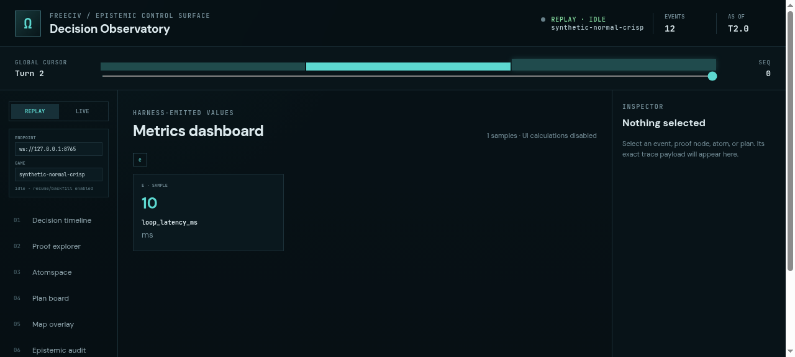
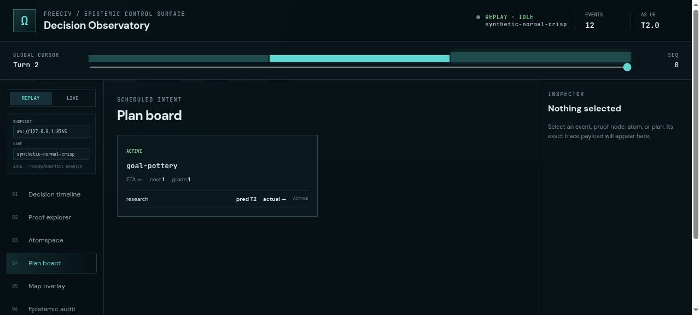
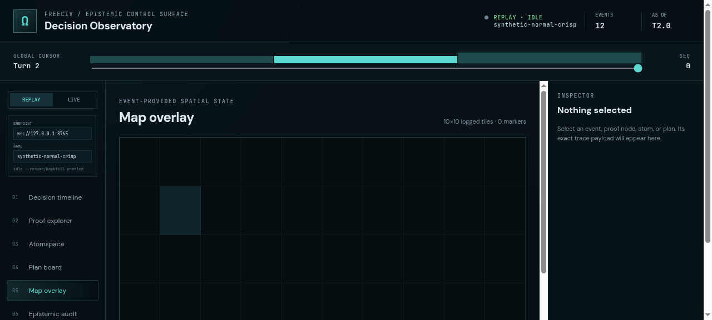
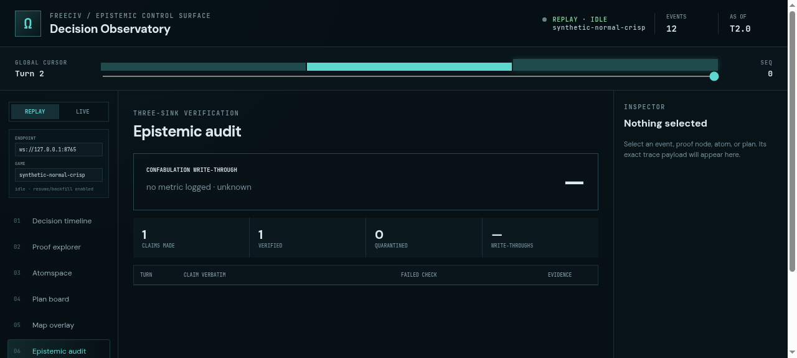

# ProofShot Verification Report

**Date:** 2026-07-18 09:24:09
**Project:** freeciv-observability
**Dev Server:** npm run dev -- --port 4174 on localhost:4174

## What Was Verified

Verify FreeCiv Decision Observatory replay navigation, causal timeline, proof explorer, plan/map/audit/metrics views, and browser error-free rendering

## Video Recording

Full session recording: [session.webm](./session.webm) (40s)

## Screenshots

## Console Errors

No console errors detected.

## Server Errors

No server errors detected.

## Environment
- Browser: Chromium (headless)
- Viewport: 1280x720
- Duration: 40 seconds
