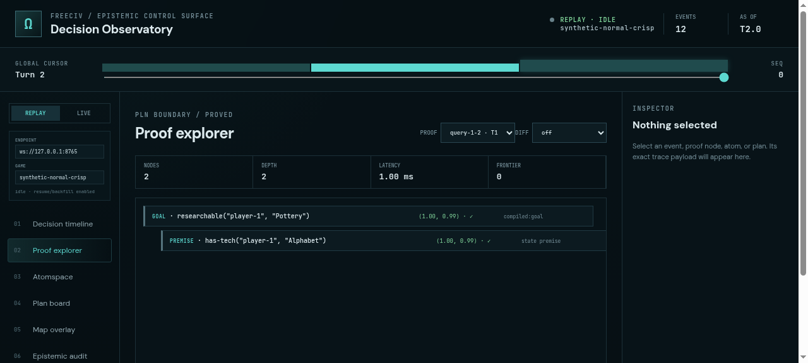
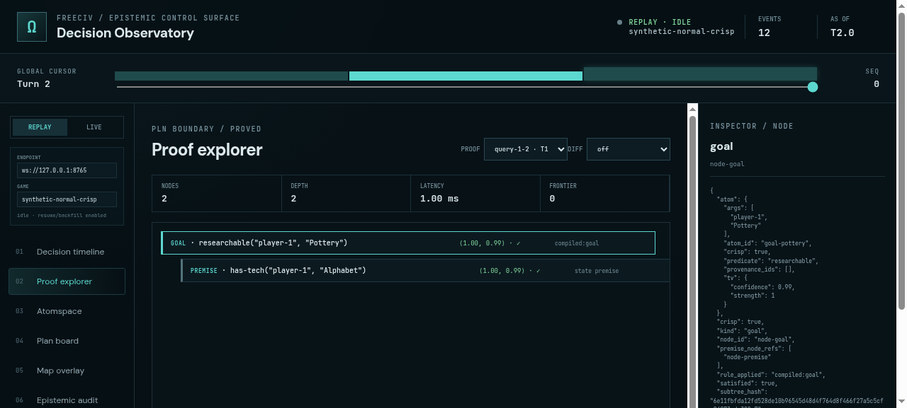
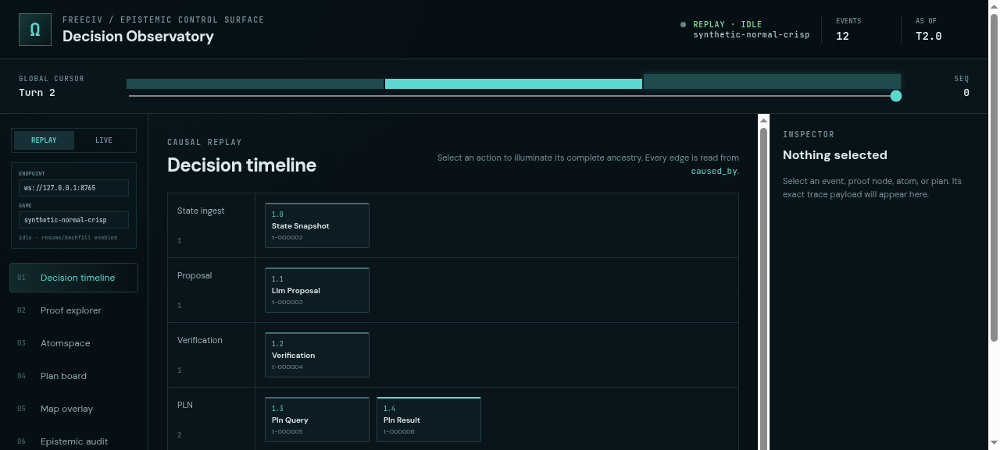

# ProofShot Verification Report

**Date:** 2026-07-18 09:31:54
**Project:** freeciv-observability
**Dev Server:** npm run dev -- --port 4174 on localhost:4174

## What Was Verified

Verify the optimized 200-node proof explorer, navigation, selection, and visual detail retention

## Video Recording

Full session recording: [session.webm](./session.webm) (52s)

## Screenshots

## Console Errors

No console errors detected.

## Server Errors

No server errors detected.

## Environment
- Browser: Chromium (headless)
- Viewport: 1280x720
- Duration: 52 seconds
