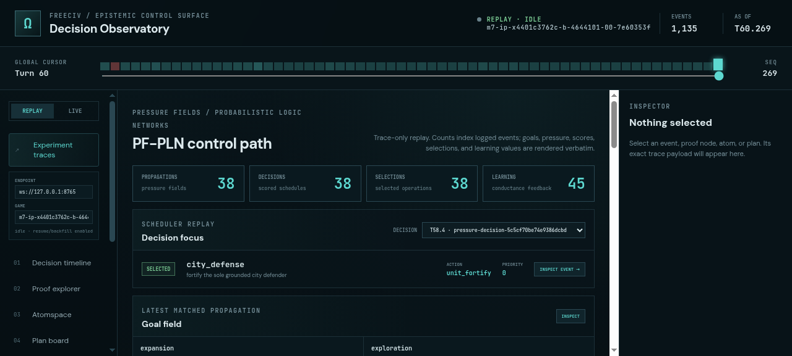
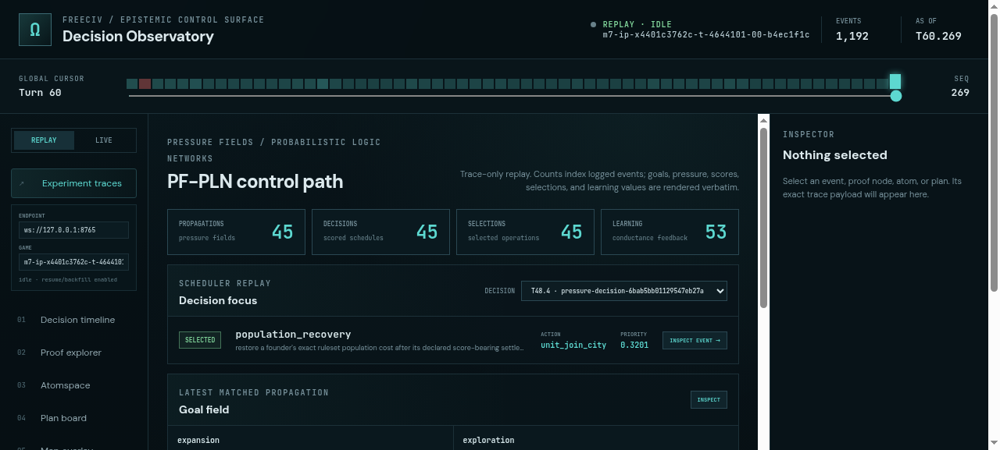
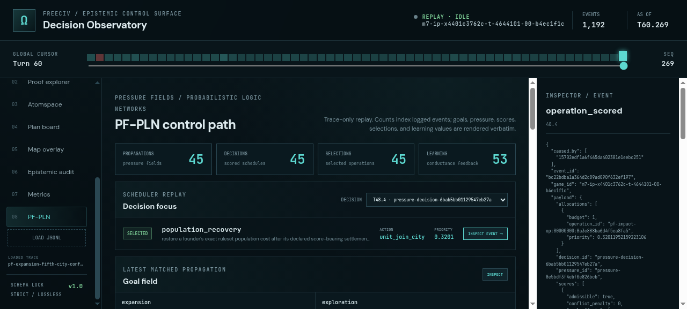
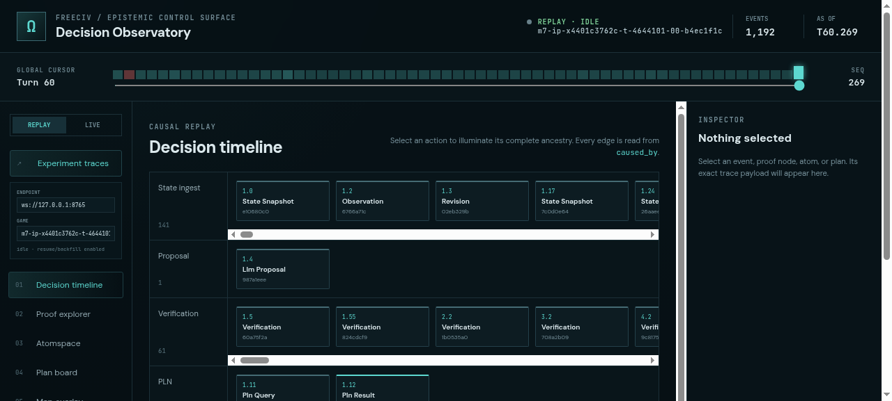
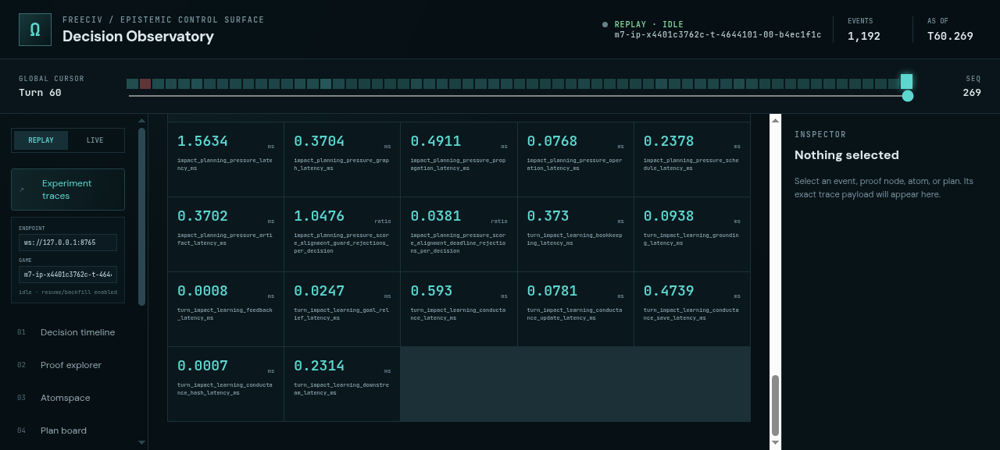
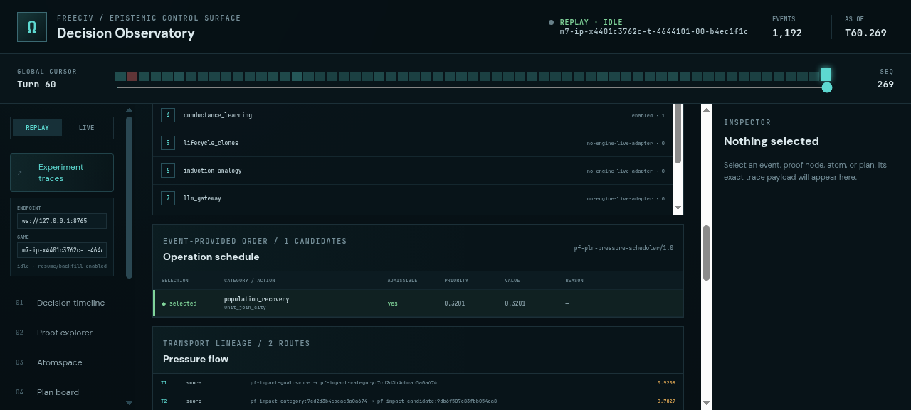

# ProofShot Verification Report

**Date:** 2026-07-27 06:13:13
**Project:** freeciv-observability
**Dev Server:** npm run dev -- --port 4178 on localhost:4178

## What Was Verified

Verify the PF-PLN observability dashboard against an engine-backed fifth-city treatment trace, including artifact loading, goals, scheduler selection, pressure flow, conductance learning, runtime metrics, and inspector interaction.

## Video Recording

Full session recording: [session.webm](./session.webm) (237s)

## Screenshots

## Console Errors

No console errors detected.

## Server Errors

No server errors detected.

## Environment
- Browser: Chromium (headless)
- Viewport: 1280x720
- Duration: 237 seconds
