# ProofShot Verification Report

**Date:** 2026-07-27 06:51:47
**Project:** freeciv-observability
**Dev Server:** npm run dev -- --port 4178 on localhost:4178

## What Was Verified

Verify all FreeCiv observability visualization upgrades with engine-backed PF-PLN traces, paired comparison, focus layout, and every upgraded view

## Video Recording

Full session recording: [session.webm](./session.webm) (464s)

## Screenshots

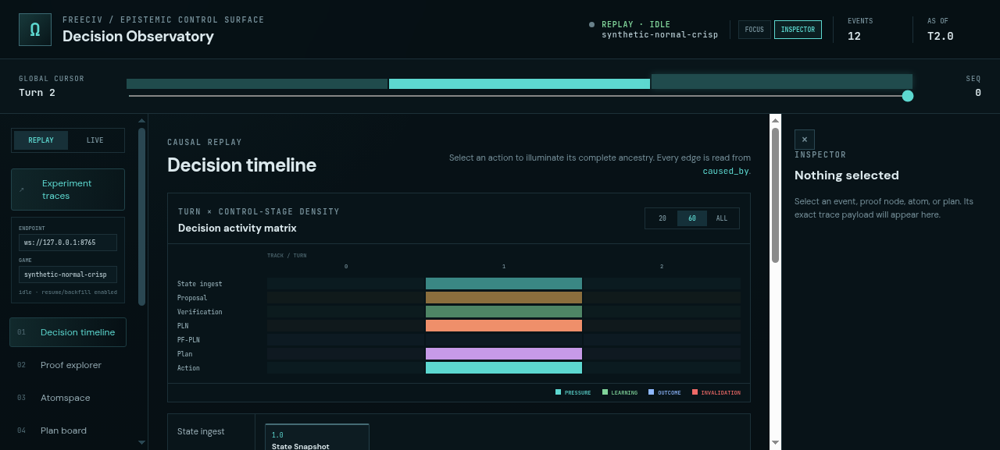

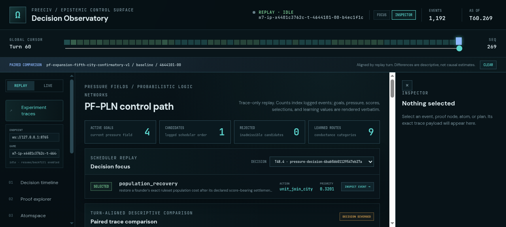

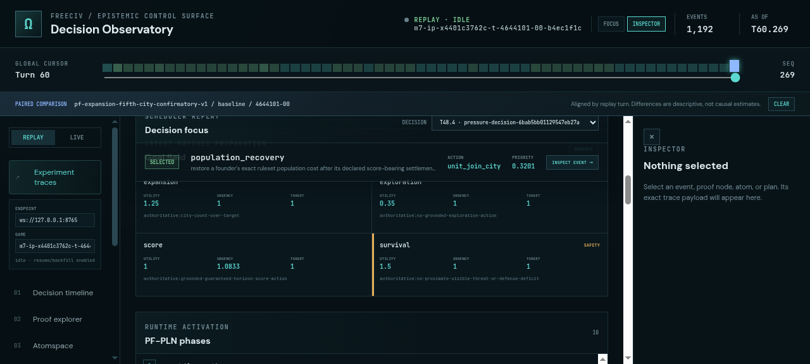

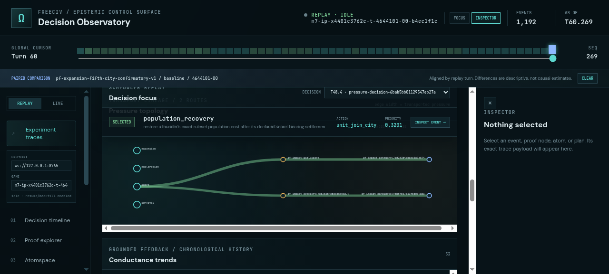

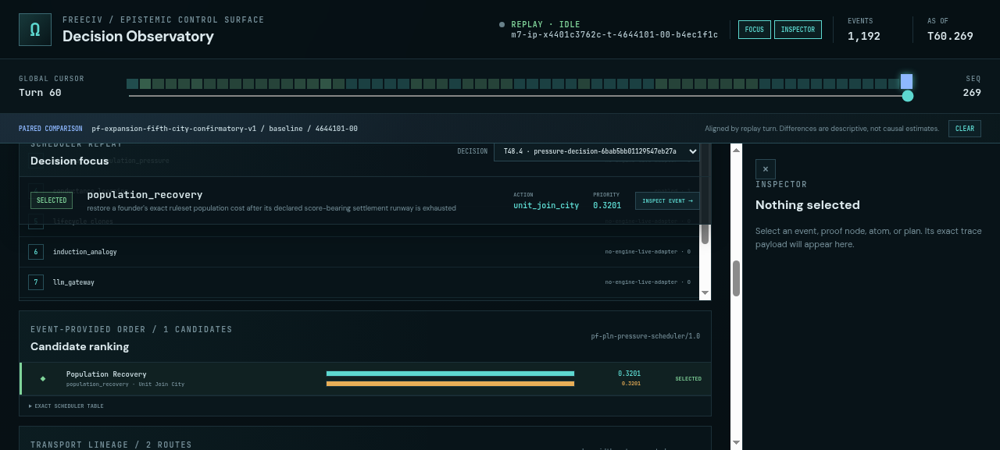

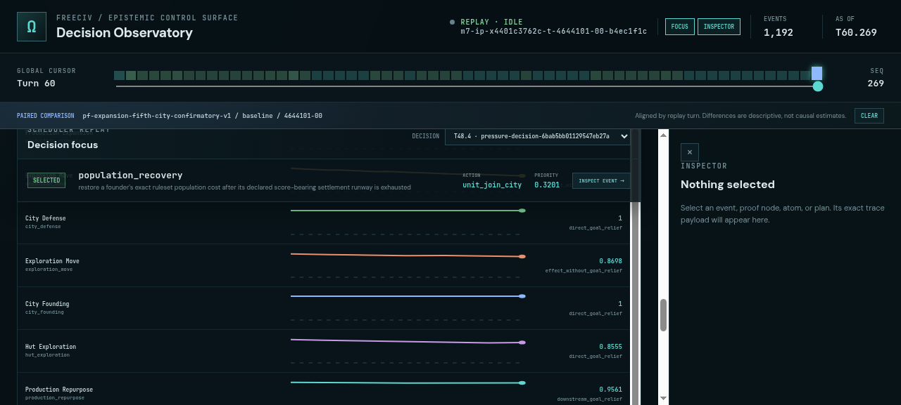

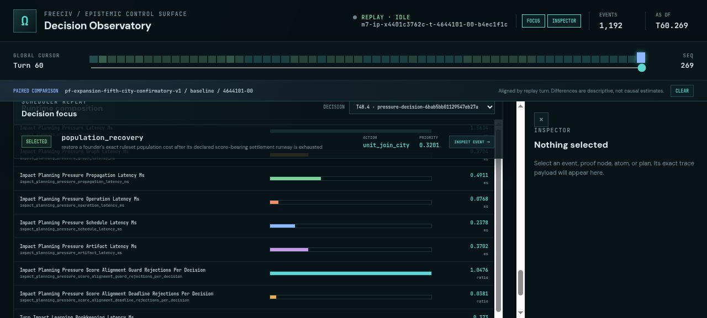

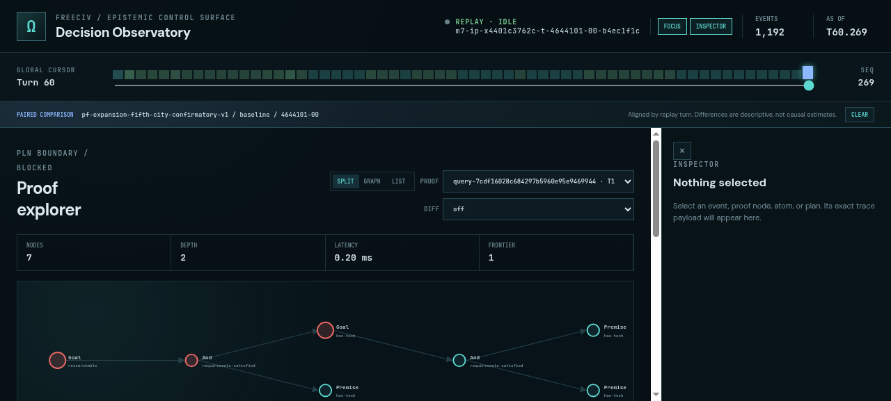

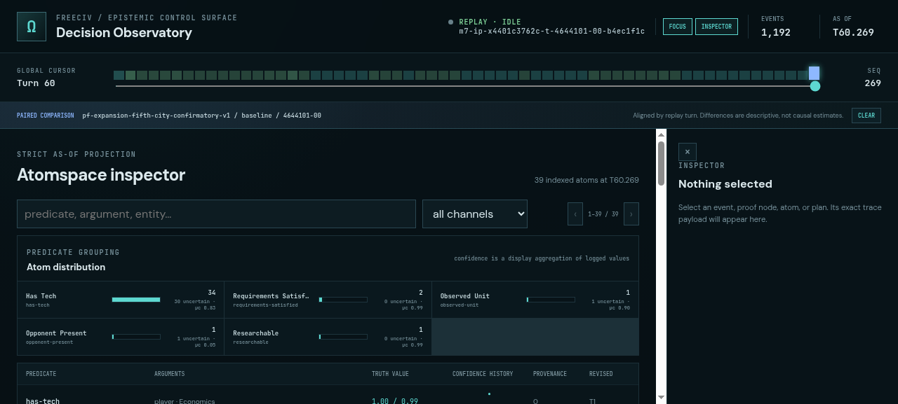

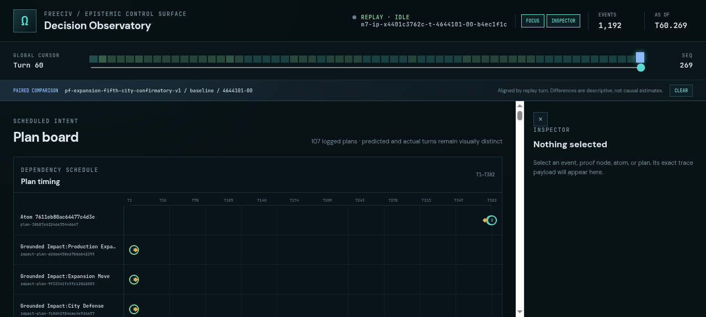

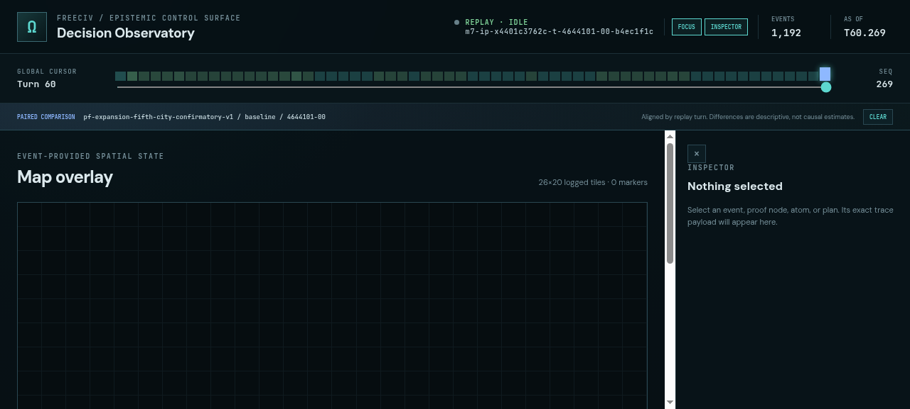

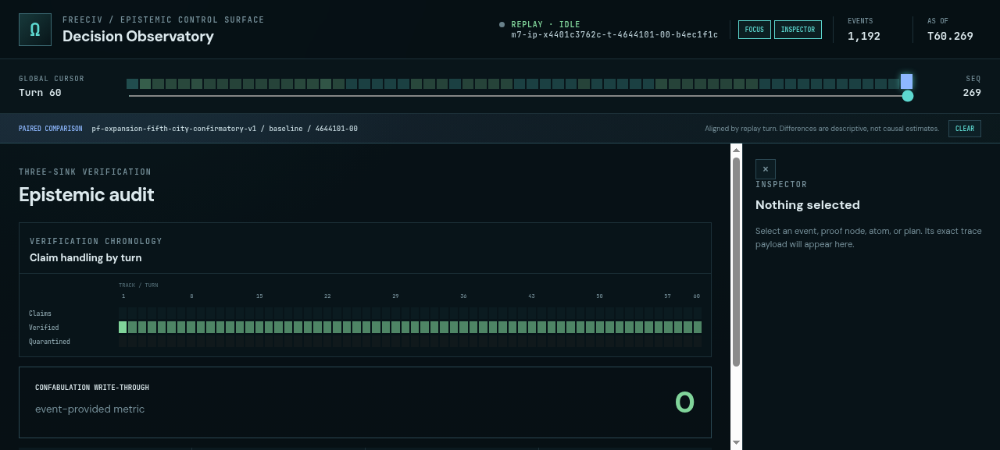

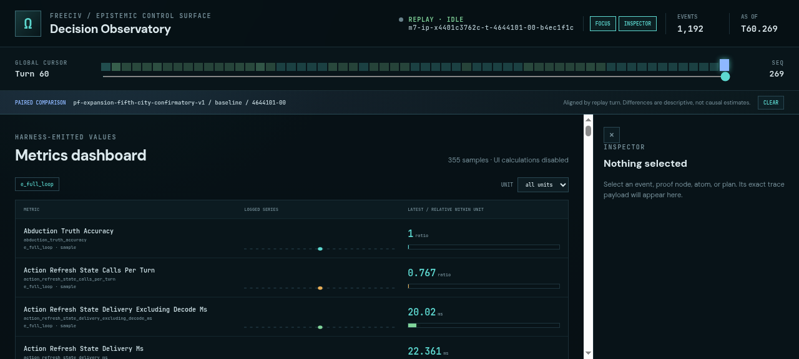

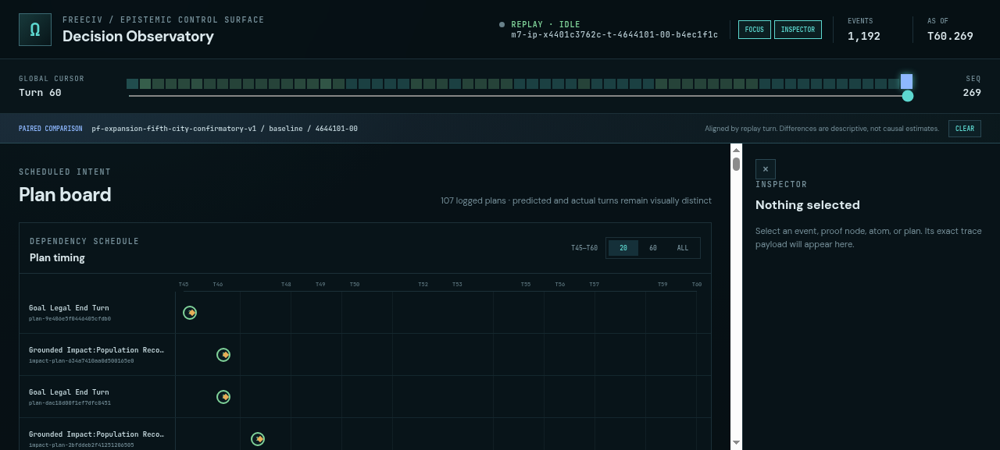

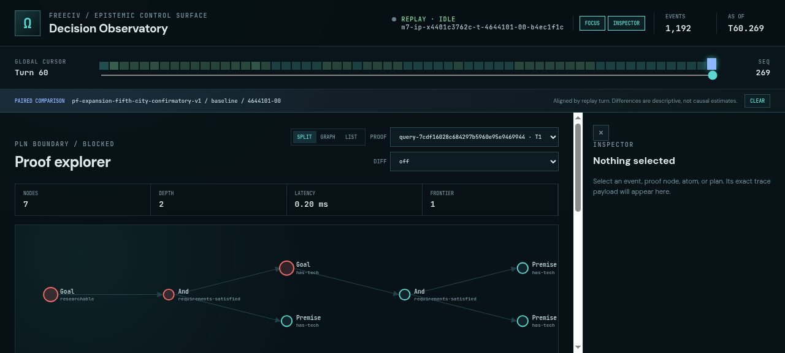

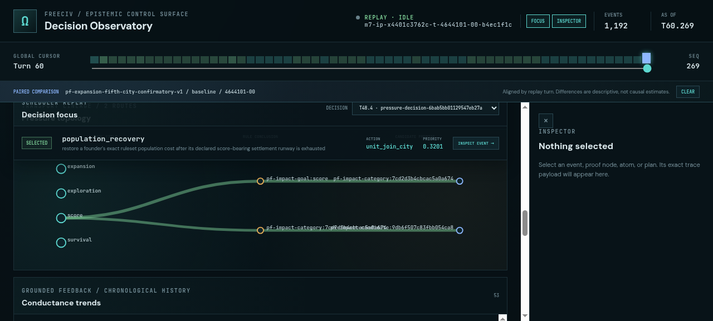

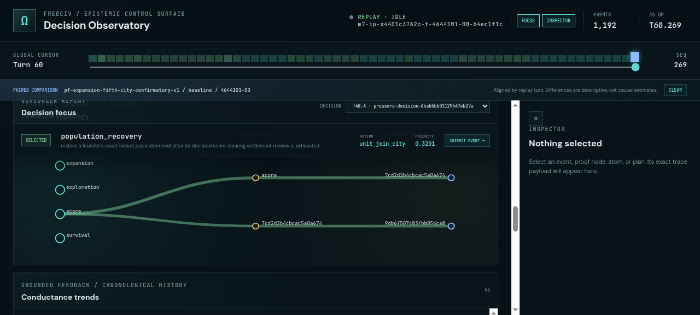

## Console Errors

No console errors detected.

## Server Errors

No server errors detected.

## Environment
- Browser: Chromium (headless)
- Viewport: 1280x720
- Duration: 464 seconds
