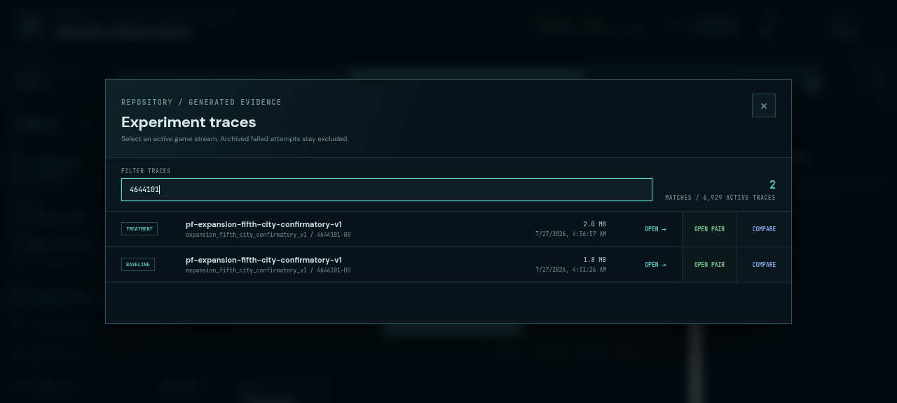
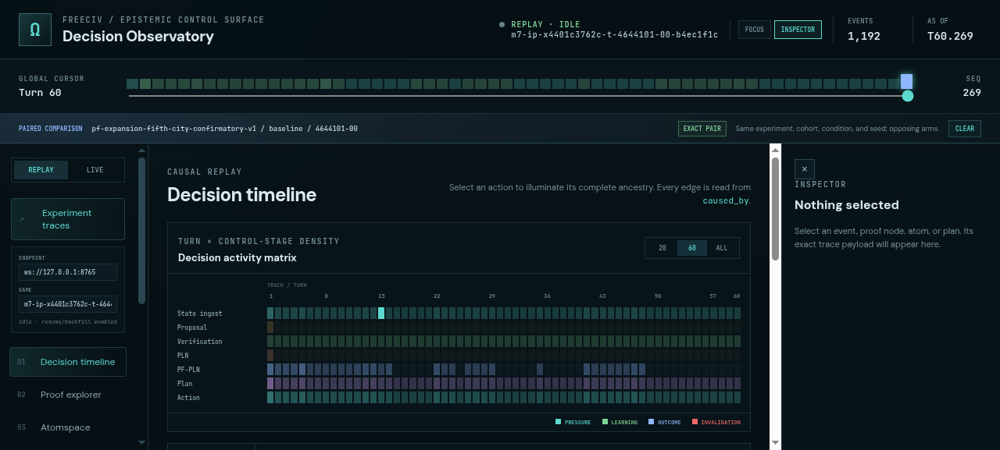
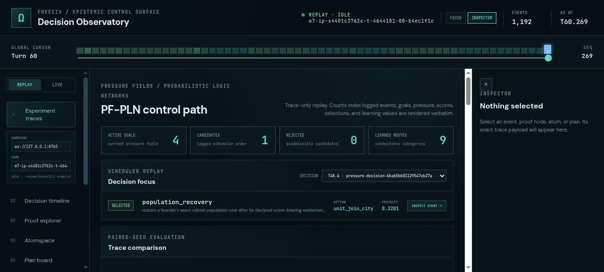

# ProofShot Verification Report

**Date:** 2026-07-27 07:26:16
**Project:** freeciv-observability
**Dev Server:** npm run dev -- --port 4178 on localhost:4178

## What Was Verified

Verify exact paired-arm discovery, one-click pair loading, stale-comparison clearing, and PF-PLN match-quality badges

## Video Recording

Full session recording: [session.webm](./session.webm) (115s)

## Screenshots

## Console Errors

No console errors detected.

## Server Errors

No server errors detected.

## Environment
- Browser: Chromium (headless)
- Viewport: 1280x720
- Duration: 115 seconds
