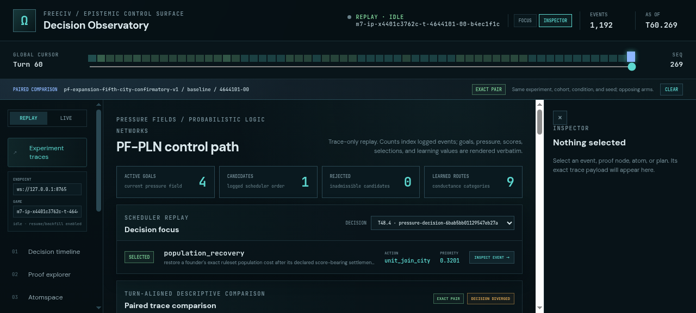

# ProofShot Verification Report

**Date:** 2026-07-27 07:29:36
**Project:** freeciv-observability
**Dev Server:** npm run dev -- --port 4178 on localhost:4178

## What Was Verified

Verify opening an exact pair from a baseline catalog row promotes treatment to the active PF-PLN replay

## Video Recording

Full session recording: [session.webm](./session.webm) (85s)

## Screenshots

## Console Errors

No console errors detected.

## Server Errors

No server errors detected.

## Environment
- Browser: Chromium (headless)
- Viewport: 1280x720
- Duration: 85 seconds
