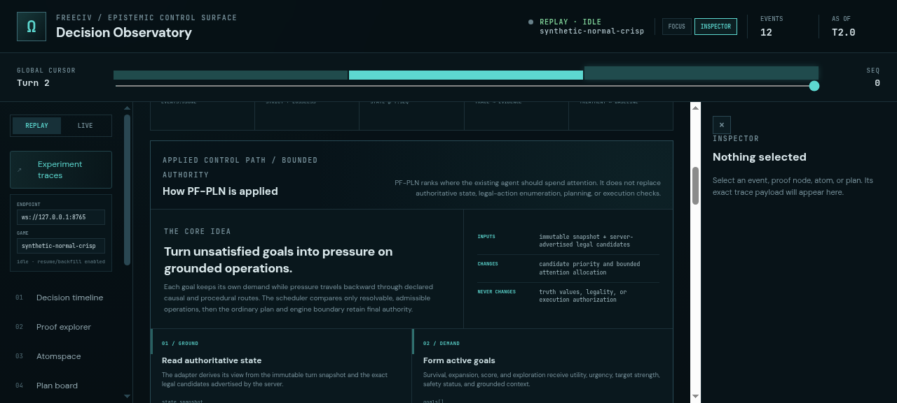
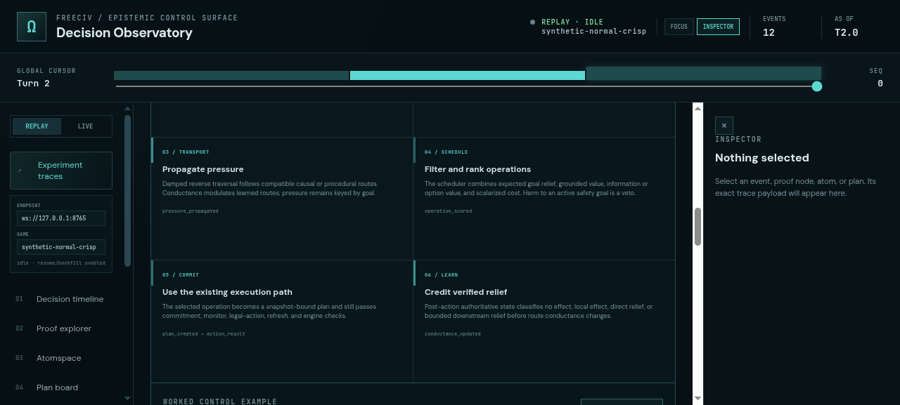
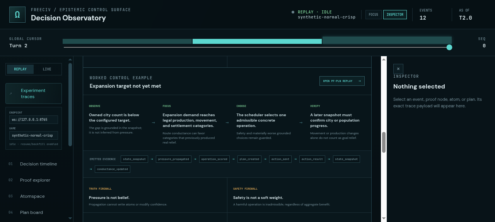
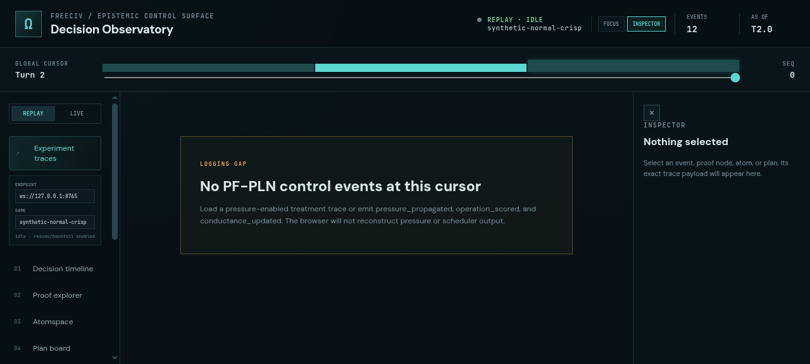

# ProofShot Verification Report

**Date:** 2026-07-27 08:18:06
**Project:** freeciv-observability
**Dev Server:** npm run dev -- --port 4178 on localhost:4178

## What Was Verified

Verify the expanded How PF-PLN is applied walkthrough, worked example, event chain, guardrails, and link into PF-PLN replay

## Video Recording

Full session recording: [session.webm](./session.webm) (86s)

## Screenshots

## Console Errors

No console errors detected.

## Server Errors

No server errors detected.

## Environment
- Browser: Chromium (headless)
- Viewport: 1280x720
- Duration: 86 seconds
