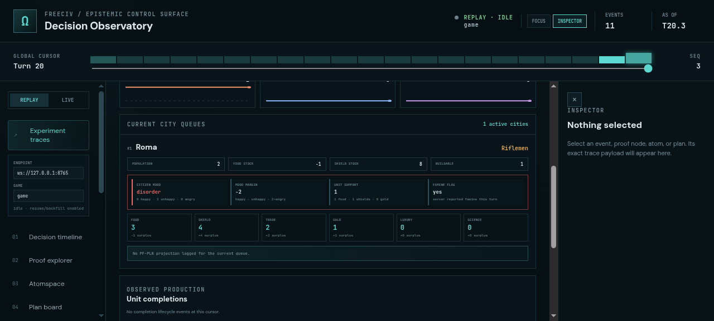
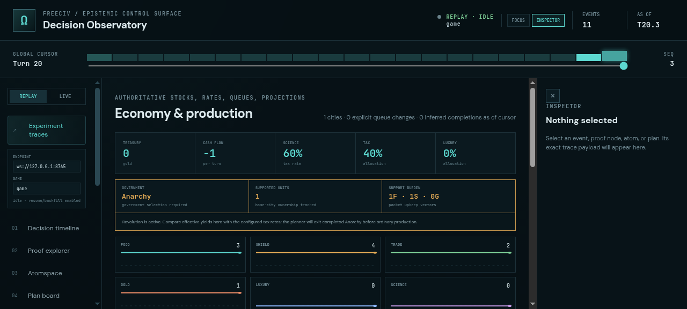
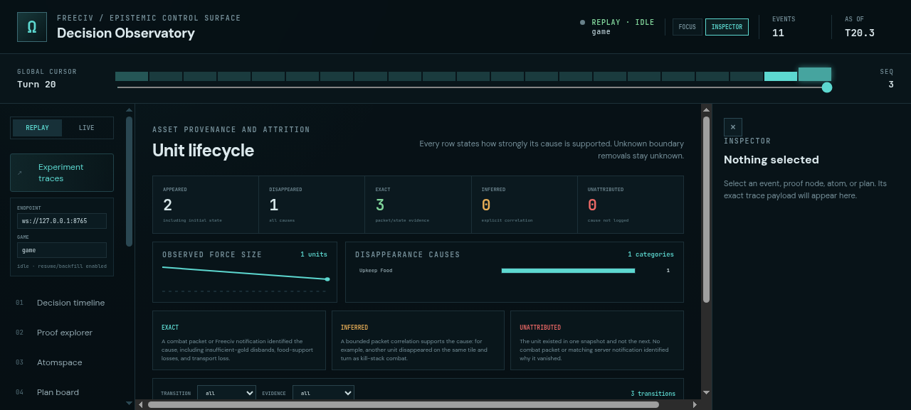
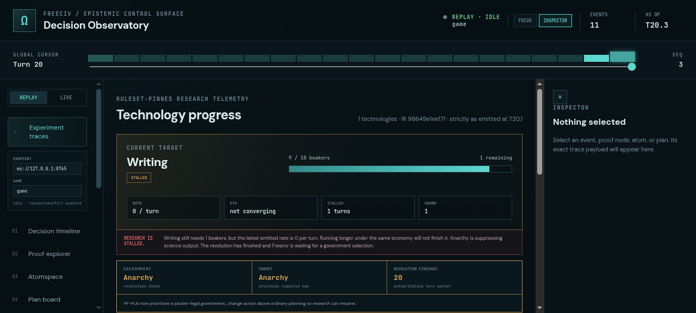

# ProofShot Verification Report

**Date:** 2026-07-27 13:21:23
**Project:** freeciv-observability
**Dev Server:** npm run dev -- --port 4182 on localhost:4182

## What Was Verified

Verify government-caused research stall, city mood/support/famine telemetry, and exact unit removal attribution

## Video Recording

Full session recording: [session.webm](./session.webm) (162s)

## Screenshots

## Console Errors

No console errors detected.

## Server Errors

No server errors detected.

## Environment
- Browser: Chromium (headless)
- Viewport: 1280x720
- Duration: 162 seconds
