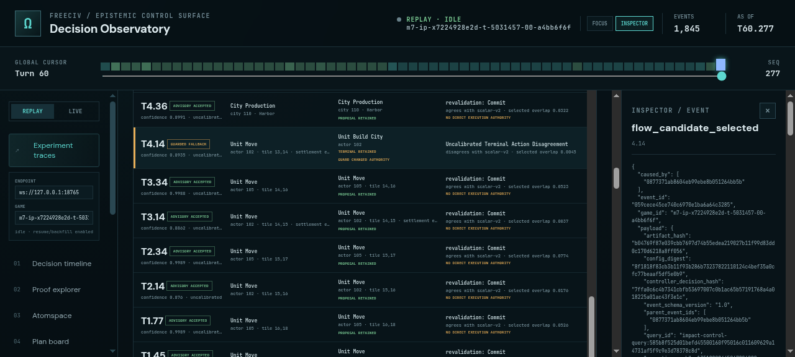
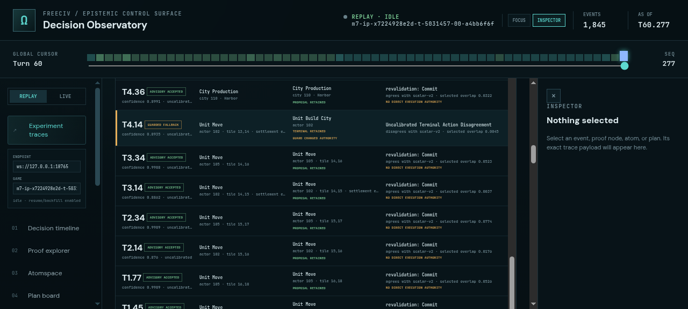
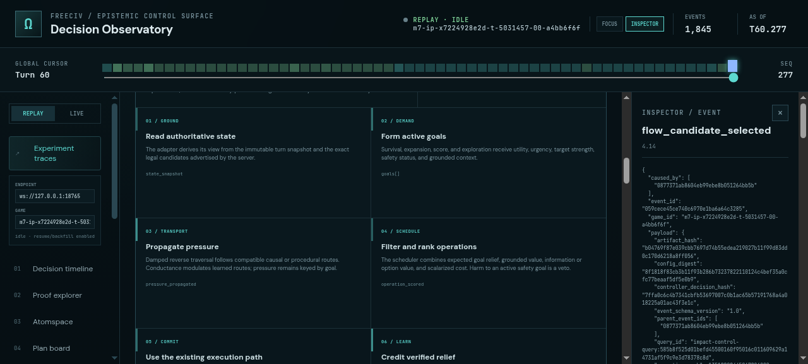

# ProofShot Verification Report

**Date:** 2026-07-29 20:33:02
**Project:** freeciv-observability
**Dev Server:** npm run preview on localhost:4178

## What Was Verified

Final visual verification of unified PF-PLN dashboard and compact terminal-guard authority ledger

## Video Recording

Full session recording: [session.webm](./session.webm) (79s)

## Screenshots

## Console Errors

No console errors detected.

## Server Errors

No server errors detected.

## Environment
- Browser: Chromium (headless)
- Viewport: 1280x720
- Duration: 79 seconds
