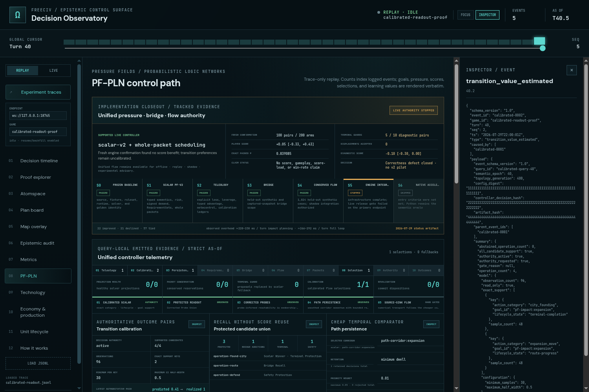
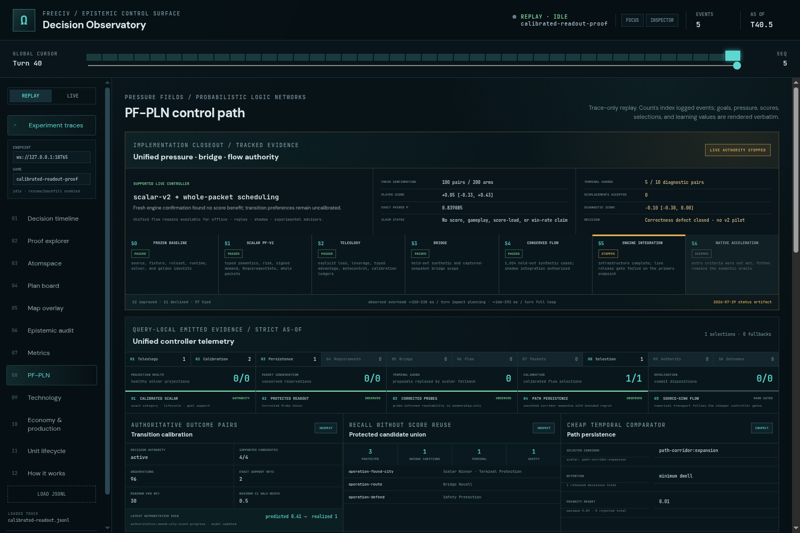
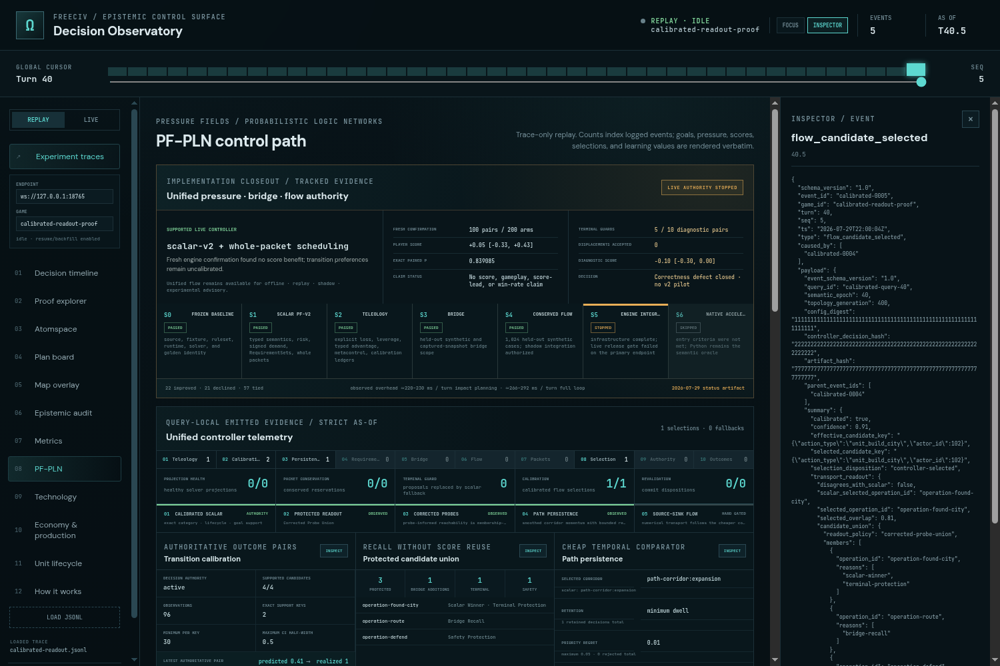

# ProofShot Verification Report

**Date:** 2026-07-29 22:47:28
**Project:** freeciv-observability
**Dev Server:** npm run preview -- --host 127.0.0.1 --port 4174 on localhost:4174

## What Was Verified

Verify calibrated transition, protected candidate union, and path persistence observability

## Video Recording

Full session recording: [session.webm](./session.webm) (76s)

## Screenshots

## Console Errors

No console errors detected.

## Server Errors

No server errors detected.

## Environment
- Browser: Chromium (headless)
- Viewport: 1280x720
- Duration: 76 seconds
