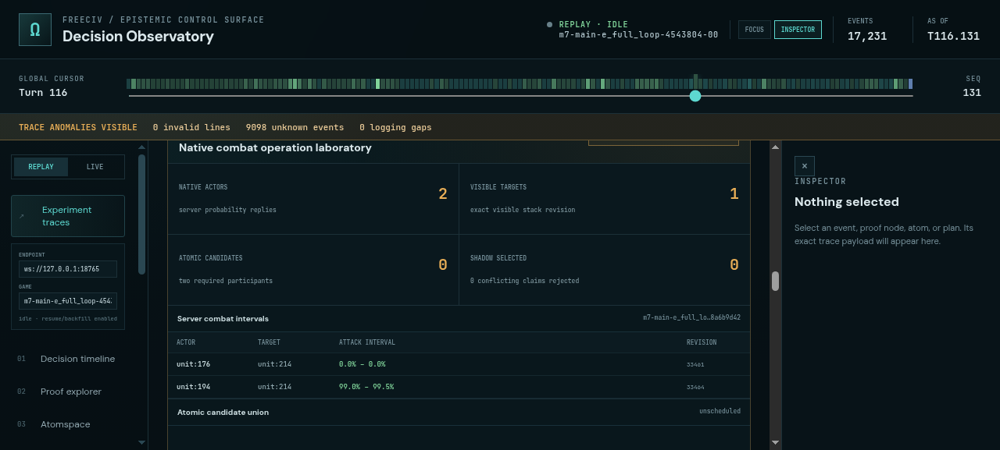

# ProofShot Verification Report

**Date:** 2026-07-30 18:35:05
**Project:** freeciv-observability
**Dev Server:** npm run dev -- --host 127.0.0.1 on localhost:4178

## What Was Verified

Post-fix verification that native combat intervals show visible defender identity instead of the zero sentinel

## Video Recording

Full session recording: [session.webm](./session.webm) (71s)

## Screenshots

## Console Errors

No console errors detected.

## Server Errors

No server errors detected.

## Environment
- Browser: Chromium (headless)
- Viewport: 1280x720
- Duration: 71 seconds
