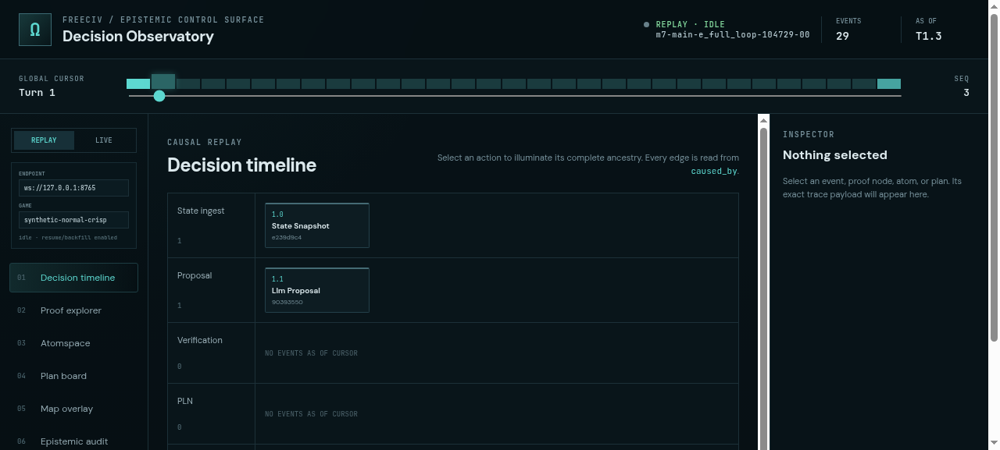
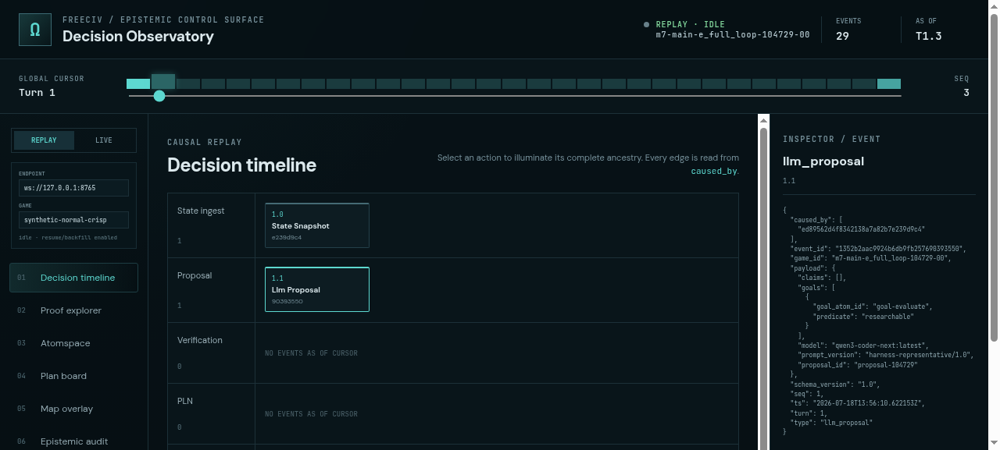
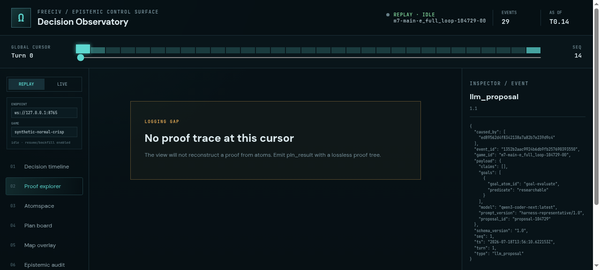
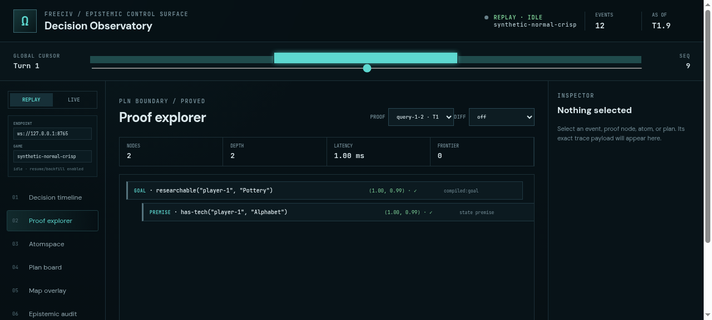
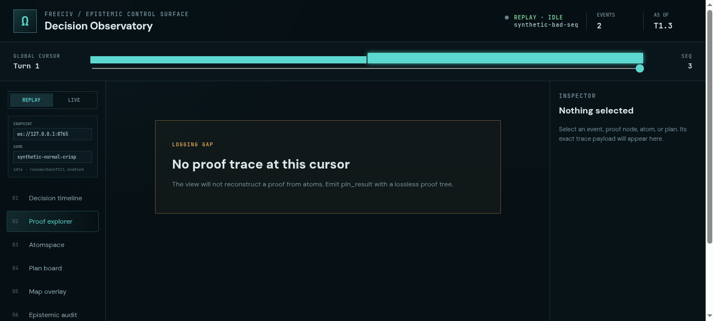
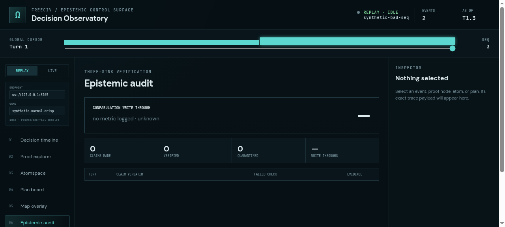
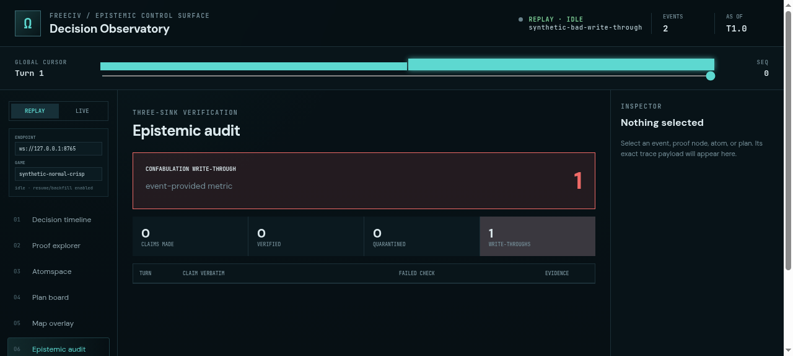
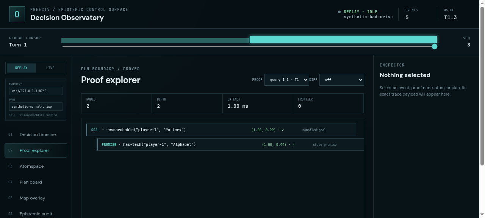
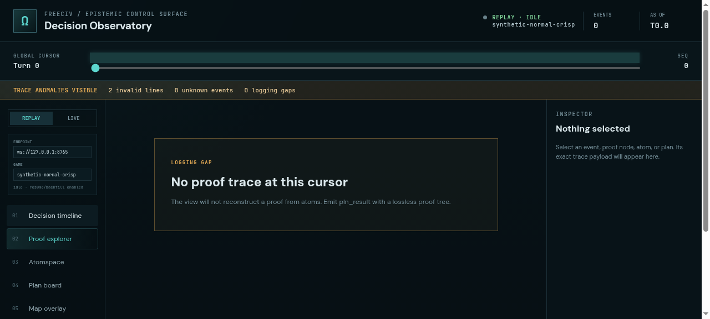
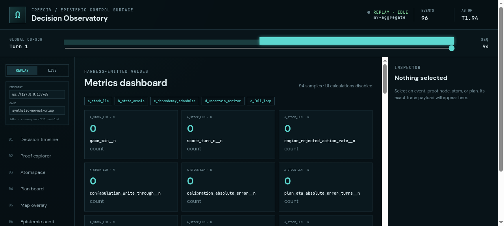

# ProofShot Verification Report

**Date:** 2026-07-18 14:01:07
**Project:** freeciv-omegaclaw
**Dev Server:** external on localhost:4178

## What Was Verified

Verify PLN FreeCiv observability dashboard: replay a harness-generated events.jsonl and check diagnostics on bad fixtures

## Video Recording

Full session recording: [session.webm](./session.webm) (249s)

## Screenshots

## Console Errors

No console errors detected.

## Server Errors

No server errors detected.

## Environment
- Browser: Chromium (headless)
- Viewport: 1280x720
- Duration: 249 seconds
