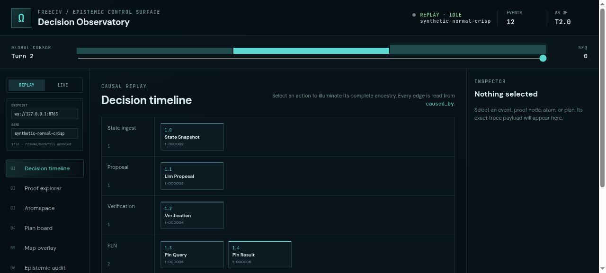
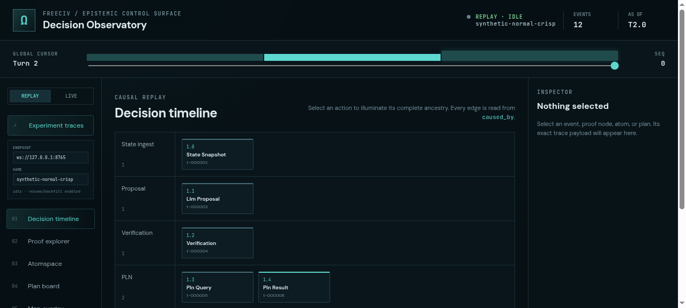
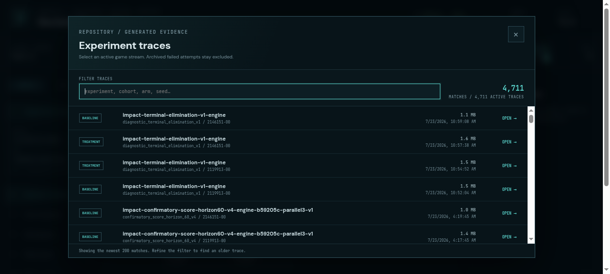
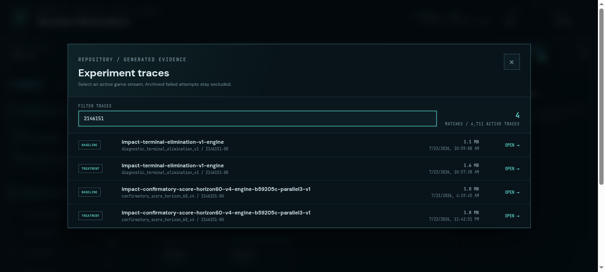
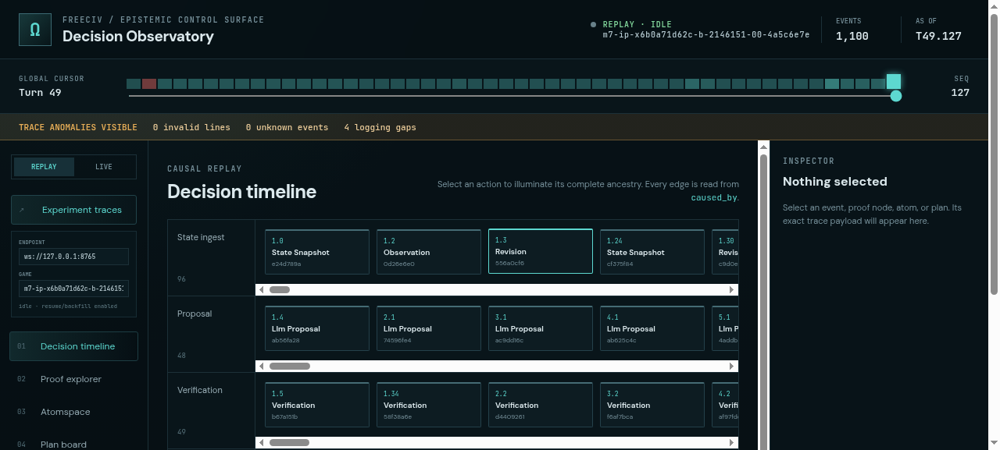
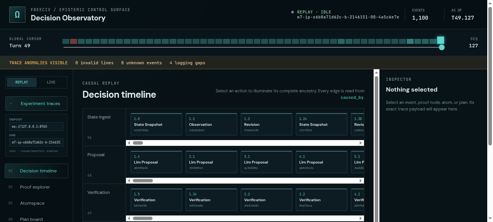

# ProofShot Verification Report

**Date:** 2026-07-23 13:24:11
**Project:** freeciv-omegaclaw
**Dev Server:** npm --prefix apps/freeciv-observability run dev -- --port 4178 on localhost:4178

## What Was Verified

Verify generated FreeCiv experiment trace catalog, filtering, and replay loading

## Video Recording

Full session recording: [session.webm](./session.webm) (141s)

## Screenshots

## Console Errors

No console errors detected.

## Server Errors

No server errors detected.

## Environment
- Browser: Chromium (headless)
- Viewport: 1280x720
- Duration: 141 seconds
