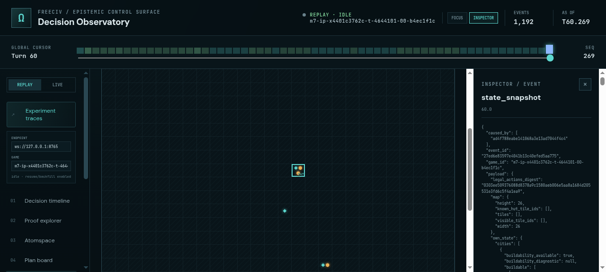
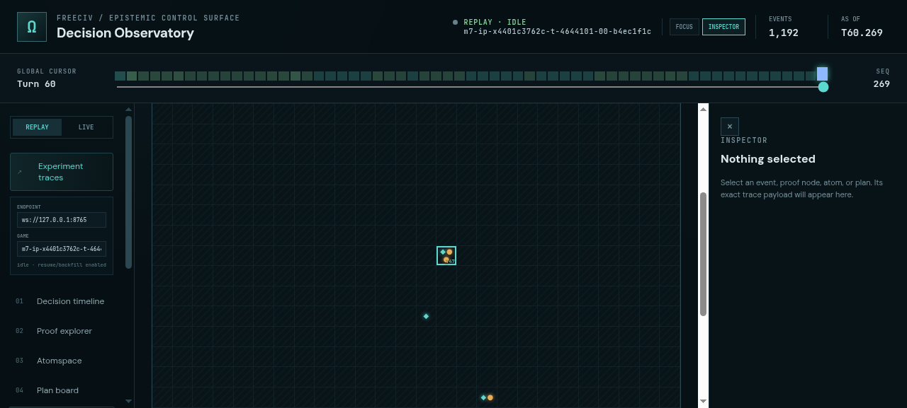
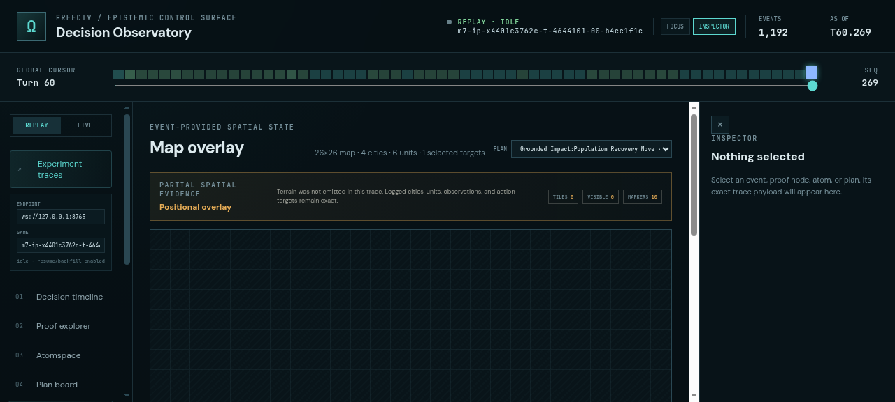

# ProofShot Verification Report

**Date:** 2026-07-27 09:01:50
**Project:** freeciv-omegaclaw
**Dev Server:** npm --prefix apps/freeciv-observability run dev -- --port 4178 on localhost:4178

## What Was Verified

Verify the repaired FreeCiv map overlay on a real dimensions-only experiment trace: full extent, city/unit markers, explicit partial coverage, and logged action targets

## Video Recording

Full session recording: [session.webm](./session.webm) (142s)

## Screenshots

## Console Errors

No console errors detected.

## Server Errors

No server errors detected.

## Environment
- Browser: Chromium (headless)
- Viewport: 1280x720
- Duration: 142 seconds
