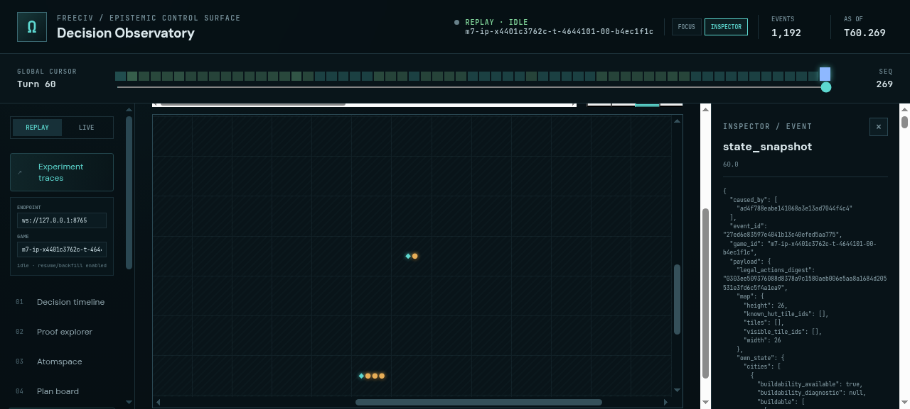
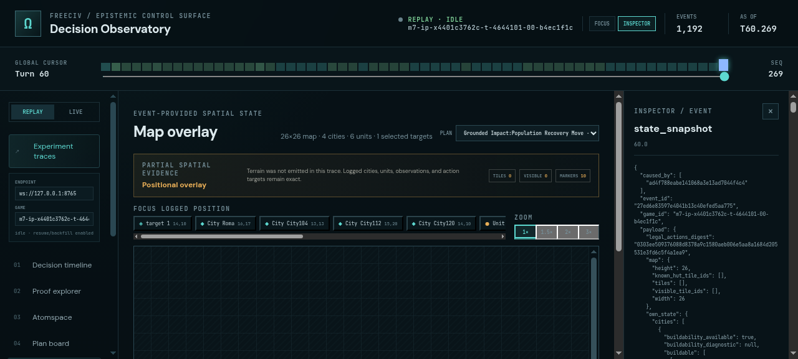
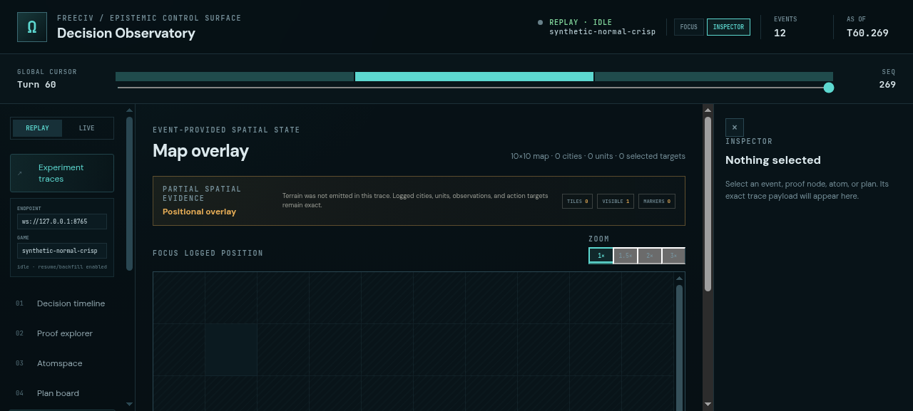
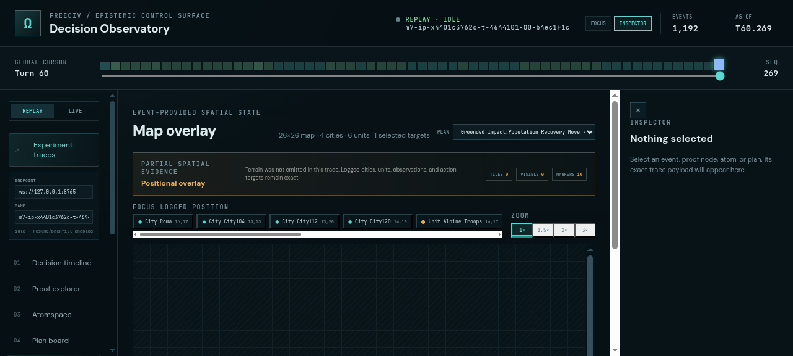
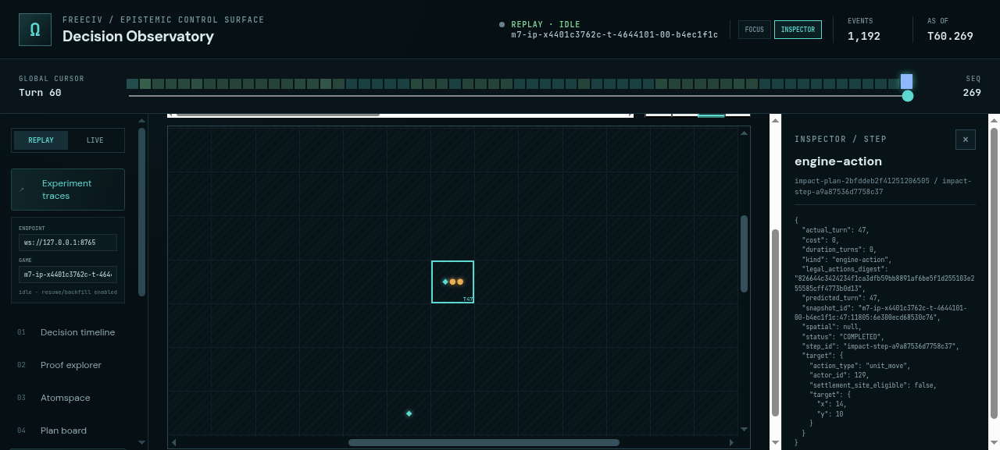

# ProofShot Verification Report

**Date:** 2026-07-27 09:18:50
**Project:** freeciv-omegaclaw
**Dev Server:** npm --prefix apps/freeciv-observability run dev -- --port 4178 on localhost:4178

## What Was Verified

Verify dense FreeCiv map navigation: entity and action-target focus, fit-to-3x zoom, scrolling, and inspector linkage on real trace 4644101-00

## Video Recording

Full session recording: [session.webm](./session.webm) (265s)

## Screenshots

## Console Errors

No console errors detected.

## Server Errors

No server errors detected.

## Environment
- Browser: Chromium (headless)
- Viewport: 1280x720
- Duration: 265 seconds
