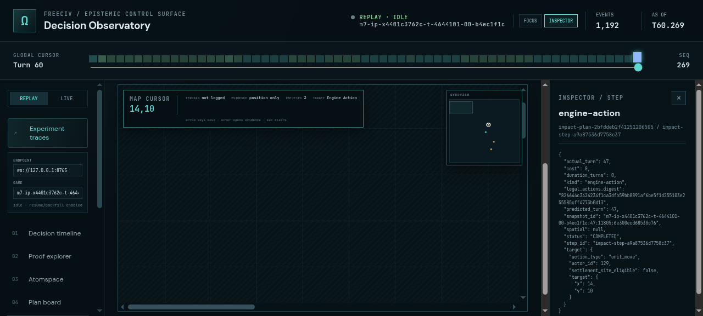
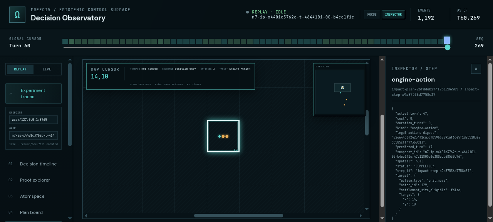
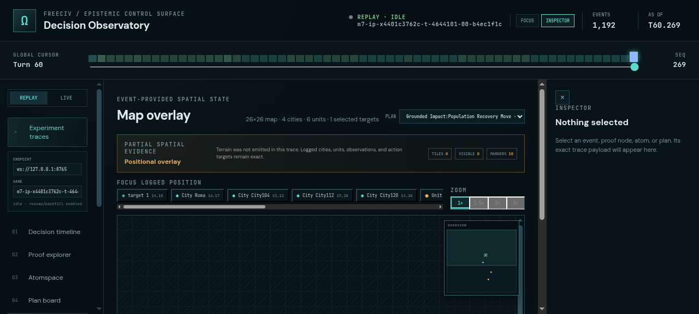

# ProofShot Verification Report

**Date:** 2026-07-27 09:39:32
**Project:** freeciv-omegaclaw
**Dev Server:** npm --prefix apps/freeciv-observability run dev -- --port 4178 on localhost:4178

## What Was Verified

Verify synchronized FreeCiv map overview, viewport window, logged markers and targets, active coordinate, and click-to-pan at 3x zoom on real trace 4644101-00

## Video Recording

Full session recording: [session.webm](./session.webm) (80s)

## Screenshots

## Console Errors

No console errors detected.

## Server Errors

No server errors detected.

## Environment
- Browser: Chromium (headless)
- Viewport: 1280x720
- Duration: 80 seconds
