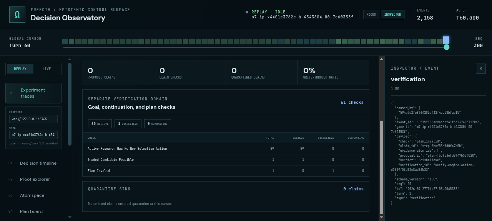
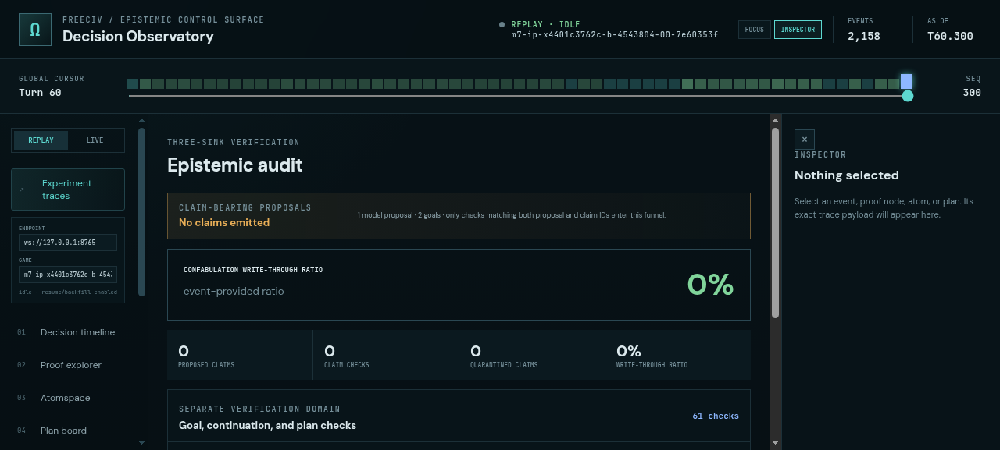
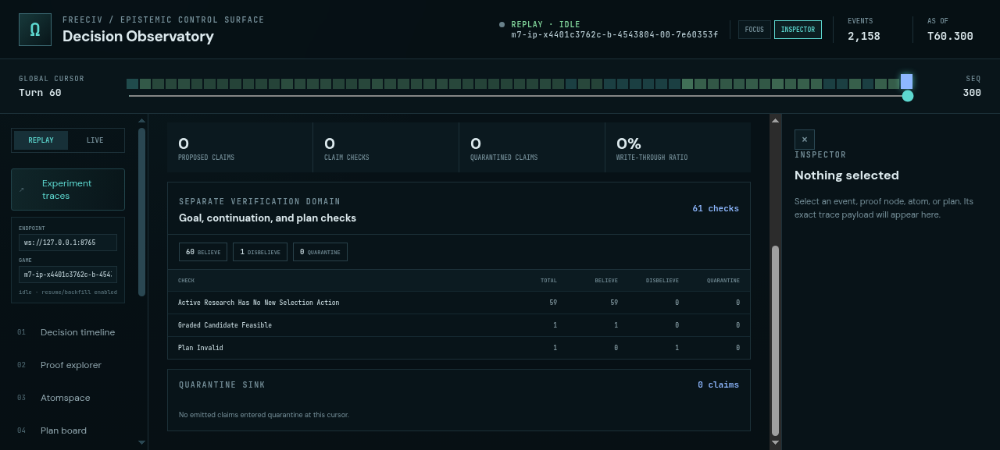

# ProofShot Verification Report

**Date:** 2026-07-27 10:00:32
**Project:** freeciv-omegaclaw
**Dev Server:** npm --prefix apps/freeciv-observability run dev -- --port 4178 on localhost:4178

## What Was Verified

Verify corrected epistemic audit semantics on baseline game 4543804-00: zero emitted claims, 61 separate goal/plan checks, zero quarantines, and explicit 0 percent write-through ratio

## Video Recording

Full session recording: [session.webm](./session.webm) (74s)

## Screenshots

## Console Errors

No console errors detected.

## Server Errors

No server errors detected.

## Environment
- Browser: Chromium (headless)
- Viewport: 1280x720
- Duration: 74 seconds
