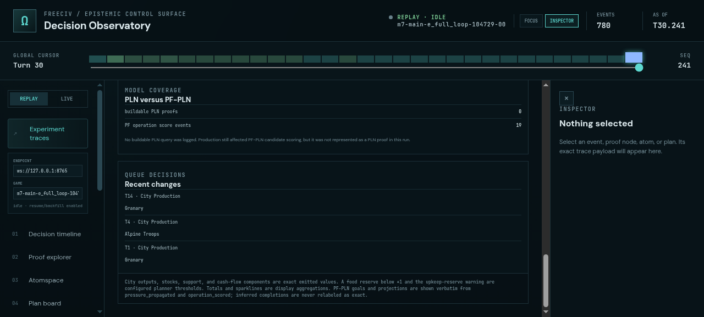
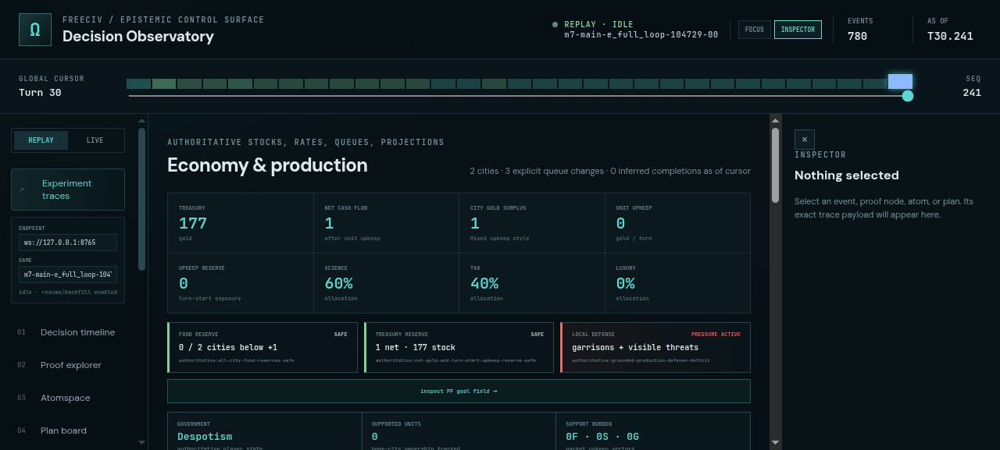

# ProofShot Verification Report

**Date:** 2026-07-27 15:57:10
**Project:** freeciv-omegaclaw
**Dev Server:** npm --prefix apps/freeciv-observability run preview -- --port 4178 on localhost:4178

## What Was Verified

Verify ruleset-aware economy telemetry and PF-PLN food treasury defense controls using the fresh 30-turn engine trace

## Video Recording

Full session recording: [session.webm](./session.webm) (49s)

## Screenshots

## Console Errors

No console errors detected.

## Server Errors

No server errors detected.

## Environment
- Browser: Chromium (headless)
- Viewport: 1280x720
- Duration: 49 seconds
