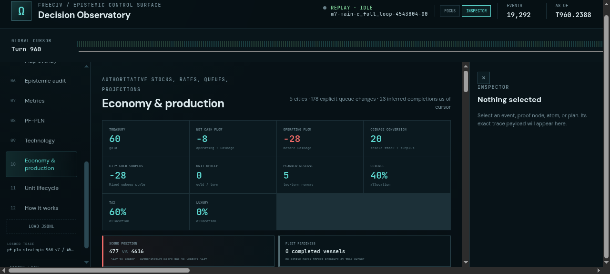
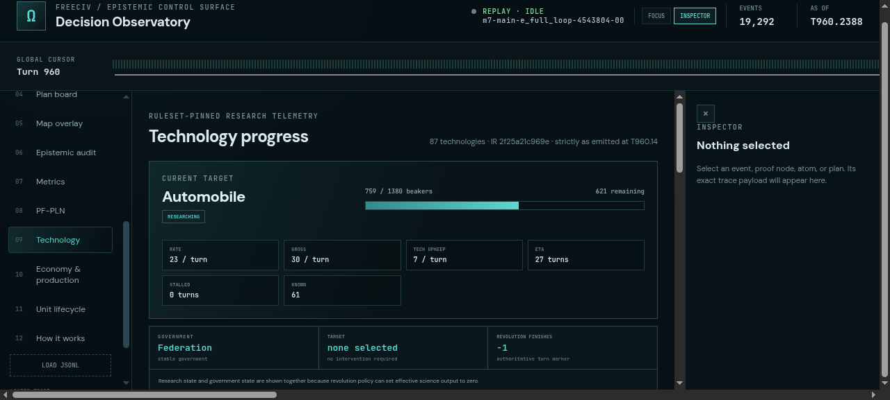
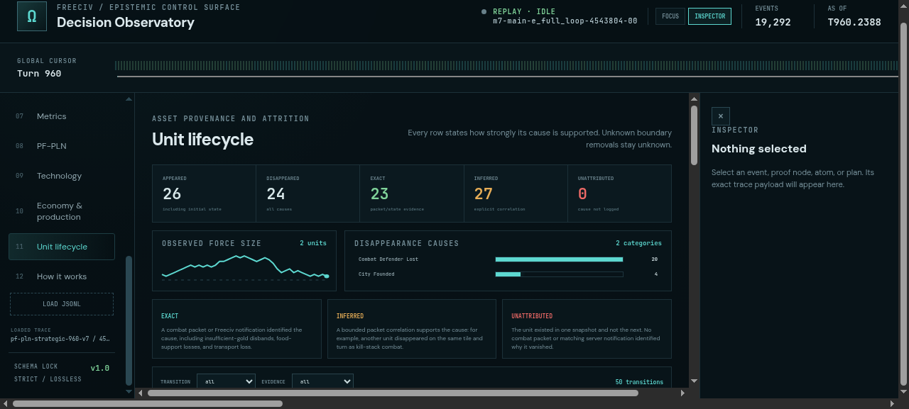

# ProofShot Verification Report

**Date:** 2026-07-28 09:23:30
**Project:** freeciv-omegaclaw
**Dev Server:** CHOKIDAR_USEPOLLING=true npm --prefix apps/freeciv-observability run dev -- --port 4179 on localhost:4179

## What Was Verified

Verify strategic FreeCiv resource, research, score, fleet, building, and lifecycle observability against the completed 960-turn trace

## Video Recording

Full session recording: [session.webm](./session.webm) (351s)

## Screenshots

## Console Errors

No console errors detected.

## Server Errors

No server errors detected.

## Environment
- Browser: Chromium (headless)
- Viewport: 1280x720
- Duration: 351 seconds
