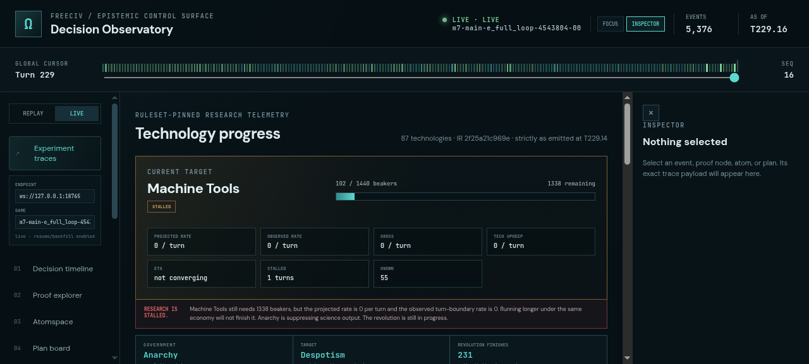
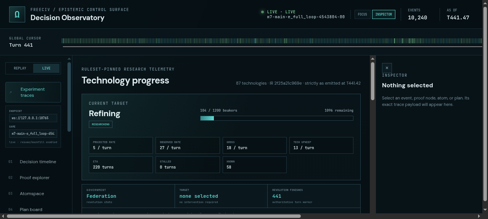

# ProofShot Verification Report

**Date:** 2026-07-28 18:46:48
**Project:** freeciv-omegaclaw
**Dev Server:** npm --prefix apps/freeciv-observability run preview -- --host 127.0.0.1 --port 4178 on localhost:4178

## What Was Verified

Verify live Technology view distinguishes projected and observed research throughput and explains research stalls

## Video Recording

Full session recording: [session.webm](./session.webm) (215s)

## Screenshots

## Console Errors

No console errors detected.

## Server Errors

No server errors detected.

## Environment
- Browser: Chromium (headless)
- Viewport: 1280x720
- Duration: 215 seconds
