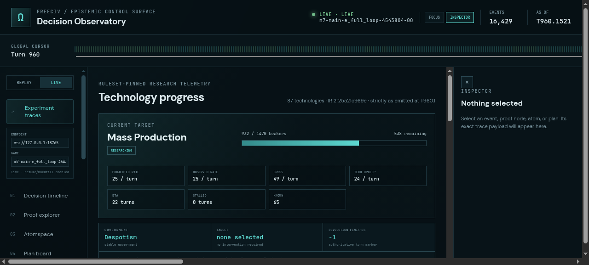
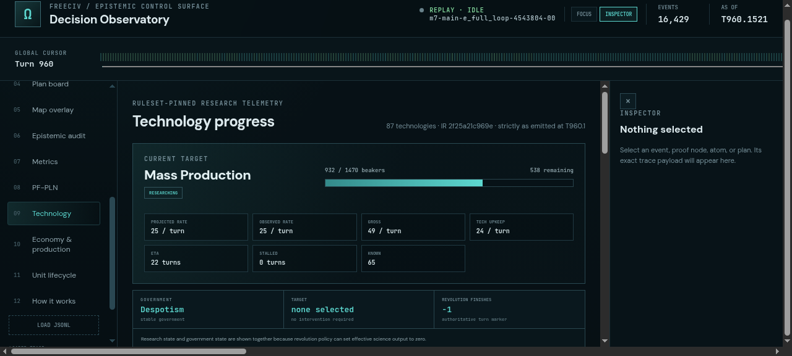

# ProofShot Verification Report

**Date:** 2026-07-28 20:24:56
**Project:** freeciv-omegaclaw
**Dev Server:** npm --prefix apps/freeciv-observability run preview -- --host 127.0.0.1 --port 4178 on localhost:4178

## What Was Verified

Verify adapter 1.32 FreeCiv observability government state, completed v48 artifact loading, and live tail rendering

## Video Recording

Full session recording: [session.webm](./session.webm) (208s)

## Screenshots

## Console Errors

No console errors detected.

## Server Errors

No server errors detected.

## Environment
- Browser: Chromium (headless)
- Viewport: 1280x720
- Duration: 208 seconds
