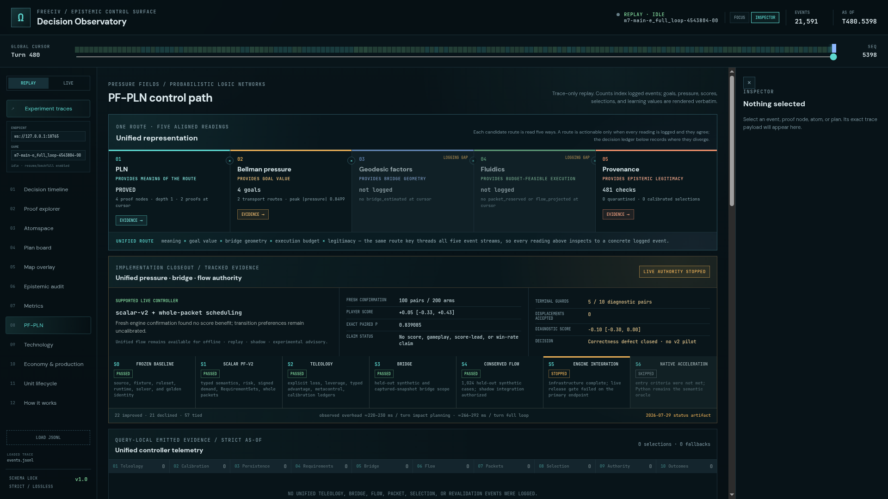
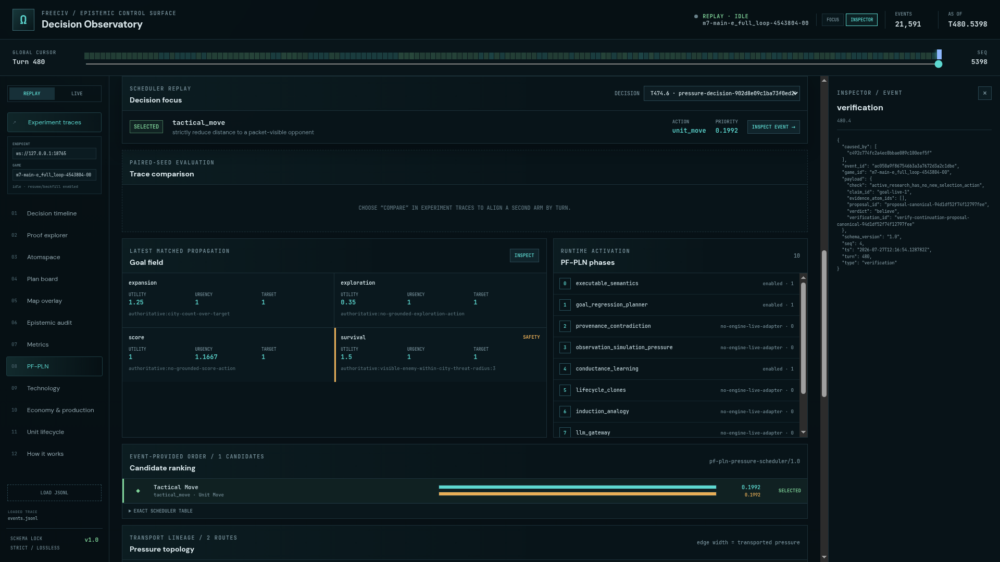
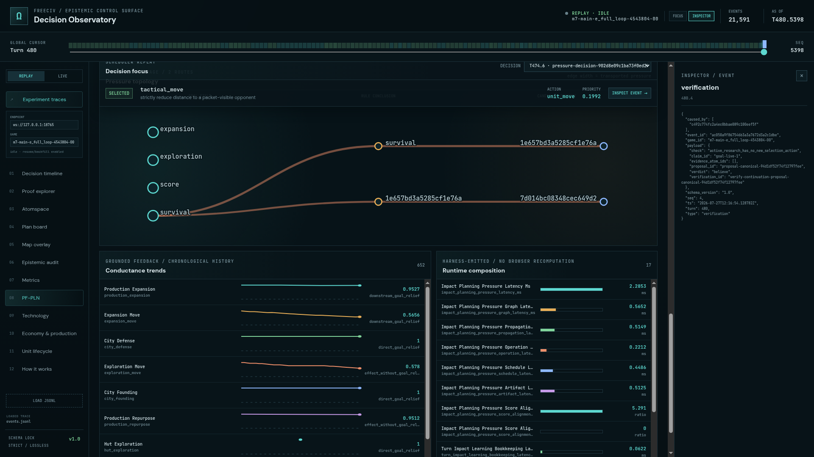

# ProofShot Verification Report

**Date:** 2026-07-30 01:26:55
**Project:** freeciv-omegaclaw
**Dev Server:** external on localhost:4179

## What Was Verified

Verify PF-PLN readability pass and unified representation panel

## Video Recording

Full session recording: [session.webm](./session.webm) (61s)

## Screenshots

## Console Errors

No console errors detected.

## Server Errors

No server errors detected.

## Environment
- Browser: Chromium (headless)
- Viewport: 1280x720
- Duration: 61 seconds
