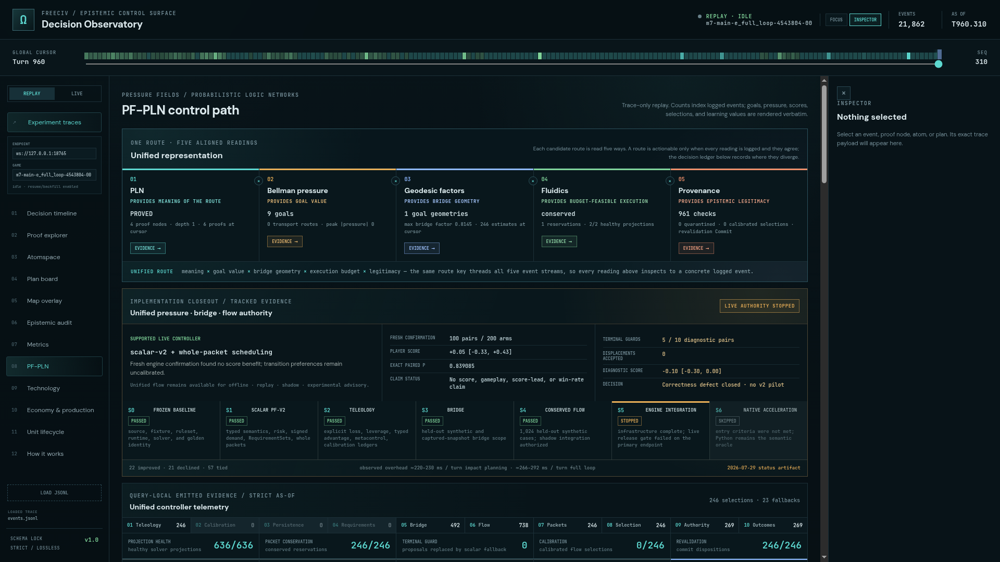
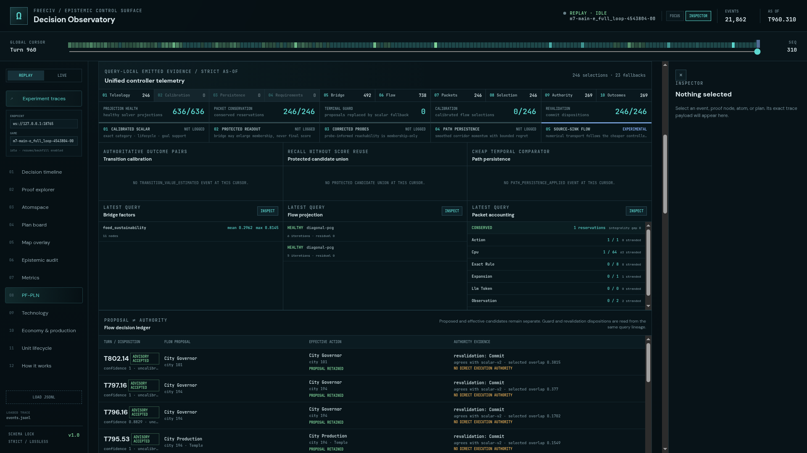
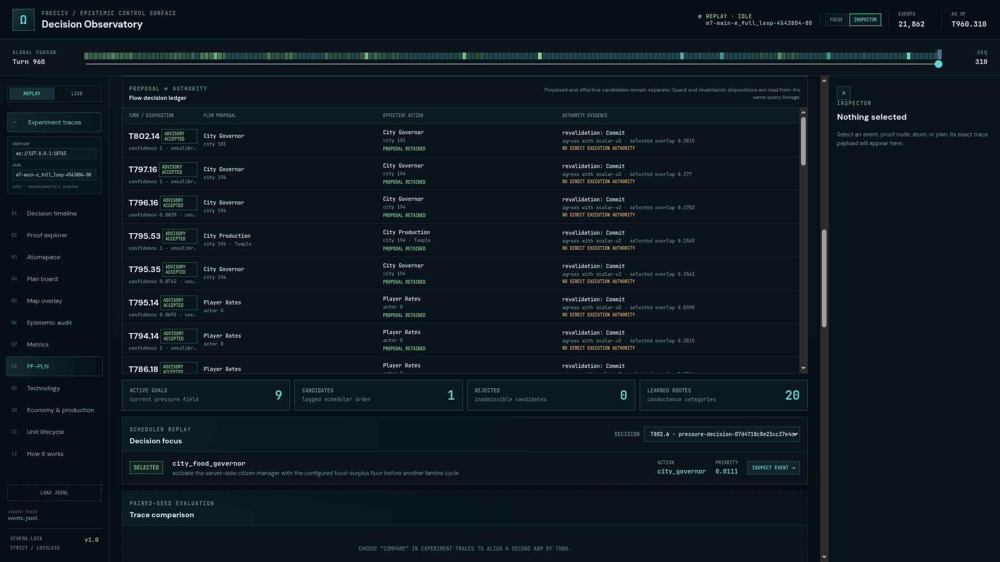

# ProofShot Verification Report

**Date:** 2026-07-30 03:16:04
**Project:** freeciv-omegaclaw
**Dev Server:** external on localhost:4179

## What Was Verified

Verify 960-turn unified-flow run lights up all five facets in the Decision Observatory

## Video Recording

Full session recording: [session.webm](./session.webm) (73s)

## Screenshots

## Console Errors

No console errors detected.

## Server Errors

No server errors detected.

## Environment
- Browser: Chromium (headless)
- Viewport: 1280x720
- Duration: 73 seconds
